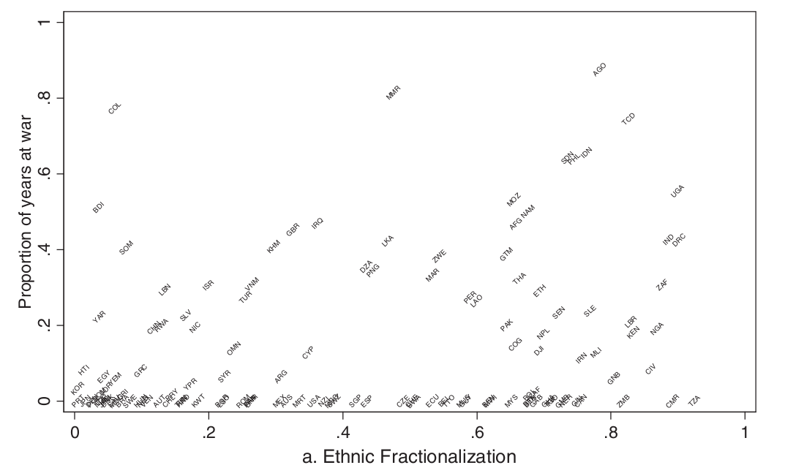

```{r setup, include=FALSE}
knitr::opts_chunk$set(echo = FALSE)
require(knitr)
require(kableExtra)
require(magrittr)
```


# Ethnicity and Civil War

## Outline

- Ethnic diversity and Civil War?
- Are diverse societies prone to conflict?
- Paper Grades

# Ethnicity and Civil War

## Ethnicity and Civil War Linked?

### **Your examples of ethnic conflict focused on civil wars:**

- Rwanda, Yugoslavia, Sudan, Iraq, Syria, Iraq, Yemen, Ethiopia, and more...

## Ethnicity and Civil War Linked?

### **Now we have possible explanations**

**instrumental**: 

- ethnic groups good for coordinating coalitions to compete for scarce resources
- many electoral rules encourage ethnic parties to adopt more extreme policy positions

**psychological**:

- people concerned with ethnic status comparisons
- efforts to increase group status $\to$ conflict
- ethnic status fears $+$ elections $\to$ fears of permanent domination

## Ethnicity and Civil War Linked?

Key implication of these arguments is that states with greater ethnic diversity$^*$ are more prone to conflict, which could then turn into civil war.

- These conflicts, particularly over relative ethnic status, cannot be resolved within 'ordinary' politics

We have lots of *theoretical* explanations for ethnic diversity producing conflict...

... but is there evidence that there is a link?

# Testing<br>Ethnicity and Civil War

## Fearon and Laitin (2003)


First major attempt to answer:

- Is ethnic diversity actually related to civil conflict?
- What other attributes of countries are actually related to civil conflict?

## Fearon and Laitin (2003)

Collect data on:

- 161 countries between 1945 and 1999
- measure incidence of civil war
- measure ethnic diversity
- measure other possible explanations of civil war

Then compare the incidence of civil war in places with greater/lesser ethnic diversity.

## Measuring Civil War

Fearon and Laitin count as **civil wars** conflicts in which ...

- fighting is between a state and organized non-state groups over control of the government (or a region)
- there are $>1000$ deaths overall, and $>100$ deaths per year on average.
- there have been $>100$ deaths on both sides of the conflict.

In total, they find $127$ civil wars.

>- What questions/concerns do you have about this approach to measuring civil war?

## Measuring Ethnic Diversity

We want to compare ethnic diversity of *countries around the world*.

Discuss with your neighbors: 

(a) what are ways we *can* or *should* measure ethnic diversity?

(b) what are challenges or difficulties that would make measuring ethnic diversity difficult?


Think about:

- what kinds of data might exist?
- how should we combine that data to reflect "diversity"
- what kinds of "diversity" are relevant to conflict (according to theory)?
- is this comparable across countries?

## Fearon and Laitin (2003)

They compare country-years with differing levels of ethnic diversity, "holding constant" economic growth, population size, democracy, terrain features, and other sources of conflict...

they find that...

>- there is **no relationship** between ethnic diversity and civil war
>- Surprised? Why?

---




## Fearon and Laitin (2003)

### Correlates of Civil War:

$1.$ Ethnic diversity: **no relationship**
    - measured as ELF, as size of largest group, presence of majority with large minority
$2.$ Linguistic/religious discrimination: **no relationship**
$3.$ GDP per capita: **negative relationship**
$4.$ Population size: **positive relationship**
$5.$ Newly Independent: **positive relationship**
$6.$ Mountainous terrain: **positive relationship**

## Ethnicity and Civil War?

Two ways of responding to Fearon and Laitin's findings:

1. **Measurement**: Does the measurement of ethnic diversity make sense?

2. **Theory**: Ethnic diversity *as such* does not lead to civil war. Particular types of ethnic configurations produce conflict

## Measuring Diversity

### "Ethno-linguistic fractionalization": "ELF"

### $$ELF = 1 - \sum_{i=1}^{n} s_i^2$$ 

Where $s_i$ is fraction of population for group $i \in \lbrace 1 \ldots n \rbrace$

Interpret as: probability that any two random individuals belong to different ethnic groups

## Measuring Diversity

Measure size $s$ of ethnic groups $1 \ldots n$ using 

1. *Atlas Narodov Mira*: Soviet anthropological text from 1964 
    - lists ethnic groups in each country and their size
2. Encyclopedia Britannica
3. CIA World Factbook


**Can you think of any potential problems with this approach?**

## Measuring Diversity

ELF treats these two situations as **identical**

- Country A: Group 1 50%, Group 2 50%
    - $ELF = 0.5$
- Country B: Group 1 66.6%, Group 2 16.6%, Group 3 16.6%
    - $ELF = 0.5$

---


## Measuring Diversity

ELF measure

- Ignores **where** ethnic groups are in space
- Ignores the **content** of the ethnic boundary
- Permits only **one dimension** of ethnicity

## Measuring Diversity

- Which ethnic categories are measured? Which ethnic categories are **activated**?
- Are ethnic categories and relative population stable over time?
- Soviet anthropologists weren't always right:
    - sometimes used ethnic categories that were not operative/activated
    - In Rwanda, Hutus and Tutsis coded as one ethnic group.

## Conclusions:

No clear relationship between ethnic diversity and civil war

**BUT**

1. There are serious measurement issues to address.
2. Our theories have more nuance: ethnic diversity might generate civil war under **some conditions**, but not others.


# Papers

## Papers:

Overall, well done! Mean of 77.1% (B+), including late penalties.

- Do not attempt overly strong thesis; make sure thesis is clear
- Make sure evidence is clearly linked to the argument
- Devote 1 paragraph at least to describing and then trying to reject counter-arguments

