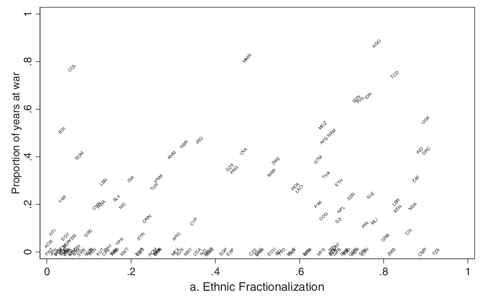
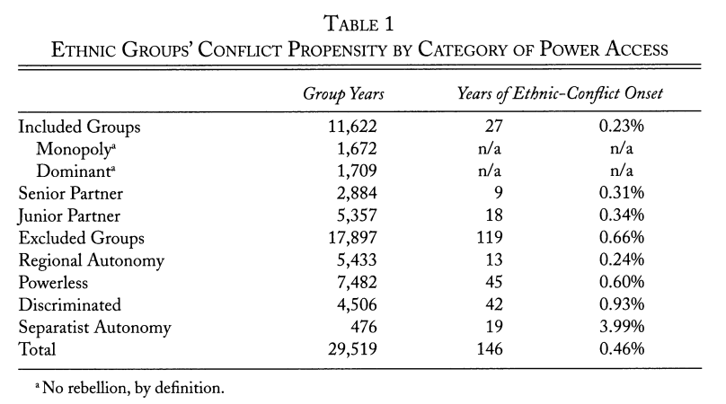
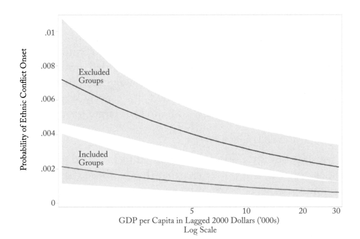
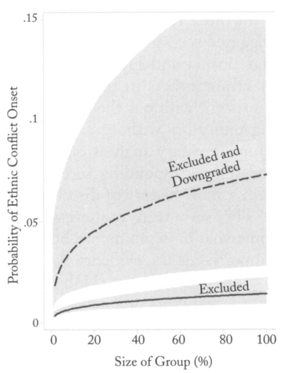
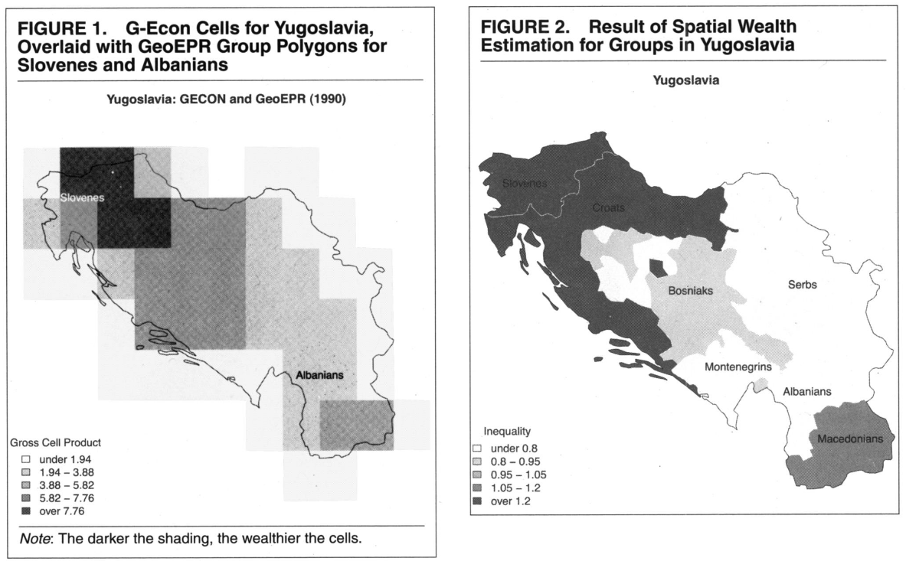
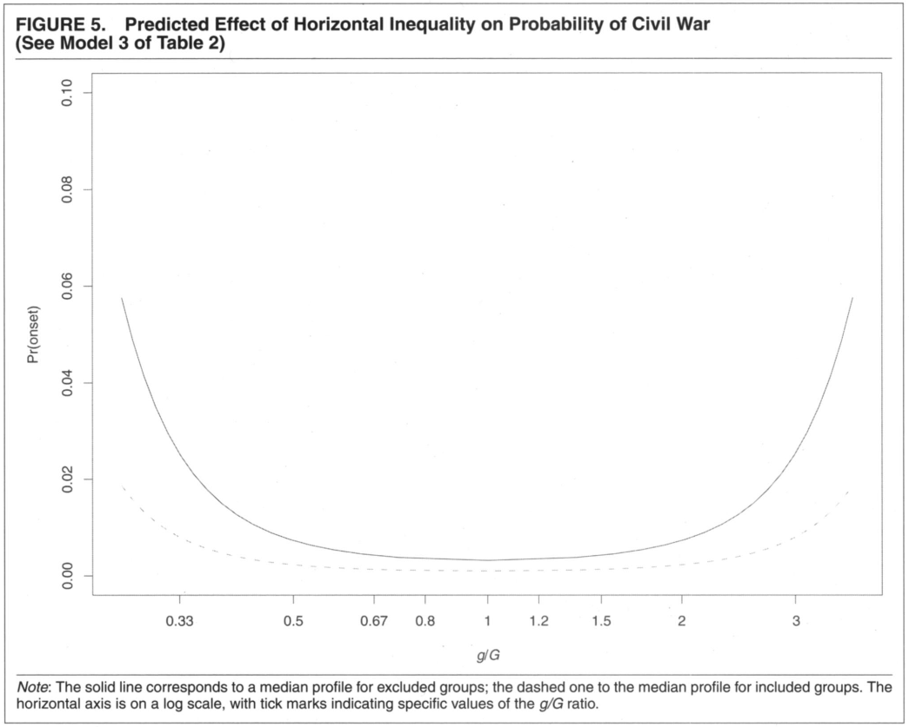

```{r setup, include=FALSE}
knitr::opts_chunk$set(echo = FALSE)
require(knitr)
require(kableExtra)
require(magrittr)
```


# Ethnicity and Conflict

## Outline

- Recap: ethnic diversity unrelated to conflict?
- *How* might ethnicity be related to conflict?
- *How* to measure ethnicity?

# Recap:


## Ethnic Diversity and Civil War?

Fearon and Laitin (2003) find **no relationship** between ethnic diversity and conflict... 



## Fearon and Laitin (2003)

### Correlates of Civil War:

$1.$ Ethnic diversity: **no relationship**
    - measured as ELF
    
$2.$ Linguistic/religious discrimination: **no relationship**

$3.$ GDP per capita: **negative relationship**

$4.$ Population size: **positive relationship**

$5.$ Newly Independent: **positive relationship**

$6.$ Mountainous terrain: **positive relationship**

## Fearon and Laitin (2003)

**Implications: Theory**

- Suggests that *motive* matters less than *opportunity* in civil wars
- Ethnic diversity *as such* does not induce civil war

But...

- Theory suggests ethnic diversity produces conflict under **specific conditions**?
    - ethnic status differences, ethnicity more salient, more resources at stake, ethnic extremists
- Does Fearon and Laitin's measurement address these points?

## Measuring Diversity

### "Ethno-linguistic fractionalization": "ELF"

### $$ELF = 1 - \sum_{i=1}^{n} s_i^2$$ 

Where $s_i$ is fraction of population for group $i \in \lbrace 1 \ldots n \rbrace$

Interpret as: probability that any two random individuals belong to different ethnic groups

## Measuring Diversity: ELF

ELF treats these two situations as **identical**

- Country A: Group 1 50%, Group 2 50%
    - $ELF = 0.5$
- Country B: Group 1 66.6%, Group 2 16.6%, Group 3 16.6%
    - $ELF = 0.5$

## Measuring Diversity: ELF

- Ignores **where** ethnic groups are in space
    - mixed? living in different regions?
- Ignores the **content** of the ethnic boundary
    - are there power disparities? institutional separation?
- Permits only **one dimension** of ethnicity
    - is this dimension  **activated** or even **operative**?
- Assumes stability over time

# How is Ethnicity Linked to Civil War?

## Ethnicity and Civil War

50–75% of civil wars in the post 1945 period involve ethnicity

- ethnic civil wars are longer; more deadly (Doyle and Sambanis 2006)

If ethnic diversity *as such* does not lead to civil war, why do civil wars involving ethnicity start?

## Cederman et al (2010)

Address why ethnic civil wars occur. Measurement differs in key ways from Fearon and Laitin:

Measuring **Conflict**:

- Examine **only** conflicts coded as "ethnonationalist"
- based on ethnic aims of armed groups, structure of alliances, recruitment patterns of armed groups

## Cederman et al (2010)

Measuring **Ethnicity**:

- move away from "diversity" as such
- Ethnic Power Relations database
    - data on $>800$ "politically relevant ethnic groups": **activated** identities
    - indicates level of group access to power at national level: **power/status disparity**
    - geographic location of ethnic population within state
    - politically relevant groups and power/status change over time


## Cederman et al (2010)

**Research Question**:

comparing **ethnic groups** (not countries), similar in terms of group size and country size, GDP per capita, and past conflict...

$1.$ Are ethnic groups that are **excluded** from political power more likely to be involved in civil war?

$2.$ Are ethnic groups that experience a **fall from political power** more likely to be involved in civil war?

## Cederman et al (2010)



## Cederman et al (2010)



## Cederman et al (2010)



## Cederman et al (2010)

**Research Question**:

$1.$ Are ethnic groups that are **excluded** from political power more likely to be involved in civil war?: **YES**

$2.$ Are ethnic groups that experience a **fall from political power** more likely to be involved in civil war?: **YES**

In line with Horowitz/Sambanis and Shayo: shifts in ethnic group power and status lead to ethnic civil war.

## Cederman et al (2011)

In another paper, Cederman, Weidmann, and Gleditsch ask

**Research Question**: Do economic inequalities between groups drive ethnic civil war?

$1.$ Are groups that experience greater economic inequality more likely to be involved in civil war?

$2.$ Are groups that experience both political exclusion and economic inequality more likely to be involved in civil war?

$3.$ Are groups that are particularly wealthy or particularly poor relative to other groups more likely to be involved in civil war?

## Cederman et al (2011)



$\mathrm{Inequality} = [log(g/G)]^2$

where $g$ is is the GDP per capita of the group; $G$ is the average GDP per capita of all groups.

## Cederman et al (2011)




## Cederman et al (2011)

**Research Question**:

$1.$ Are groups that experience greater economic inequality more likely to be involved in civil war?: **YES**

$2.$ Are groups that experience both political exclusion and economic inequality more likely to be involved in civil war? **YES**

$3.$ Are groups that are particularly wealthy or particularly poor relative to other groups more likely to be involved in civil war? **YES**

## Cederman et al (2013)

Cederman, Gleditsch, and Hug investigate:

**Research Question**:

$1.$ Do recent elections induce ethnic civil war?

>- On average, more likely to be more ethnic civil war after elections, but not significant

$2.$ Do recent competitive/non-competitive elections induce ethnic civil war?

>- On average, ethnic war more likely to follow competitive elections. Only a significant difference for wars over territory (secession/autonomy)

## Conclusions:

1. ELF has limitations in matching our theories of ethnic conflict
2. Ethnic diversity as such does not produce conflict
3. Political mobilization of ethnic groups can produce conflict when...
    - there are power / status differences between groups
    - elections are more recent (maybe)
    
 Evidence of psychological (maybe instrumental?) logic leading to ethnic civil war.