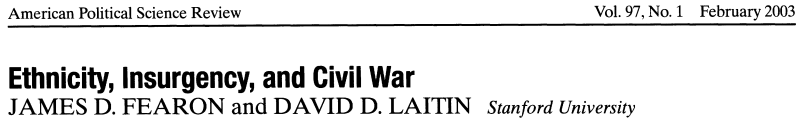

```{r setup, include=FALSE}
knitr::opts_chunk$set(echo = FALSE)
require(knitr)
require(kableExtra)
require(magrittr)
```


# Ethnicity and Conflict

## Outline

- Ethnic diversity and conflict?
- Theories of ethnic conflict
- Are diverse societies prone to conflict?

- Papers

# Puzzle:

## Stop and think

### **What are major civil conflicts that have happened around the world**

>- Ukraine, Syria, Iraq, Yemen, Sudan, Ethiopia
>- Many conflicts have ethnic dimension

---

<iframe width="560" height="315" src="https://www.youtube.com/embed/qGoKFk-P99w" title="YouTube video player" frameborder="0" allow="accelerometer; autoplay; clipboard-write; encrypted-media; gyroscope; picture-in-picture" allowfullscreen></iframe>

## Raises the question:

**Does ethnic diversity in a country increase the likelihood of conflict?**

<br>

**Is there something about ethnicity that makes conflict more likely?**

# Theorizing<br>Ethnicity and Conflict

## Modernization

Many variations, with some differences:

**modernization** of economy and government creates **new goods and services**.

- but these new opportunities are limited, often unevenly distributed
- ethnicity makes it easy to organize to compete for goods
- competition produces winners/losers $\to$ conflict

(Bates 1983, Horowitz 1985, pp 99-105)

>- Horowitz asks: How much "modernization"?

## Economic Competition

Ethnicity may produce conflict because either:

- ethnic groups compete over limited employment opportunities
- ethnic groups occupy different segments of the market (laborers vs. traders)
- conflict of economic interests drives ethnic groups into conflict

>- But, if this is the case, why would ethnicity produce more conflict?

Horowtiz  (pp 105-109)

## Ethnic Status Competition:

Conflict can be the result of ethnic groups seeking to raise their relative status:

- the material and cultural status of ethnic groups the result of colonial governments
- "backward" (lower status) groups seek to improve status vis-a-vis "advanced" groups
    - seek special protections, separation
    - new status dimensions (legitimacy of groups)
    - fears of "extinction"
- groups seek political power as a form of status/means to status $\to$ conflict

Horowitz (pp. 141-184)

## Ethnicity and Conflict

Different explanations for why ethnicity may be linked to conflict:

- not all equally plausible
- all imply that, on average, ethnically diverse societies should be more likely to experience conflict

# Testing<br>Ethnicity and Conflict

## Fearon and Laitin (2003)



First major attempt to answer:

- Is ethnic diversity actually related to civil conflict?
- What other attributes of countries are actually related to civil conflict?

Examine 161 countries between 1945 and 1999

## Measuring Ethnic Diversity

Think about how we've defined ethnicity in previous weeks...

Discuss with your neighbors:

If we want to *compare countries around the world*... how might we measure ethnic diversity?

think about... 

- what kinds of data can we use?
- how should we combine that data to reflect "diversity"
- is this comparable across countries?

## Fearon and Laitin (2003)

Comparing countries with differing levels of ethnic diversity, they find that...

>- there is no relationship between ethnic diversity and civil war
>- Surprised?

## Fearon and Laitin (2003)

### Correlates of Civil War:

1. Ethnic diversity: **no relationship**
    - measured as ELF, as size of largest group, presence of majority with large minority
2. Linguistic/religious discriination: **no relationship**
3. GDP per capita: **negative relationship**
4. Population size: **positive relationship**
5. Mountainous terrain: **positive relationship**

## Ethnicity and Conflict?

Two ways of responding to Fearon and Laitin's findings:

1. **Measurement**: Does the measurement of ethnic diversity make sense?

2. **Theory**: Ethnic diversity *as such* does not lead to conflict. Particular types of ethnic configurations produce conflict

## Measuring Diversity

### "Ethno-linguistic fractionalization": "ELF"

### $$ELF = 1 - \sum_{i=1}^{n} s_i^2$$ 

Where $s_i$ is fraction of population for group $i \in \lbrace 1 \ldots n \rbrace$

 
Interpret as: probability that any two random individuals belong to different ethnic groups

## Measuring Diversity

Measure size $s$ of ethnic groups $1 \ldots n$ using 

1. *Atlas Narodov Mira*: Soviet anthropological text from 1964 
    - lists ethnic groups in each country and their size
2. Encyclopedia Britannica
3. CIA World Factbook


**Can you think of any potential objections to this approach?**

## Measuring Diversity

- Country A: Group 1 50%, Group 2 50%
    - $ELF = 0.5$
- Country B: Group 1 66.6%, Group 2 16.6%, Group 3 16.6%
    - $ELF = 0.5$

- Ignores where ethnic groups are in space, the content of the ethnic boundary
- Permits only **one dimension** of ethnicity

## Measuring Diversity

- Which ethnic categories are measured?
- Are ethnic categories and relative population stable over time?
- Soviet anthropologists weren't always right:
    - sometimes used ethnic categories that were not operative
    - In Rwanda, Hutus and Tutsis coded as one ethnic group.

## Theorizing Conflict

Finding that ethnic diversity does not correlate with conflict does not imply no link between ethnicity and conflict

Instead of diversity as such, what might matter is:

- relative status of activated ethnic categories
- how ethnic categories are institutionalized by the state (e.g. census)
- how ethnic diversity interacts with constitutional rules
- how the salience of ethnic categories change


# Papers

## Papers:

Overall, well done! Mean of 77.7% (B+)

- Students should make sure they are actually answering the prompts.
- Clearer and more decisive language in the thesis.
- Greater consideration and rebuttal of counterarguments.
- Avoid directly quoting the readings too much (Paraphrase and cite)
- Avoid using overcomplicated language in general. Stick with concise and clear writing/sentence structure.

