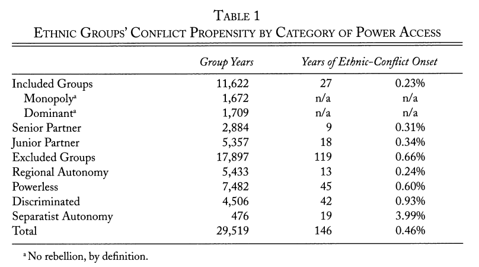
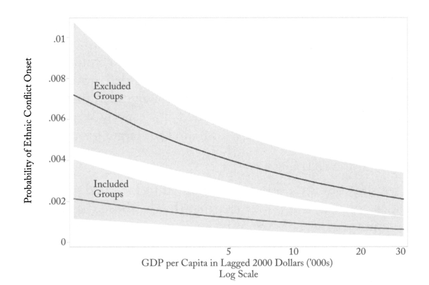
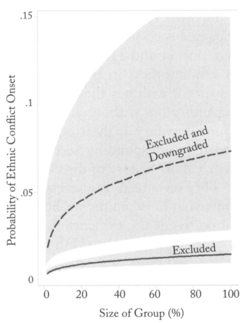

```{r setup, include=FALSE}
knitr::opts_chunk$set(echo = FALSE)
require(knitr)
require(kableExtra)
require(magrittr)
```


# Ethnicity and Conflict

## Outline

- admin
- Recap: ethnic diversity unrelated to conflict
- *How* might ethnicity be related to conflict?
- *How* to measure ethnicity?

# Puzzle:

## Ethnic Diversity and Conflict?

Fearon and Laitin find no relationship between ethnic diversity and conflict... 


---

**YET**

- 50–75% of civil wars in the post 1945 period involve ethnicity; are longer; more deadly (Doyle and Sambanis 2006)


- even other measures (e.g. ethnic polarization or having a few large groups), have noisy relationship with conflict.


## Ethnic Diversity and Conflict?

### **Two ways of responding**

1. Theory linking ethnic diversity to conflict is too simple; 

- which groups are activated?
- ethnic boundaries are different in places with similar "diversity"
- there may be differences within groups

2. Better measures of ethnicity: diversity is not the only way ethnicity might matter for conflict

- what are 'activated' ethnic categories?
- what is the content of ethnic boundaries?

# Theorizing Ethnic Conflict

## Ethnic Status Competition:

Conflict can be the result of ethnic groups seeking to raise their relative status:

- the material and cultural status of ethnic groups the result of colonial governments
- "backward" (lower status) groups seek to improve status vis-a-vis "advanced" groups
    - seek special protections, separation
    - new status dimensions (legitimacy of groups)
    - fears of "extinction"
- groups seek political power as a form of status/means to status $\to$ conflict

Horowitz (pp. 141-184)

## Ethnic Status Competition:

Fearon and Laitin presume that, if competition over ethnic status is correct, diversity $\xrightarrow{leads \ to}$ conflict

- Sambanis and Shayo (2013) ask: is this really the prediction from this theory?
- To answer this, translate Horowitz's argument to a formal mathematical model

## Why formalize?

What is it?

- assumptions (informed by prior research) about the relevant actors, the choices they can make, the information and calculations that inform those decisions
- translate these to a mathematical model
- solve for how actors behave under different conditions (find "equilibria")

Why?

- Derive predictions from  the model based on different conditions
- compare predictions with reality. (but compare with natural sciences)

## Sambanis and Shayo

Formalize the logic outlined by Horowitz:

- Individuals choose to identify with their ethnic group $G$ or with the nation $N$

    - set of relevant ethnic categories fixed, membership rules fixed, choice of identification only
    - a function of the relative status of ethnic group $J$ or $N$, perceived similarity ('distance') to members of $J$ or $N$

- Groups compete over resources that can allocated to benefit specific groups (could be money, political power, etc.)

- Informed by these conditions, individuals make decisions on whether and how much to "fight" for these resources


## Sambanis and Shayo

Implications of the model:

$1.$ There are **multiple equilibria**.

- even with status differences between ethnic groups, and people are "closer" to ethnic group than nation...
- history of peaceful relations can lead to stable peace, preference for national identity OR history of conflict can produce conflict

For example: Kenya vs. Tanzania.
- both highly diverse; but Tanzania has built strong national identity, equitable redistribution. Has less conflict than Kenya.

## Sambanis and Shayo

Implications of the model:

$2$. **Lower national status** leads to greater ethnic identification and ethnic conflict.

Example:

- Catalan separatism took off as Spain declined as international power (lower national status), regional economic growth increased in Catalonia (higher ethnic status)

## Sambanis and Shayo

Implications of the model:

$3$. Increase in the **salience** (distance between) of ethnic identities increases ethnic identification, conflict.

- linguistic differences associated with conflict; but can be reduced with schooling, assimilation
- short term changes in salience are possible:

    - Hindu nationalist processions, attempt to replace mosque with temple
    - Mexican revolution reduced salience of indigenous/criollo divide in favor of national identity

## Sambanis and Shayo

Implications of the model:

$4$. Increasing the share of resources that can be captured by a group increases ethnic identification.

Example:

- presence of natural resources (e.g. in Congo) permits ethnic armed groups to capture resources, leading to more conflict

## Sambanis and Shayo

Implications of the model:

$6$. "Ethnic extremists" with **sufficient organizational resources** can generate ethnic conflict even if large numbers in their ethnic community prefer national identification. 

Example

- While many Serbs/Croats in Yugoslavia voted against ethnic parties in 1990, Serban and Croat ultranationalists formed ethnic militias. Their violence pushed mdoerate voters to back ethnic mobilization.

## Sambanis and Shayo

**Key insights:**

Building on the insights of social identity theory and Horowitz...

-  ethnic diversity may or may not lead to conflict (multiple equilibria). Fearon and Laitin do not actually test this theory.
- despite psychological founation, structural factors matter: 

    - perceived status of national identity
    - the perceived salience of ethnic differences
    - whether institutions permit groups to capture national resources
    - the organizational/violence capabilities of ethnic entrepreneuers 


# Measuring Ethnicity

---

<iframe width="560" height="315" src="https://www.youtube.com/embed/hXtq2-SRQdg" title="YouTube video player" frameborder="0" allow="accelerometer; autoplay; clipboard-write; encrypted-media; gyroscope; picture-in-picture" allowfullscreen></iframe>

## Cederman et al (2010)

Similar to Horowitz, Sambanis and Shayo, argue that...

- Ethnic conflict more likely if ethnic groups are excluded from political power at the national level
- Ethnic conflict more likely if ethnic groups experience a **decline** in political power at the national level (think of Tigray example)

## Cederman et al (2010)

Measurement is very different from Fearon and Laitin:

- Ethnicity

    - Ethnic Power Relations database
    - "We classify as politically relevant if at least one political organization represents it in national politics or if its members face political discrimination"
    - What is group's access to political power in national government?

- Conflict

    - Examine only conflicts coded as "ethnonationalist"
    - based on ethnic aims of armed groups, structure of alliances, recruitment patterns

## Cederman et al (2010)

Analysis:

comparing **ethnic groups** (not countries)...

- do ethnic groups that are excluded from political power, experience loss in political power become more likely to become involved in a civil war?

## Cederman et al (2010)



## Cederman et al (2010)



## Cederman et al (2010)




## Conclusions:

1. Theory:

    - Ethnic diversty does not lead to conflict as such
    - Thinking through structural, psychological approaches to ethnicity show **when** ethnic conflict is more likely
    
2. Methods:

    - When we measure the relevant features of ethnicity, we can see relationship between particular ethnic structures and conflict:
    - e.g. census, exclusion from power