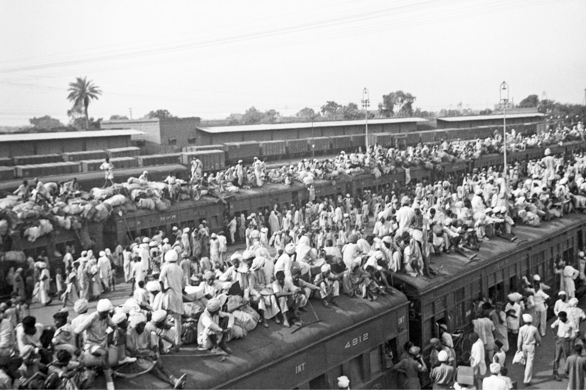
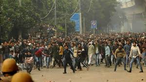
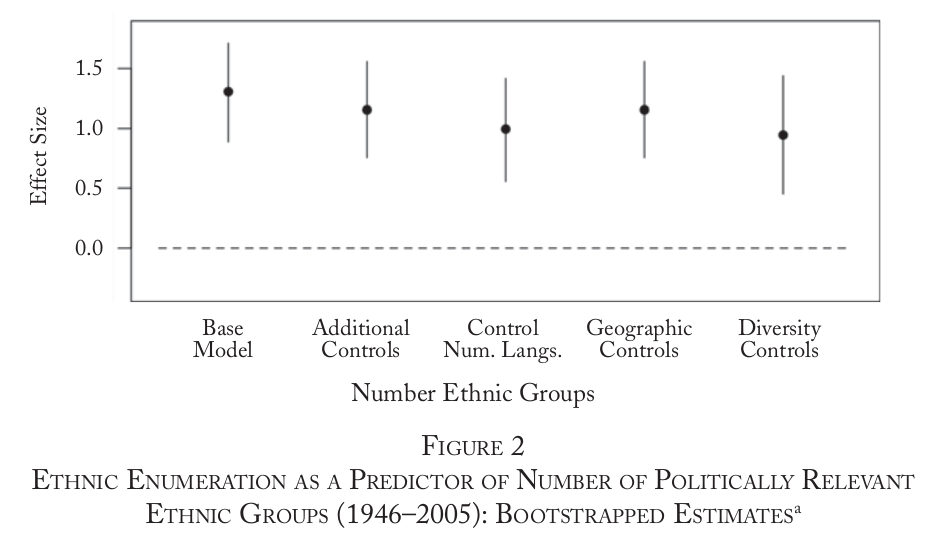
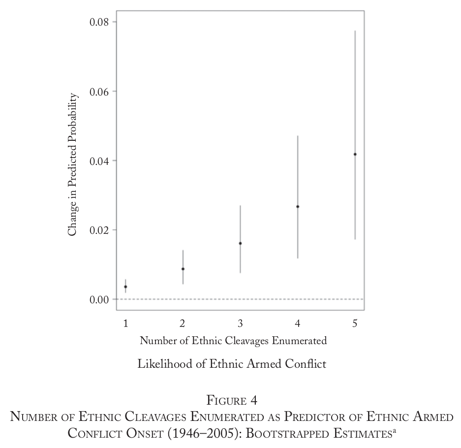
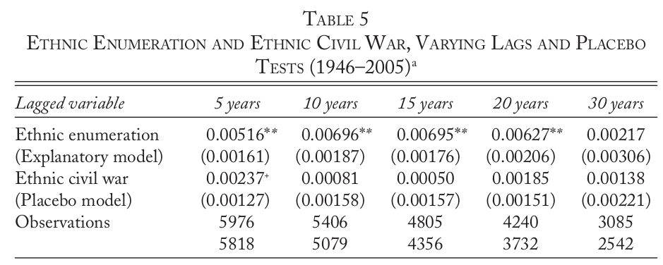

```{r setup, include=FALSE}
knitr::opts_chunk$set(echo = FALSE)
require(knitr)
require(kableExtra)
require(magrittr)
```


# Ethnic Structure and Conflict

## Outline

- Linking strategic, psychological, and structural explanations
- British Census in India
- Census enumeration and conflict: evidence

# Structural Questions

## Where does structure come in?

**Instrumental** theories of conflict:

- which ethnic groups become *operative* to mobilize around?
  
    - to create ethnic parties
    - to appeal to through ethnic out-bidding?
    

**Psychological** theories of conflict:

- which ethnic categories become operative (how salient is ethnicity)?
- what is the basis of status comparisons?
- what determines the relative status of groups?

## Where does structure come in?

**Instrumental theories** emphasize rational calculations of ethnic entrepreneurs...

**Psychological theories** emphasize individual psychological responses...

But these calculations, cognitive processes take place against a **structural** background.

## Where does structure come in?

What features of ethnic boundary (structures) do you think might ...


- amplify/intensify **instrumental** logic of ethnic conflict?
- amplify/intensify **psychological** logic of ethnic conflict?

# An Example

## South Asia: Communal Violence {.centered}



Partition: 1947

## South Asia: Communal Violence

Hindu-Muslim divide a continuing source of conflict, violence

- Major political parties divided on the issue
- Major riots in Delhi, 2020.
- Conflict over Citizenship Amendment Act, National Register of Citizens



## South Asia: Before Colonization

**Hindus**

- no unifying label was in widespread use
- texts, rituals, traditions highly varied
- disputes within "Hindus"

**Muslims**

- often labeled by their geographic origin, not by religion

**Syncretism**

- Hindus and Muslims shared saints, holy men, shrines, gods, festivals
- religious practices/taboos spread across the divide
- cross-cultural hybrid identities

## South Asia: Before Colonization

In this period...

- Muslim rulers broadly tolerant of different religious practices
- Hindu-Muslim violence rare; often not understood as about religion at the time

### **How did the Hindu-Muslim cleavage emerge?**

## South Asia: Colonization

One part of the story is the British Colonial Census of India

- First Census in 1871
- Recognized only the religious categories of: "Hindu", "Muslim", "Sikh", and "Christian" (later more added).
- Defined rules for applying these labels to colonial subjects

<br>

>- What kind of boundary change is use of census categories?
>- Why might this lead to conflict?

## South Asia: Colonization

### Census and Structure:

British colonial imagination imposed on diverse population:

> "'Hindu' means a non-Musalman native of India."

> "a quarter of the persons classed as Hindus denied the supremacy of the brahmans and the authority of the Vedas; more than half did not receive the mantras from a recognised Hindu guru, a quarter did not worship the great Hindu gods, and were not served by good Brahmans priests; a third were denied access to temple; a quarter caused pollution by touch, a seventh always buried their dead, while a half did not regard cremation as obligatory and two-fifths ate beef."

Lieberman and Singh (2017), p. 41

## South Asia: Colonization

### Census and Structure:

Census categories...

- are **institutional use**
- basis of **institutional separation**
- produced reports on size, geography, economic/political status of "groups" (**groupness**)
- created new knowledge about **power disparity**

## South Asia: Colonization

**Census and Psychology:**

- Social Identity Theory: people seek to maintain or promote their group status
- fear of reduced majority/permanent minority status $\to$ ethnic mobilization

When census showed smaller Hindu majority$^*$

- Hindu elites used census data to argue Hindus "a dying race" in their homeland

- Hindu political organizations:  reassert Hindu "traditions", purge hybrid religion, enforce "purity"

- Muslim elites feared status compared to new "Hindu" majority: lobbied to split up Hindu census category


## South Asia: Colonization

**Census and Strategy**

Ethnic "entrepreneurs" exploit the census to make political gains

- Muslim elites used Census data to lobby for special protections, institutions (separate electorates)
- BJP (Hindu political party) used 2011 census data to attack rival secular parties for ignoring growth rate of Muslims vs. Hindus

Ethnic parties use census figures/labels to make out-bidding/more extreme ethnic appeals to voters.

# Census and Conflict

## Lieberman and Singh (2017)

Building on these insights:

Does including more ethnic dimensions on the census induce greater ethnic conflict? 

Recognition and definition of identity categories by the **state**...

- **structurally**: possible to *imagine* groups, *see* economic/political disparities, be recognized by the state 
- **psychologically**: facilitates inter-group comparison, efforts to maintain/change relative group status
- **strategically**: creates opportunities for ethnic entrepreneuers

## Lieberman and Singh (2017)

### **Data**

**Census**

- tracked down 1333 census questionnaires for 156 countries between 1800 and 2005, nearly all of modern censuses

## Lieberman and Singh (2017)

### **Data**

- "Politically Relevant Ethnic Groups": expert coding of ethnic groups that are politically "activated" (from Ethnic Power Relations database)
- Ethnic Violence: ranging from riots to armed conflict
- Ethnic Civil War: armed conflicts coded as "Ethnic" (from Cederman et al)


## Lieberman and Singh (2017)

### **Research Design**

**Conditioning**:

Comparing countries that **differ in ethnic census** but **similar**$^*$ in:

- ethnic fractionalization, GDP per capita, population, colonial ruler, regime type, political exclusion of ethnic groups, oil production, terrain, year, time since independence

$^*$ using mathematical approximation

---

Countries with more ethnic cleavages enumerated in the census, compared to (otherwise similar) countries with fewer, have...

- **more** politically relevant ethnic groups




---

Countries with more ethnic cleavages enumerated in the census have...

- **more** ethnic armed conflicts




--- 


>- Are you convinced that census enumeration of ethnicity **causes** ethnic conflict? Why or why not?

## Lieberman and Singh (2017)

**Placebo**:

If prior ethnic conflict $\to$ enumerating more ethnic groups, then cannot conclude census $\xrightarrow{causes}$ conflict.

Does census enumeration of ethnic groups **predict earlier ethnic conflict**?





## Conclusion:

Takeaways:

- changes in ethnic boundary (structures) can intensify/inhibit instrumental and psychological pathways to ethnic conflict
- Institutional recognition of identities in the census is one example of this; decent empirical evidence

Three perspectives on ethnicity are complementary,  **not** either/or
