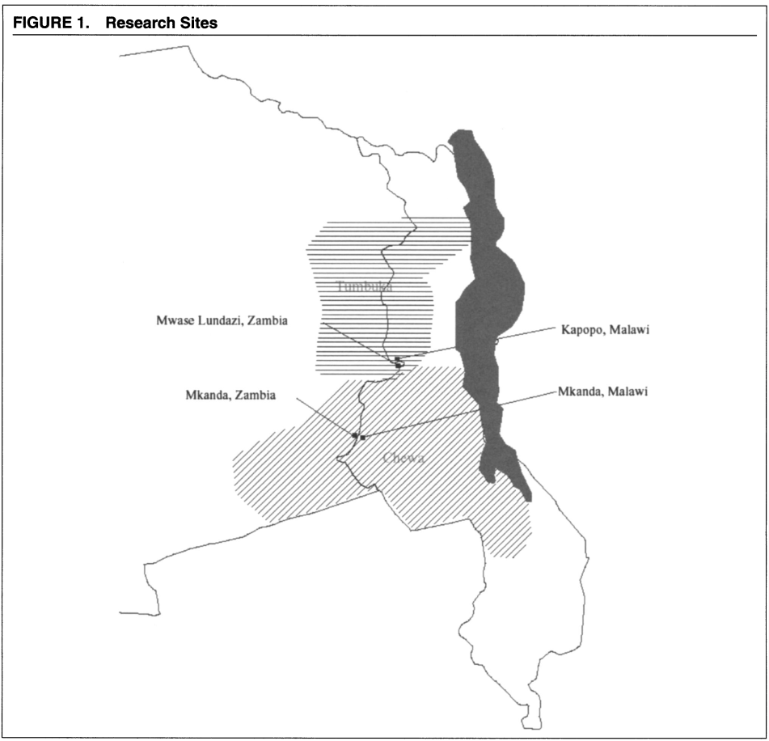
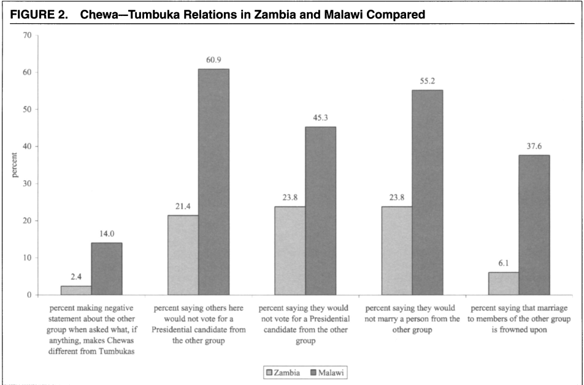
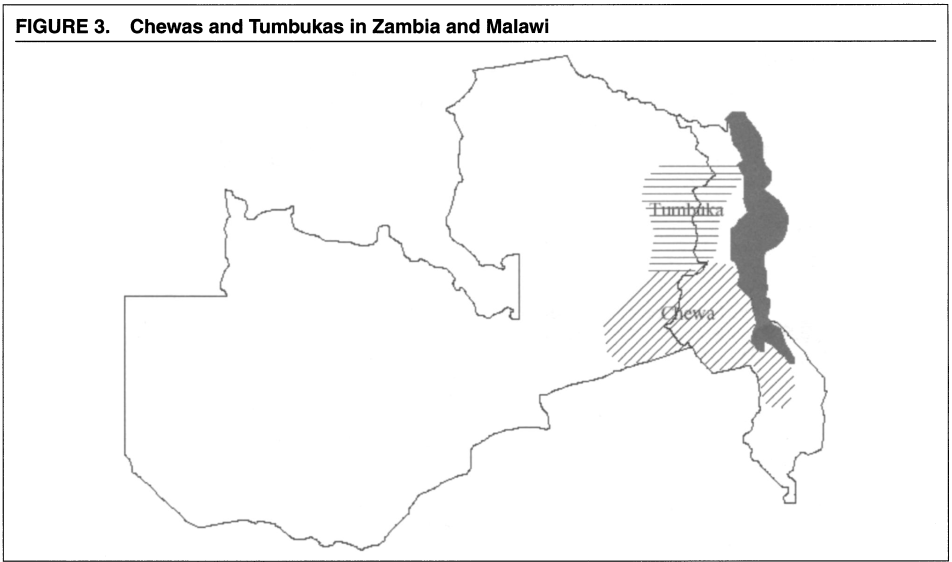
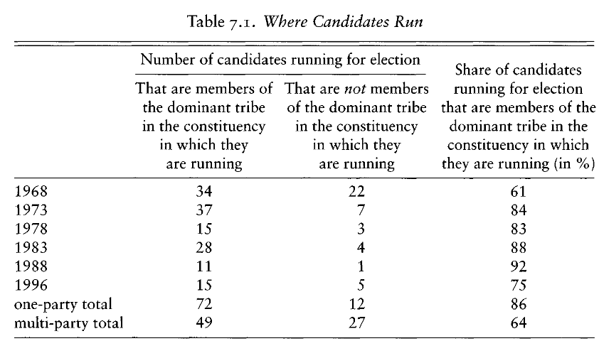

```{r setup, include=FALSE}
knitr::opts_chunk$set(echo = FALSE)
require(knitr)
require(kableExtra)
require(magrittr)
require(ggplot2)
require(data.table)
```


# Ethnicity and Conflict

## Outline

- How do institutions shape *which* groups are in conflict?
- Locus of electoral competition
- Parties 

## Institutions and Instrumentalism

Institutions: 

- sets of rules that dictate how people interact
- can be laws/constitutions, rules within organizations
- can be informal rules that people just know

They are the "rules of the game":

- just like in boardgames, card games, changing rules alter the rational strategies of self-interested players.

## Institutions and Instrumentalism

Horowitz's account of ethnic parties and ethnic outbidding:

- rational voters, rational parties respond to rule of electoral game, leading to extremism.
- changing electoral rules can make it rational for parties to pursue alternative 

## Other institutions?

But do other kinds of institutions other than voting rules matter?

# A puzzle:

## Chewas and Tumbukas {.centered}



Two ethnic groups divided by Zambia-Malawi border.

## Chewas and Tumbukas

In Malawi:

- Extensive hostility between the groups
- Express negative stereotypes of each other

In Zambia

- These groups get along amicably
- Often express that they are actually united, one people.

**Even when comparing villages just across the border from each other**

## Chewas and Tumbukas  {.centered}

Despite recognizing same cultural differences in both countries...



## Chewas and Tumbukas

### **Why do the same ethnic groups behave differently just across the border?**

# Political Institutions

## Administrative Boundaries

- If elites (and possibly voters) are rational, they seek to mobilize ethnic categories that generate **minimum winning coalitions**(Posner 2005)
- Jurisdictional boundaries (within which laws made, policies set, patronage given) determine ethnic demography (relative size of membership within different ethnic categories)

## Administrative Boundaries



## Administrative Boundaries

Posner (2004):

**Malawi**: Much smaller country...

- Chewas and Tumbukas make up a large share of the population. Large enough to win elections.
- President mobilized Chewas *as Chewas* during elections, expanded membership rules to include more people as "Chewa".

**Zambia**: Much larger country...

- Chewas and Tumbukas are small groups, not large enough to matter for national elections.
- Parties mobilize regional language groups: Chewas and Tumbukas mobilized together as "Easterners"

# Another Puzzle:

## Zambia

In 1960s, Language/Region was politically salient ethnic cleavage

Between the 1970s and 1980s, tribal divisions were more important.

In the 1990s, language/region became the more salient divide.

- Always used FPTP, SMD... can't be electoral rules
- Zambia hasn't changed in size... can't be administrative boundaries

## Party System

Between 1972 and 1990, Zambia was a one-party state. Elections were held within the ruling party.

- National level office (President, party control of parliament) not decided in competitive elections
- Only choice of who local MP would be was competitive $\to$ competition at the **local** level

Before 1972 and after 1990, Zambia had multi-party competition.

- Elections do choose national leadership (President *and* ruling party)
- Competition takes place at **national** level

## Party System

Changing the focus of competition from national to local changes the **relevant ethnic demography** (Posner 2005)

With one-party rule, only demography of constituency matters: 

- language does not form minimum winning coalition $\to$ tribe

With multi-party competition, national demography matters:

- tribal groups are too small to win, rational to mobilize by language/region 

## Party System



# Final Puzzle:

## BSP and SC Voters

Indian Constitutions recognized and created special protections for previously "untouchable" caste groups

- new category of "Scheduled Castes" or SCs

Despite these protections, by 1980s, growing number of educated and upwardly mobiles SCs faced discrimination, inadequate employment.

## BSP and SC Voters

Enter the Bahujan Samaj Party:

- Ethnic political party that sought SC votes and campaigned on policies to help out SC community

## BSP and SC Voters

Uttar Pradesh:

- Large province, population divided along religious, linguistic, and caste lines
- Large SC population (21%), with ~20% literate by 1981.
- Single member districts, first past the post elections, multi-party elections.

Karnataka:

- Medium province, population divided along religious, linguistic, and caste lines
- Large SC population (16%), with ~20% literate by 1981.
- Single member districts, first past the post elections, multi-party elections.

## Puzzle:

Despite similarities...

- In Uttar Pradesh, BSP won SC votes, able to lead state assembly
- In Karnataka, BSP could not even recruit candidates to run.

Why does the same ethnic party fail to win in two places?

- cannot be electoral rules, administrative boundaries, party system

## BSP and SC Voters

Chandra (2004)

Even if voters/elites want to distribute government resources to their group...

- will support whatever party able to do this best, *regardless of whether it is exclusively ethnic*
- parties best able to distribute to an ethnic group:

    - are able to win
    - and include more group members in leadership positions
    
## BSP and SC Voters

In Uttar Pradesh:

- Major non-ethnic parties (Congress) run by upper castes, would not permit SC leaders to take high ranking positions in the party
- BSP leadership mostly SC and could conceivably win elections.

In Karnataka:

- Major non-ethnic party (Congress) had open competition for leadership positions; SCs included in proportion to their population
- BSP could not offer a credible improvement for representing SC interests 

## BSP and SC Voters

Key takeaway:

Party institutions in ethnic and non-ethnic parties, along with ethnic demography, determine whether ethnic parties can successfully compete.

# Conclusion

## Institutions and Conflict:

Many formal/informal rules enable/constrain ethnic conflict:

- Constitution/electoral rules
- Administrative boundaries
- Party systems
- Internal party rules

Change the strategic benefits/costs to pursuing ethnic extremism or compromise.

But institutions can not easily be changed.

