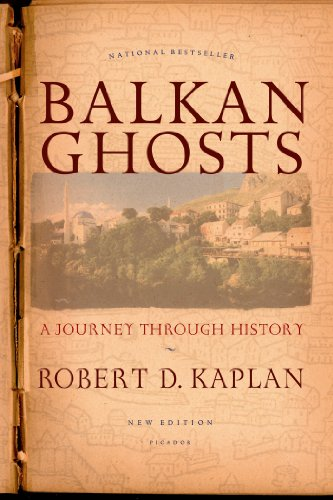

```{r setup, include=FALSE}
knitr::opts_chunk$set(echo = FALSE)
```


# 

## Today's Agenda

### 1. Course Expectations/Assignments

### 2. Course Policies

### 3. Questions

### 4. 

# Course Themes

## Learning Objectives:

Be able to provide answers to these questions:

- What is ethnicity/race? 
- Where do ethnic/racial groups come from?
- Why does ethnic conflict occur?
- Why does ethnic violence occur?

## Learning Objectives:

Be able to use three kinds of explanations for these questions:

- strategic/instrumental
- psychological
- structural

# Course Expectations

## Your grade

| Item             | Number | Fraction of Grade |
|------------------|--------|-------------------|
| Reading Responses | 10      | (10*2.5) 25%        |
| Short Papers | 3      | (3*15) 45%        |
| Final Assignment | 1      | 30%               |

## Reading Responses:

- Do 10 out of 13 weeks, by Monday evening
- On Canvas discussion board
- Ask question about the reading and/or draw an insight/connection from the reading; respond to another student
- Graded for effort: 100 you tried;, 70 if it shows minimal effort, 0 if nothing.
- Average best 9 out of 10

## Grading: Papers

### $\bullet$ **TA**: Viktoria Zlomanova

### $\bullet$ **Rubrics**

### $\bullet$ **Validation**

Assigned/Due Wednesdays

## Grading: Capstone Assignment

- Independent research on a case
- "Guided" research paper: specific questions you need to answer

## What you need to do:

### $\bullet$ **Attend lecture:**

- in-class discussion/activities
- slides are not enough
- no recordings (except for 2 Zoom lectures)

### $\bullet$ **Read**

- links to Week's readings on "Modules" tab
- links to reading response discussion forum

### $\bullet$ **Canvas**


## What I will do

### $\bullet$ **Slides**

- AFTER class.

### $\bullet$ **Office Hours**

- Wednesdays or by appointment on Zoom

### $\bullet$ **Speed**

# Course Policies

## Late Assignments:

### $\bullet$ **Scheduling Conflict**

- Need to know ASAP to get a concession

### $\bullet$ **Arts Advising**

- may give retroactive concessions

### $\bullet$ **Lateness**

- non-catastrophic deduction (0.5 points per day)

## Grade Appeals:

### **letter to TA, 48 hours after, written argument**

### **Grades can change $\Updownarrow$**


## Public Health

- Masks not required, but not a terrible idea
- Please don't come if you feel ill; I will follow same protocol

## Sensitive Material

- A sort of "trigger" warning

# 

## Why ethnic conflict?





## Why ethnic conflict?

### "**Ancient Hatreds** Thesis"

Contemporary ethnic conflicts are inevitable result of long-standing animosity and rivalry between distinct ethnic groups.

- institutions, policies (other than totalitarian repression) cannot mitigate conflict

## Ancient Hatreds

**ancient hatred is intrinsic/latent...**

> "Appropriately, this tract of land is where the tectonic plates of Africa, Asia, and Europe—plates shouldering peoples and religions that have historically been at odds—happen to collide."

> "Here the ethnic hatreds released by the decline of the Ottoman Empire first exploded"

> "the ardor of its hatreds — among Muslim, Orthodox, Catholic, and Jew; among Bulgar, Greek, Serb, and Turk — was abruptly, if temporarily, chilled by the advent of stern Communist regimes"

## Ancient Hatreds

Why is hatred latent?

**...because nationality/ethnicity is NATURAL**

## Ancient Hatreds

**ethnicity is the product of nature, and people have a natural attachment to them:**

> "But, as Kemal suspected, Enver and the Young Turks underestimated the force of the many long-repressed nationalisms in the Balkans."

> "Like Macedonia, these other nations are waking up from a Communist stupor to embrace dreams of lost glory"

## Ancient Hatreds

**and the natural self-expression of the nation is through the nation-state:**

> "Each nation harbors the dream that its borders will revert to those it boasted when the ancient empire it once possessed was at the zenith of expansion."

> "What the Bulgarians and the Serbs have always demanded ... is that with the retreat of the region’s longtime rulers, the Ottoman Turks, the frontiers recognized when they came in should be re-established, in spite of the lapse of five centuries."

> "While Serbia and Croatia are easily imaginable as nation-states Macedonia represents a political no-man’s land where Serbian, Albanian, Bulgarian, and Greek ambitions vie with one another and with a nascent Macedonian nationalist movement"

## Ancient Hatreds

**and because tendency to ethnicity is "natural", most evident in "backward" places:**

> "Zagreb  is  an urbane,  ethnically  uniform  community  on  the  plain,  while  Bosnia  is  a morass of ethnically mixed villages in the mountains. Bosnia is rural, isolated, and full of suspicions and hatreds to a degree that the sophisticated Croats of Zagreb could barely imagine."
 
> "Bosnia  did  have  one sophisticated  urban  center,  however:  Sarajevo,  where  Croats,  Serbs, Muslims,  and  Jews  had  traditionally  lived  together  in  reasonable  harmony. But the villages all around were full of savage hatreds"

## Ancient Hatreds

Conflict emerges because groups have natural claims over the same places that are incompatible.

While education, modernization, or oppressive regimes might keep ethnic conflict at bay, eventually the "cauldron" boils over.


## Essentialism

Ancient hatreds thesis relies on an **essentialist** conception of ethnicity:

membership in a descent-based group that

- shares some essential similarity in culture, values, beliefs
- that persists through time
- that is inherited at birth
- and is immutable/unchangable

e.g. "The Serbs", "The Croats", "The Bosnians" each have an essence, can be described as believing, thinking, doing as one


## Essentialism belied

Yet, at the very same time, Kaplan...

- names specific insurgent/ethnic nationalist organizations
- describes efforts at education, propaganda, contested history
- mentions the work of states to foment national attachments
- describes circumstances of broad political upheaval

## Essentialism

Essentialist conception of ethnicity is used by nationalist political actors.

In fact, Kaplan sounds like Serbian nationalists on why peaceful coexistence was not possible: "too  much  hatred,  centuries-old hatreds."

## Ancient Hatreds a Strawman

**This thesis more or less a strawman:**

- many of its premises (like essentialism) are wrong
- over-predicts ethnic conflict
- cannot explain timing of conflict, variation over time

**Why engage with it?**