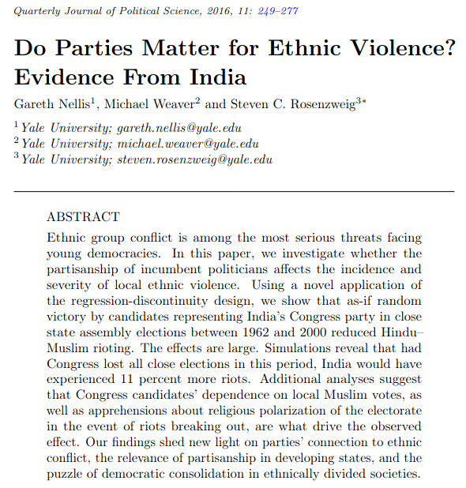
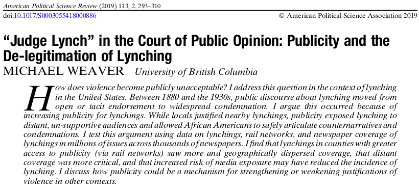
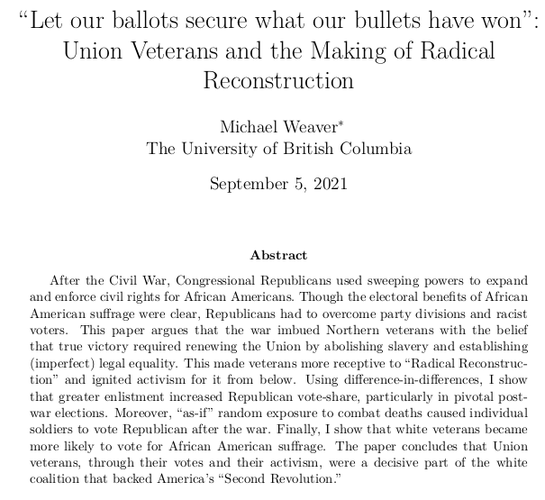

```{r setup, include=FALSE}
knitr::opts_chunk$set(echo = FALSE)
```

# Course Introduction

## Today's Agenda

### 1. Personal Introduction

### 2. Course Learning Objectives

### 3. Course Expectations/Assignments

### 4. Course Policies

# Personal Introduction

---



---

<blockquote class="twitter-tweet"><p lang="en" dir="ltr">1/8🧵🧵🧵🧵New paper w/<a href="https://twitter.com/GarethNellis?ref_src=twsrc%5Etfw">@GarethNellis</a>, Michael Weaver (<a href="https://twitter.com/CanIMeasureThat?ref_src=twsrc%5Etfw">@CanIMeasureThat</a>): Do mass religious events (like pilgrimages) increase support for religious parties? If so, how?? 🧵🧵🧵🧵 We explore the impact of India’s Kumbh Mela on voting for Hindu nationalists, 1951-2019</p>&mdash; Siddhartha (@BaralSiddhartha) <a href="https://twitter.com/BaralSiddhartha/status/1407408678030909440?ref_src=twsrc%5Etfw">June 22, 2021</a></blockquote> <script async src="https://platform.twitter.com/widgets.js" charset="utf-8"></script> 

---



---




---

### My Approach

- Histor#### Methods

ical cases
- Rigorous statistical analysis
- "Big data"

- How is#### Questions

 violence used to produce ethnicity/race?
- How is media/discourse used to enable/stop violence?
- What are the political consequences of violence?

# Course Learning Objectives

## Learning Objectives: Academic

- What is ethnicity/race? 
- Where do ethnic/racial groups come from?
- Why ethnic conflict? Is it different than other political conflicts, and why?
- Why does ethnic violence occur?

# Course Expectations

## Your grade

| Item             | Number | Fraction of Grade |
|------------------|--------|-------------------|
| Reading Responses | 10      | (10*2.5) 25%        |
| Short Papers | 3      | (3*15) 45%        |
| Final Assignment | 1      | 30%               |

## Reading Responses:

- Do 10 out of 12 weeks
- On Canvas discussion board
- Describe key idea/insight from reading(s) and connect it to (another course, course reading, personal experience, real world example, etc.)
- Graded for effort: 100 you tried;, 71 if it shows minimal effort, 0 if nothing.
- Best 7 out of 10

## Grading: Papers

### $\bullet$ **One TA**

### $\bullet$ **Rubrics**

### $\bullet$ **Validation**

Due Wednesdays (poll)

## Grading: Capstone Assignment

- Some independent research
- A sort of "guided" paper: specific questions you need to answer

## What you need to do:

### $\bullet$ **Attend lecture:**

- plan for discussion/activities
- slides not enough

### $\bullet$ **Read**

- on "Modules" tab

### $\b- reading responses
ullet$ **Canvas**

## What I will do:

### $\bullet$ **Slides**

- AFTER class.

### $\bullet$ **Lecture Notes**

- list of students willing to share

### $\bullet$ **Office Hours**

- Wednesdays or by appointment on Zoom

### $\bullet$ **Speed**


# Course Policies

## Late Assignments:

### $\bullet$ **Scheduling Conflict**

- Need to know ASAP to get a concession

### $\bullet$ **Arts Advising**

- may give retroactive concessions

### $\bullet$ **Lateness**

- non-catastrophic deduction

## Grade Appeals:

### **letter to TA, 48 hours after, written argument**

### **Grades can change $\Updownarrow$**


## Public Health

- Masks required, but concessions are possible
- Please don't come if you feel ill; I will follow same protocol
- Sharing notes, easy concessions/forgiving lateness policies.
- Asynchronous/online a possibility, but not preferred.

## Sensitive Material

- A sort of "trigger" warning

## Don't be "that guy"

<iframe width="560" height="315" src="https://www.youtube.com/embed/JBO7pphKTtU?start=38" title="YouTube video player" frameborder="0" allow="accelerometer; autoplay; clipboard-write; encrypted-media; gyroscope; picture-in-picture" allowfullscreen></iframe>

# Questions?


