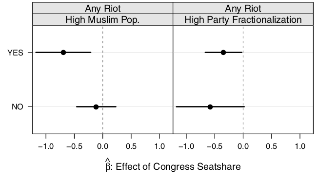

```{r setup, include=FALSE}
knitr::opts_chunk$set(echo = FALSE)
require(knitr)
require(kableExtra)
require(magrittr)
require(ggplot2)
require(data.table)
```

# Strategic Violence

## Outline

- Example: Muzaffarnagar Riot 
- Strategic ethnic violence
- Wilkinson (2004)

# An Example

---

<iframe width="560" height="315" src="https://www.youtube.com/embed/24D_xgSumLk?start=10" title="YouTube video player" frameborder="0" allow="accelerometer; autoplay; clipboard-write; encrypted-media; gyroscope; picture-in-picture" allowfullscreen></iframe>

---

<iframe width="560" height="315" src="https://www.youtube.com/embed/razLpILGsDQ?start=58" title="YouTube video player" frameborder="0" allow="accelerometer; autoplay; clipboard-write; encrypted-media; gyroscope; picture-in-picture" allowfullscreen></iframe>

## Muzaffarnagar Riot

**What factors seem important in explaining why this violence took place?**

# Strategic Ethnic Violence

## Strategic Ethnic Violence:

Fearon and Laitin (2000) identify different different strategic logics:

- "elite manipulation"
    - political elites encourage/foment ethnic violence for strategic reasons
- "on-the-ground"
    - ordinary people have incentives to participate in ethnic violence

## Elite Manipulation

Political elites may encourage violence for several reasons:

- Win Elections:
    - increase attractiveness of ethnic vs other parties
    - suppress/displace voters for rival parties
- Consolidate power:
    - shift balance of power *within* ethnic group
    - establish political dominance of one ethnic group 

Violence as a means to accomplish these goals (directly or *indirectly*)

# Elections and Violence

## Wilkinson (2004)

Theorizes two strategic logics for ethnic violence:

1. Electoral incentives create a **motive** to perpetrate violence

2. Electoral incentives shape the **opportunity** for violence (the use of state/police forces to limit violence.)

## Wilkinson (2004): Motive

**Why would political elites encourage ethnic violence?**

- ethnic parties use violence to mobilize and capture the votes of co-ethnics

    - ethnic groups may not be united behind ethnic parties 
    - ethnic parties have incentives to increase the salience of ethnic identity
    - provocative/controversial actions, processions
    - violence links physical safety to ethnic membership $\to$ salience.

- Violence may unify ethnic voters behind ethnic party $\to$ winning elections.

## Wilkinson (2004): Motive

If this is true, there are empirical implications:

- ethnic parties must have  **capability** to foment violence
- **ethnic** parties stand to gain from violence, should encourage it
- violence is more likely near elections, and when elections are **competitive** (close)
- violence should **actually affect voting**
- **non-ethnic** parties stand to lose, should stop violence 

## Evidence: Capability

What enables elites to foment/stop violence? In India...

- Brass (2004): "institutionalized riot networks"
    - patronage networks connecting low-level party officials, Hindu nationalist organizations, criminals, police officials
    - can be used even when *not holding office*

Berenschot (2011):

- "riot networks" are really just everyday political networks
    - Political influence over capacities for violence (police/crime), e.g. Delhi Riots
    - political parties use these networks differently

## Evidence: Capability

Berenschot (2011):

In Ahmedabad (Gujarat) during 2002 riots:

- Mixed Dalit-Muslim neighborhood with BJP (Hindu party) patronage network saw mobilization for violence
- Mixed Dalit-Muslim neighborhood with Congress (multi-ethnic party) patronage network saw mobilization to defuse violence

## Evidence:

Key empirical implications:

- ethnic parties must have  **capability** to foment violence (**yes**)
- ethnic parties stand to gain from violence, should encourage it (**anectdotally**)
- violence is more likely near elections, and when elections are competitive (close)
- violence should actually affect voting
- non-ethnic parties stand to lose, should stop violence 

## Evidence: Competition

Wilkinson (2004) looks at riots in **towns** in Uttar Pradesh

- towns are more likely to experience riots when elections are less than 6 months away 
- towns in which the last MLA election was won by $<5\%$ more likely to experience riots

>- Is this evidence that parties use violence strategically? (Are there other explanations for this pattern?)

## Evidence: Competition?

Heightened ethnic tensions for other reasons (e.g., nationalist propaganda, prior violence, etc.)

- may cause elections to be competitive
- may make additional riots more likely

Hard to know that electoral competition **causes** riots to be more likely.


## Evidence:

Key empirical implications:

- ethnic parties must have  **capability** to foment violence (**yes**)
- ethnic parties stand to gain from violence, should encourage it (**anectdotally**)
- violence is more likely near elections, and when elections are competitive (close) (**maybe**)
- violence should actually affect voting
- non-ethnic parties stand to lose, should stop violence 

## Evidence: Electoral Gains

How would we know whether riots benefit ethnic / hurt non-ethnic parties at the polls?

>- comparing places with riots to places without?
>- comparing election results in a place before/after riots?
>- comparing changes in election results in places with riots against places without

## Evidence: Electoral Gains

Nellis et al (2016) find that riot in the year prior to an election...

- **decreases** votes for Congress Party  (multi-ethnic) at the next election, compared to places without riot
- **increases** votes for BJP (Hindu ethnic party) at the next election, compared to places without riot

## Evidence: Electoral Gains

Iyer and Shrivastava (2018) exploit "as-if random" riots to find the effect of riots on BJP (ethnic party) voteshare:

- look at riots occurring when Hindu festivals fall on Friday (Muslim holy day)
- these occur due to **arbitrary** overlap in religious calendars, inducing **precipitating events**
- find that riots **increase** BJP voteshare

## Evidence:

Key empirical implications:

- ethnic parties must have  **capability** to foment violence (**yes**)
- ethnic parties stand to gain from violence, should encourage it (**anectdotally**)
- violence is more likely near elections, and when elections are competitive (close) (**maybe**)
- violence should actually affect voting (**yes**)
- non-ethnic parties stand to lose, should stop violence 

## Wilkinson (2004): Opportunity

People with control over state/police/military forces have much stronger capacity to **stop** violence.

- e.g., arresting/shooting rioters likely to bring a halt to violence.
- Are there strategic incentives for governments to **stop** or **permit** violence to continue?

## Gujarat (2002)

In late February 2002, a train carrying Hindu nationalists home to Gujarat from Ayodhya$^*$ caught fire, 58 people died

- the cause of fire is disputed, but allegations that Muslims had set fire to the train
-  Hindu nationalists *across India* held demonstrations, processions, or attacks against minorities during this period, explicitly linked to the violence in Gujarat.

---

Confrontations across India (see squares)


---

But... major riots (circles) limited to Gujarat 


## Wilkinson (2004)

Government in Gujarat did not stop the riots. BJP (Narendra Modi) government:

- transferred officials who prevented riots/arrested Hindu militants
- delayed calling the army
- punished people filing police reports
- instructed officials to not take action to prevent violence

## Wilkinson (2004)

in other Indian states:

- state governments moved swiftly to quash conflict 
- few riots; places with deaths *entirely* due to police firing on rioters.

**Why did Gujarat permit riots to occur while other states did not?**

## Wilkinson (2004)

Government strategy dictated by elections: will only **stop violence** if they directly or indirectly **depend on votes** of people **targeted by the riots**

This can happen under two sets of conditions:

1. When many parties compete successfully, minority group voters can determine who wins. Permitting riots that target this group may cost **any** ruling party victory at the next election.

2. When only a few parties are competitive, only parties that need the support of minority voters will stop riots against that group (non-ethnic parties stop violence; ethnic parties do not).

---


---


## Evidence: Effective Parties

- States with **many** competitive parties protected Muslims
    - even in Orissa, Kerala, BJP led coalition stopped riots.
- States with **few** competitive parties yet had ruling coalitions dependent on Muslim voters stopped riots.
- Only in Gujarat was there **few** competitive parties, ruling party did not need Muslim votes

## Evidence: Effective Parties

This logic appears to hold more generally.

Examining Hindu-Muslim riots by month in Indian states between 1961-1995...

- when an Indian state has greater electoral competition (more competitive parties), making Muslims more pivotal, they have fewer riots
- this pattern holds, even when other attributes of the state/month are held constant

## Evidence: Do non-ethnic parties stop violence?

Nellis et al (2016)

Indian National Congress party historically depended on Muslim voters. As a non-ethnic party, Congress stood to lose from riots.

Does electing a Congress MLA cause a constituency to have fewer riots?

- when the non-ethnic party has both **motive** and **opportunity**, does it work to inhibit ethnic violence?

## Evidence: Do non-ethnic parties stop violence?

How would we know whether Congress MLAs **stop riots**?

>- compare places with/without Congress MLAs?
>- could there be bias in this comparison?

## Evidence: Do non-ethnic parties stop violence?

Nellis et al (2016) focus on places with **random** exposure to Congress MLA:

- Compare constituencies where Congress **barely won** (by $<1\%$) to where Congress **barely lost** (by $<1\%$) 
- like an experiment, with **treatment** (Congress MLA) and **control** (Non-Congress MLA)
- No significant differences between constituencies where Congress won vs lost close elections.

## Evidence: Do non-ethnic parties stop violence?


## Evidence: Do non-ethnic parties stop violence?



## Evidence:

Key empirical implications:

- ethnic parties must have  **capability** to foment violence (**yes**)
- ethnic parties stand to gain from violence, should encourage it (**anectdotally**)
- violence is more likely near elections, and when elections are competitive (close) (**maybe**)
- violence should actually affect voting (**yes**)
- non-ethnic parties stand to lose, should stop violence (**yes**)

# Conclusion

## Conclusion

Ethnic political parties have electoral incentives to **foment** ethnic violence or **permit** it to happen:

