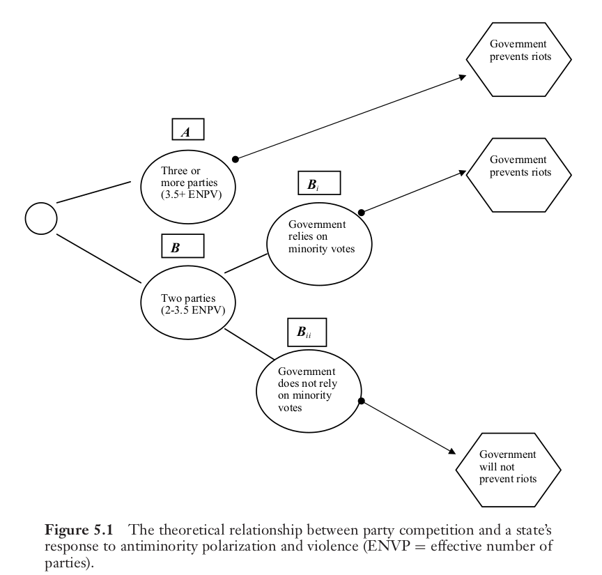
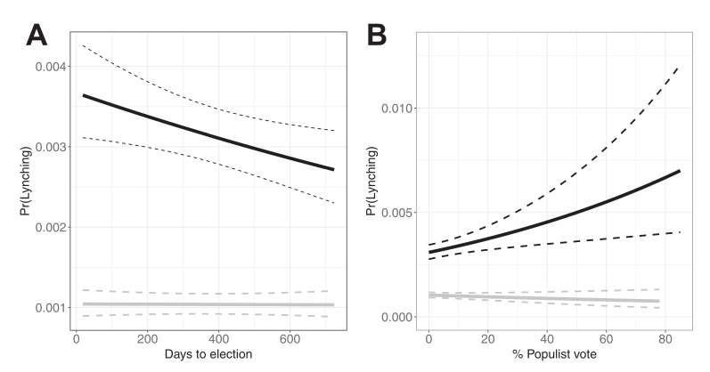

```{r setup, include=FALSE}
knitr::opts_chunk$set(echo = FALSE)
require(knitr)
require(kableExtra)
require(magrittr)
require(ggplot2)
require(data.table)
```

# Strategic Violence

## Outline

- Recap
- Electoral Violence
- Power Consolidation

## Strategic Ethnic Violence:

Fearon and Laitin (2000) identify different different strategic logics:

- "elite manipulation"
    - political elites encourage/foment ethnic violence for strategic reasons
- "on-the-ground"
    - ordinary people have incentives to participate in ethnic violence

## Elite Manipulation

Political elites may encourage violence for several reasons:

- Win Elections:
    - increase attractiveness of ethnic vs other parties
    - suppress/displace voters for rival parties
- Consolidate power:
    - shift balance of power *within* ethnic group
    - establish political dominance of one ethnic group 

Violence as a means to accomplish these goals (directly or *indirectly*)

## Wilkinson (2004)

Theorizes two strategic logics for ethnic violence:

1. Electoral incentives create a **motive** to perpetrate violence

2. Electoral incentives shape the **opportunity** for violence (the use of state/police forces to limit violence.)

## Evidence:

Key empirical implications:

- ethnic parties must have  **capability** to foment violence (**yes**)
- ethnic parties stand to gain from violence, should encourage it (**anectdotally**)
- violence is more likely near elections, and when elections are competitive (close) (**maybe**)
- violence should actually affect voting (**yes**)
- non-ethnic parties stand to lose, should stop violence 

## Wilkinson (2004): Opportunity

People with control over state/police/military forces have much stronger capacity to **stop** violence.

- e.g., arresting/shooting rioters likely to bring a halt to violence.
- Are there strategic incentives for governments to **stop** or **permit** violence to continue?

---

Confrontations across India in 2002 (squares), but major riots (dark circles) limited to Gujarat 


## Wilkinson (2004)

**Why did Gujarat permit riots to occur while other states did not?**

## Wilkinson (2004)

Government strategy dictated by elections: will only **stop violence** if they directly or indirectly **depend on votes** of people **targeted by the riots**

This can happen under two sets of conditions:

1. When many parties compete successfully, minority group voters can determine who wins. Permitting riots that target this group may cost **any** ruling party victory at the next election.

2. When only a few parties are competitive, only parties that need the support of minority voters will stop riots against that group (non-ethnic parties stop violence; ethnic parties do not).

---



---


## Evidence: Effective Parties

- States with **many** competitive parties protected Muslims
    - even in Orissa, Kerala, BJP led coalition stopped riots.
- States with **few** competitive parties but had ruling coalitions dependent on Muslim voters stopped riots.
- Only in Gujarat was there **few** competitive parties, ruling party did not need Muslim votes

## Evidence: Effective Parties

This logic appears to hold more generally.

Examining Hindu-Muslim riots by month in Indian states between 1961-1995...

- when an Indian state has greater electoral competition (more competitive parties), making Muslims more pivotal, they have fewer riots
- this pattern holds, even when other attributes of the state/month are held constant

## Evidence: Do non-ethnic parties stop violence?

Nellis et al (2016)

Indian National Congress party historically depended on Muslim voters. As a non-ethnic party, Congress stood to lose from riots.

Does electing a Congress MLA cause a constituency to have fewer riots?

- when the non-ethnic party has both **motive** and **opportunity**, does it work to inhibit ethnic violence?

## Evidence: Do non-ethnic parties stop violence?

How would we know whether electing Congress MLA **stops riots**?

>- compare places with/without Congress MLAs?
>- could there be bias in this comparison?

## Evidence: Do non-ethnic parties stop violence?

Nellis et al (2016) focus on places with **random** exposure to Congress MLA:

- Compare constituencies where Congress **barely won** (by $<1\%$) to where Congress **barely lost** (by $<1\%$) 
- like an experiment, with **treatment** (Congress MLA) and **control** (Non-Congress MLA)
- No significant differences between constituencies where Congress won vs lost close elections.

## Evidence: Do non-ethnic parties stop violence?


---

Congress Party responsive to presence of Muslim voters; not number of competing parties


## Evidence:

Key empirical implications:

- ethnic parties must have  **capability** to foment violence (**yes**)
- ethnic parties stand to gain from violence, should encourage it (**anectdotally**)
- violence is more likely near elections, and when elections are competitive (close) (**maybe**)
- violence should actually affect voting (**yes**)
- non-ethnic parties stand to lose, should stop violence (**yes**)

## Electoral Incentives:

Overall...

Elite incentives that create **motive** to perpetrate violence:

- some evidence that this is true, but limits to evidence on competition logic
- unresolved question: why does elite manipulation "work"? "Why do the followers follow?"

Elite incentives that encourage controlling **opportunity** for ethnic violence:

- strong evidence that parties that need minority votes stop violence against those groups

# Example

## Wilmington Race Riot

1898 Racial Violence in North Carolina:

- 21 years after "end" of Reconstruction, return of whites to power in the South

While you watch, compare this to electoral logic of ethnic violence we've discussed so far:

- how are motives for violence similar/different?
- how are opportunities for violence similar/different?
- how are techniques for violence similar/different?

---

<iframe width="560" height="315" src="https://www.youtube.com/embed/LVQomlXMeek" title="YouTube video player" frameborder="0" allow="accelerometer; autoplay; clipboard-write; encrypted-media; gyroscope; picture-in-picture" allowfullscreen></iframe>

---

## Wilmington Race Riot

Discuss with your neighbors: compared to the electoral logic of ethnic violence in India we discussed earlier this week:

- how are motives for violence similar/different?
- how are opportunities for violence similar/different?
- how are techniques for violence similar/different?

# Power Consolidation

## Comparison: Motives

**Electoral logic**: politicians/parties interested in winning office.

- use of ethnic violence is cynical tactic to win support of voters
- goal is to win next election, no agenda to end elections/change the rules
- violence "works" by unifying ethnic group around ethnic party

**Power consolidation**: politicians/parties have specific policy goals (group dominance, non-ethnic policy)

- use of violence to secure policy goals, **change the rules**
- violence "works" by intimidating/disempowering outgroup (as an end in itself)
- violence "works" by unifying ethnic group, to attain *policy goals*

## Comparison: Motives

**Electoral logic**

- only worthwhile just before an election
- violence does not need to be routinized
- primarily aimed at shifting voters preferences

**Power consolidation**

- violence may be useful before or **after** election to overturn/undo results. 
- violence may be formalized (into violence that constitutes boundaries) with **rule changes**
- often aimed at intimidating "wrong" voters

## Comparison: Opportunity

**electoral logic**: 

- parties exploit existing organizational networks

**power consolidation**: 

- parties exploit existing organizational networks
- use of state coercive power (or insurgent organizations)

# Evidence

## Race in the US

Before Wilmington Riot, similar events took place in 1870s:

- Ku Klux Klan and so-called "Redeemers" violently repressed black voters, overthrew elected legislatures/governors in the 1870s.
- E.g. in Louisiana, laid siege to state capitol building.

## Epperly et al (2020)

Epperly et al (2020) examine whether racial violence was used for power consolidation more broadly in the US:

White Southern elites were interested in either or both policy goals 

- white supremacy
- limiting progressive economic policies (taxation, workers rights)

violence is strategically useful to...

- inhibit black political power
- prevent biracial political coalitions that enact progressive economic reforms

## Epperly et al (2020)

Different forms of violence available 

**lynching/mob violence**

- could unify whites (if mob is large), intimidate African Americans
- but costly: arouse national attention, federal civil rights enforcement
- inefficient: sporadic, requiring collective action and coordination

**legal system**

- could legally bar most African Americans from voting
- violence is *less visible*
- *efficient*: enforced by state agencies, easier to coordinate

## Epperly et al (2020)

If lynching served as a form of power consolidation, then

1. should expect lynching to follow electoral logic **when Jim Crow laws not in force**
    - lynchings nearer in time to elections
    - lynchings when bi-racial coalitions are powerful
2.  should expect lynching to no longer follow electoral logic **once Jim Crow laws in effect**
    - lynching no longer needed to take power; legal institutions replace it as form of power consolidation

## Epperly et al (2020)

Comparing counties within the same former slave states with

- similar proportion black population, cotton production; same year

Does lynching follow proximity to election? Success of bi-racial parties?

---

*before Jim Crow* (black lines)



*during Jim Crow* (gray lines), **flat**... no electoral logic

## Lynching and Power Consolidation

Other scholars find that...

- Lynching more likely in places with less white unity (in support for Democratic Party), though elections were not "close"
- Lynching more likely in cotton-producing counties when cotton prices drop (dividing white land-owners vs. white workers)

# Conclusion

## Back to Wilmington

Unresolved questions:

- Why attack Wilmington **after** electoral defeat of Fusion government?
- What is the purpose of extensive media coverage invoking racist fears?
- Why **hide** the history of this event?

## Back to Wilmington

Hints at an answer to question: why do "followers follow" ethnic elites who manipulate votes using violence?

Ethnic violence is often accompanied by messages that:

- provide "facts", narratives, and arguments that **justify** and **encourage** violence
    - highlight threat to **moral relationship**
    - signal support for violence

## Conclusion

Power Consolidation motives for violence:

- involve **policy goals** (including ethnic hierarchy)
- willingness to **change the rules**
- may transition from "violence that transforms boundary" to "violence constitutive of boundary"


