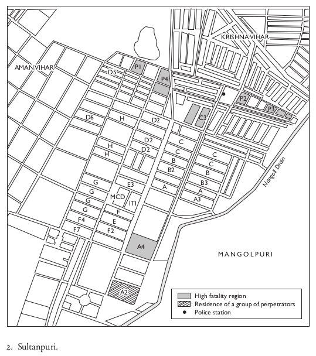
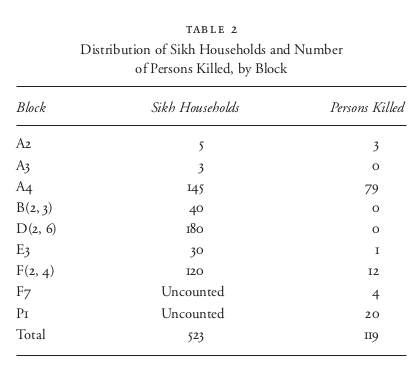

```{r setup, include=FALSE}
knitr::opts_chunk$set(echo = FALSE)
require(knitr)
require(kableExtra)
require(magrittr)
require(ggplot2)
require(data.table)
```

# Violence

## Outline

- 1984 Delhi Riots
  - video (warning)
  - Das (2007)
- What is ethnic violence?

# 1984 Delhi Riots


## Context

- Political Conflict in state of Punjab

- Rise of Sikh Nationalists

- Amritsar and Operation Blue Star

---

<iframe width="560" height="315" src="https://www.youtube.com/embed/KrWBWcQQ2WA" title="YouTube video player" frameborder="0" allow="accelerometer; autoplay; clipboard-write; encrypted-media; gyroscope; picture-in-picture" allowfullscreen></iframe>

---

<iframe width="560" height="315" src="https://www.youtube.com/embed/m9_xYae2Tcs?start=19" title="YouTube video player" frameborder="0" allow="accelerometer; autoplay; clipboard-write; encrypted-media; gyroscope; picture-in-picture" allowfullscreen></iframe>

## Context

- Assassination of Indira Gandhi by Sikh Bodyguards

- Widespread killing of Sikhs in Delhi

## In Groups:

### **Is this ethnic violence?**

### **What makes this ethnic violence (or not)?**

# Look a little closer

## Das (2007)

What happened during the 1984 riots **at a local level**?

- Neighborhood of Sultanpuri
- Marginal area on outskirts of Delhi

## Das (2007)



## Das (2007)

Sikh communities largest in:

- Blocks A4, B2, B3, C3, D2, D6, E3, F2, F4

## Das (2007)

Where was the violence?



## Das (2007)

**What explains these uneven patterns**?

## Das (2007)

**Block A4** and **Block A2**

- Neighboring communities of Siglikars (Sikhs)/Chamars (SC Hindu)
- both migrants to Delhi, relatively low status
- insecurity of legal tenure to households

This produced ...

- dependence on local politicians (fixers)

## Das (2007)

**Block A4** and **Block A2**

- status divisions between groups: Siglikar Sikhs had remittances from Middle East (nicer homes, consuer goods)
- disputes between Siglikar/Chamar pradhans (neighborhood leaders) over status in patronage network
- pradhan status threats from gurudwara

## Das (2007)

Local patronage leader was intermediary between:

- state/local government
- local organized crime, muscle
- local laborers
- police

## Das (2007)

**Block A4** and **Block A2**

How the violence happened:

- started with taunts between A2 and A4 pradhans
- targeting of Sikh pradhan with police standing by
- participation of local organized crime
- violence spread, murder of men, looting of houses
- invocation of status reversal, murder of Indira Gandhi

## Das (2007)

**Block B2-B3**

Sikhs told by neighbors:

- violence in A4 was between Chamars and Siglikar Sikhs
- property not worth looting

## Das (2007)

**Block D**

- Organized self defense, with help of Hindu neighbors, fended off mobs

**Block F**

- Minimal violence

## Das (2007)

Personal motives?

- killing of paramours
- looting of material goods


## Das (2007)

Revisiting...

### **Is this ethnic violence?**


# What is ethnic violence?

## Ethnic Violence?

What makes violence **ethnic**?

- the perpetrators? **Who** is doing the violence?
- the victims? **Who** is targeted in the violence?
- the form of the violence? What is the **technique**?
- discourse about it? How do people present and label the violence?
- the audience? Who is observing/reacting to the violence?

## Conclusion

- Whether violence is ethnic: not always easy to decide
- Real-world violence is complex, challenges our narratives
- Link/disjuncture between what physically happened and the narrative


