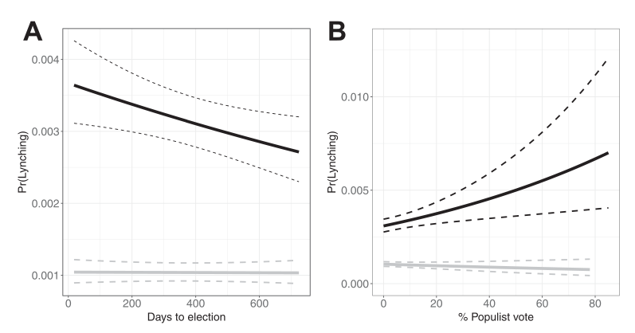
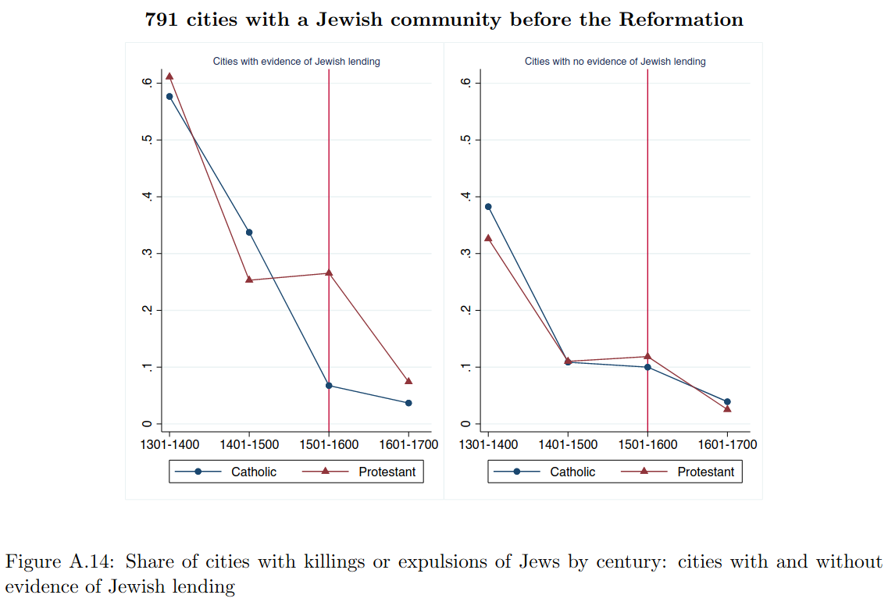

```{r setup, include=FALSE}
knitr::opts_chunk$set(echo = FALSE)
require(knitr)
require(kableExtra)
require(magrittr)
require(ggplot2)
require(data.table)
```

# Strategic Violence

## Outline

- Recap
- Power Consolidation
- Limits of Elite Manipulation
- "On The Ground" 

## Strategic Ethnic Violence:

Fearon and Laitin (2000) identify different different strategic logics:

- "elite manipulation"
    - political elites encourage/foment ethnic violence for strategic reasons
- "on-the-ground"
    - ordinary people have incentives to participate in ethnic violence

# Power Consolidation

## Comparison: Motives

**Electoral logic**: politicians/parties interested in winning office.

- use of ethnic violence is cynical tactic to win support of voters
- goal is to win next election, no agenda to end elections/change the rules
- violence "works" by unifying ethnic group around ethnic party

**Power consolidation**: elites have specific policy goals (group dominance, non-ethnic policy)

- use of violence to secure policy goals, **change the rules**
- violence "works" by intimidating/disempowering outgroup (as an end in itself)
- violence "works" by unifying ethnic group, to attain *policy goals*

## Comparison: Motives

**Electoral logic**

- only worthwhile just before an election
- violence does not need to be routinized
- primarily aimed at shifting voters preferences

**Power consolidation**

- violence may be useful before or **after** election to overturn/undo results. 
- violence may be formalized (into violence that constitutes boundaries) with **rule changes**
- often aimed at intimidating "wrong" voters

# Evidence

## Race in the US

Before Wilmington Riot, similar events took place in 1870s:

- Ku Klux Klan and so-called "Redeemers" violently repressed black voters, overthrew elected legislatures/governors in the 1870s.
- E.g. in Louisiana, laid siege to state capitol building.

## Epperly et al (2020)

Epperly et al (2020) examine whether racial violence was used for power consolidation more broadly in the US:

White Southern elites were interested in either or both policy goals 

- white supremacy
- limiting progressive economic policies (taxation, workers rights)

violence is strategically useful to...

- inhibit black political power
- prevent biracial political coalitions that enact progressive economic reforms

## Epperly et al (2020)

Different forms of violence available 

**lynching/mob violence**

- could unify whites (if mob is large), intimidate African Americans
- but costly: arouse national attention, federal civil rights enforcement
- inefficient: sporadic, requiring collective action and coordination

**legal system**

- could legally bar most African Americans from voting
- violence is *less visible*, less costly
- *efficient*: enforced by state agencies, easier to coordinate

## Epperly et al (2020)

If lynching served as a form of power consolidation, then

1. should expect lynching to follow electoral logic **when Jim Crow laws not in force**
    - lynchings nearer in time to elections
    - lynchings where bi-racial coalitions are powerful
2.  should expect lynching to no longer follow electoral logic **once Jim Crow laws in effect**
    - lynching no longer needed; legal institutions replace it as form of power consolidation


## Epperly et al (2020)

Comparing counties within the same former slave states with

- similar proportion black population, cotton production; in the same year

Does lynching follow proximity to election? Success of bi-racial parties?

---

*before Jim Crow* (black lines)



*during Jim Crow* (gray lines), **flat**... no electoral logic

## Lynching and Power Consolidation

Other scholars find that...

- Lynching more likely in places with less white unity (in support for Democratic Party), though elections were not "close"
- Lynching more likely in cotton-producing counties when cotton prices drop (dividing white land-owners vs. white workers)

Some racial violence may have been about power-consolidation:

- asserting white supremacy (as a policy aim), even if need to overturn elections
- wealthy whites protect economic interests by uniting with poor whites over white supremacy

## Unresolved issues:

All **elite manipulation** explanations for violence must answer...

- "Why do the followers follow?"
- Why do non-elites get "manipulated" by elites into 
    - participating in violence
    - responding the "right" way: support ethnic elites

# On-the-ground Strategy

## Non-elite Strategy

One answer is that **non-elites** also have strategic reasons for participating in ethnic violence:

1. **security**: non-elites strategically participate in ethnic violence to ensure their physical security
2. **economic competition**: non-elites that compete economically with out-group use ethnic violence to gain access to jobs/market

## Ethnic Security Dilemma

Posen (1993) explains ethnic conflict as a result of a **security dilemma** that arises between ethnic groups.

## Ethnic Security Dilemma

**security dilemma**: a strategic logic for conflict escalation in international relations:

- states in a world of anarchy (no overarching authority) seek to maximize their security
- security is attained by increasing the military power of the state vis-a-vis it's neighbors
- increase in neighbors military (even for defensive reasons) reduces relative power of a state
- even if all states seeking security, rationally face pressures to escalate 

This is particularly true when...

- hard to tell whether military capabilities are offenseive or defensive

## Ethnic Security Dilemma

**ethnic security dilemma**:

- in weak states (where central government cannot enforce peace)...
    - ethnic groups seek to maximize security
    - security is attained by increasing capacities for violence
    - increasing armed capabilities of one group reduces relative power of the other group
    - security-seeking ethnic groups rationally pursue path of increasing escalation

In this logic...

- even ethnic cleansing may be "strategic" to reduce the threat posed by another ethnic group

## Evidence: Security?

Posen's argument may be simplistic (assumes unified ethnic groups) but is there evidence for strategic participation in violence driven by security?

## Evidence: Security?

Alexandra Scacco investigates ethnic (Christian-Muslim) riots in Nigeria: who participates in riots?

If rational pursuit of personal security drives participation in riots we should expect:

- People whose security is most at risk participate more:
    - people who are **poorer** more likely to live where violence takes place, have fewer protections from police/private security 
    
- But participating in violence **alone** is dangerous:
    - only people who are able to organize violence **as part of a group** will participate
    - people who have stronger social networks better able to engage in collective action

## Evidence: Security?

Surveying people living in neighborhoods affected by riots...

- People who are **poor** and have **strong social networks** more likely to participate in riots
    - compared to people who are poor but lack network ties
    - compared to people who are not poor and have network ties
- People who participate in riots also indicate there are **benefits** rioting:
    - large numbers identify **security** of family/property as main motive
    - very few people indicate riots as opportunity to gain money, food, status

Once violence starts, strategic security concerns may lead ordinary people to participate.

## Economic Competition

Ordinary people may also use ethnic violence to improve their economic position. We would expect this to happen when people in different ethnic groups compete over finite economic resources:

- when ethnic groups are in competition over the same jobs
- when ethnic groups are in competition over the same markets

...violence can be used to displace or beat out ethnic economic competitors 

## Becker and Pascali (2019)

Becker and Pascali investigate the **economic competition** logic for ethnic violence as it applies to Jews in Early Modern Europe.


## Becker and Pascali (2019)

Economic Competition between Jews and Christians **changed** after the Reformation:

- Catholic Church bans on usury (collecting interest) gave Jewish money-lenders a clear advantage
- Christians borrowed money from Jewish money-lenders: complementary, not competitive
- Protestant churches removed ban on usury: Christian and Jewish money-lenders competed in the same market

If economic competition drives conflict:

- Should observe greater increases in anti-Semitic violence **after** Reformation in places **that become Protestant**
- These changes should be larger where Jewish community participated in money-lending.

## Becker and Pascali (2019)



# Conclusion

## Strategic Violence

Unresolved questions:

- Is all ethnic violence strategic? (Consider Wilmington Riot; Anti-semitic violence)
- Why do non-elites get "manipulated" by elites into 
    - participating in violence
    - responding the "right" way: support ethnic elites


