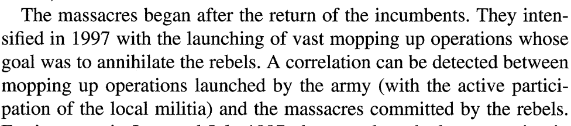
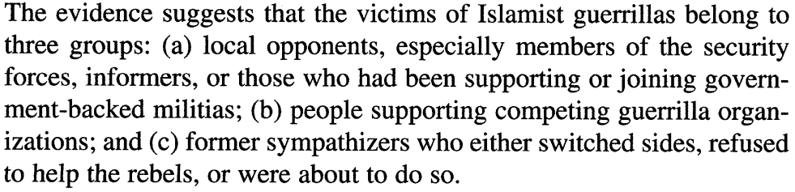
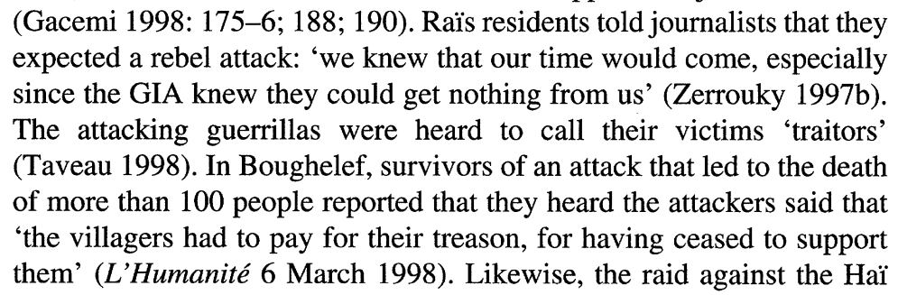

```{r setup, include=FALSE}
knitr::opts_chunk$set(echo = FALSE)
require(knitr)
require(kableExtra)
require(magrittr)
require(ggplot2)
require(data.table)
```

# Explaining Atrocities

## Outline

- Limits of Strategic Explanations
- Why do people engage in violence? 
- The role of Psychology and Structure 

# Why atrocities?

## Why atrocities?

### **$1.$ Why do atrocities take place?**

ethnic violence may be associated with:

- mass murder of men, women, children
- torture, use of sexual violence
- mutilation of bodies

Can we explain this "senseless" violence?

## Why atrocities?

### **$2.$ Why pay special attention to atrocities?**

- atrocities seem to defy strategic explanation
- can they illuminate more about why people use violence?

# An Example

## An Example

Algerian Civil War

- in 1992, Algerian Army toppled democratic government headed by political party: Islamic Salvation Front (FIS)
- Armed groups emerged to challenge the new regime: *Groupe islamique arme* (GIA).
- GIA seized control of large areas in 1993-1994.

## An Example

Between 1996 and 1998, GIA (rebel) forces started doing **massacres**

- *repertoire*: nighttime raids on villages, with killings
- *targeting*: killed families in their entirety (infants to the elderly) in their homes
- *technique*: hacking/slicing to death using machetes, axes; corpses mutilated; sexual violence against women 
- *frequency*: dozens of massacres; between 10 and 400 killed 

>- Why would people do this?

## Strategic violence



Massacres tied to counter-insurgency efforts

## Strategic violence



Massacres targeted perceived enemies of GIA rebels

## Strategic violence?



Killers in massacres invoked "treason"...

is there more to this than forcing people to "comply"?

## Questions

Even if we can explain where and when atrocities take place as "strategic"...

- why do 'followers' follow? Why do perpetrators participate in these horrific killings?

## Questions 

Humans not usually inclined to violence; requires preparation and training

<br>

**Why do perpetrators participate in ethnic violence?**


#

---

<iframe width="320" height="240" src="https://charlierose.com/video/player/13707" marginheight="0" marginwidth="0" frameborder="0" allowfullscreen></iframe>

## Questions

Based on this video:

**Any additional reasons you might give for why perpetrators participate in violence?**

#

---

<iframe width="560" height="315" src="https://www.youtube.com/embed/hn1VxaMEjRU" frameborder="0" allow="autoplay; encrypted-media" allowfullscreen></iframe>

## "Are we the baddies?"

**Perpetrators** generally don't think they are morally **wrong**...

much violence is **morally motivated**:

> person doing the violence subjectively evaluates that their actions are right (that they *ought* to be done)

## "Virtuous Violence"

Fiske and Rai (2015)

Relational Models Theory: psychological theory, from the perspective of **perpetrators**:

- **people often judge that to constitute or regulate crucial relationships they are morally required to hurt or kill another person**

- by **moral**, they mean evaluating actions, motives, and intentions with respect to an ideal model of how people *should* relate 

## Relational Models Theory

Four varieties of **moral** relationships; focus on **two**

### 1. **Communal Sharing**/unity: 

relationship with people in the same group as undifferentiated and equivalent

- shared responsibility; shared fate
- threat to one is a threat to all; crime of one is a crime by all
- connection to **essentialism**, **social identity**

## Relational Models Theory

### 2. **Authority Ranking**/hierarchy

rank individuals in a hierarchical relationship

- subordinates are to respect/obey/defer to superiors
- asymmetrical relationships are natural, good, legitimate, necessary
- connection to **social identity theory**, **status**, **ranked systems**

## Relational Models Theory

### Violence is used to **regulate** at least one or more of these moral relationships with the victim *and others*

## Relational Models Theory

### Violence can...

- **create** moral relationships (e.g. bonds of unity among perpetrators)
- **enhance** or **transform** relationships (e.g. increase group unity, transform ethnic hierarchy)
- **protect** relationships (e.g. to defend ethnic hierarchy; to defend ethnic group)
- **redress**/**rectify** relationships (e.g. to punish/avenge a transgression against the group/ethnic hierarchy)

## Why use *violence*?

- Violence gets people's attention
- Shows that the stakes are high
    - stronger/more important relationships
    - entire relationship is at stake, not simply its practice

Should imply that:

- violence is more likely when, e.g., there are serious threats to a particular morally important relationship, like racial hierarchy.

## Key insights: Cultural Context

Even through RMT is *psychological* approach to violence, it points to the importance of cultural context:

### Why do we often see violence as **immoral**?

### **Who** evaluates actions as moral?

## Key insights: Audiences

### Violence may be as much about the audience as the victim

- violence to regulate relationship with the audience (prove oneself as a member of a team)
- violence may be constrained if there are multiple, diverse audiences.
- cultural/symbolic content of violence may be important 

## Extra-Lethal Violence

Fujii shows that **extra-lethal violence** often is symbolic action that communicates in complex ways to other perpetrators, audiences, and the victim.

"spectacle lynching"...

- transformed moral status of perpetrators (both enacting and "above the law")
- spectators were "part of the show"
- communicating white supremacy to other African Americans

## Conclusion:

In coming weeks, we bring turn attention to

- Psychology and Violence
    - how are individuals motivated to engage in ethnic violence?
- Structures (Media) and Violence
    - if individuals are morally motivated...
    - how are events, relationships given moral salience?
