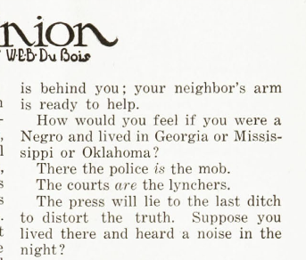
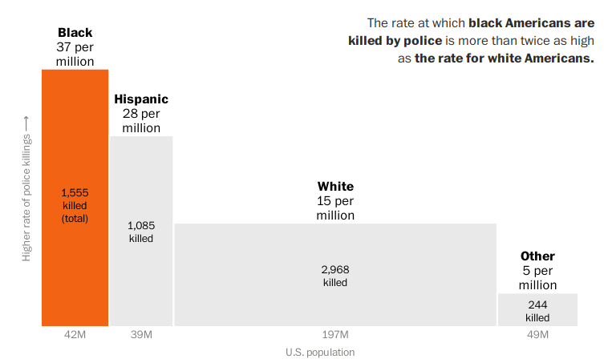
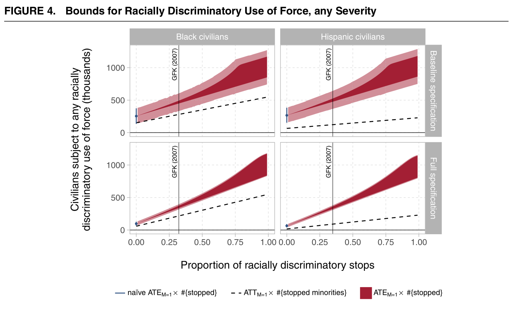

```{r setup, include=FALSE}
knitr::opts_chunk$set(echo = FALSE)
require(knitr)
require(kableExtra)
require(magrittr)
require(ggplot2)
require(data.table)
```

# Ethnic Violence

## Outline:

- Race and Policing
- Forms of discrimination
- Evidence of discrimination


# Race and Policing


## Race and Policing in the US

Historically and today...

- racial bias has shaped criminal code
- concerns about bias in **who** is policed, **how** they are policed, **consequences** of police encounters.

In recent years, focus has been on police shootings.

---



---

<iframe src="https://globalnews.ca/video/embed/2810801/" width="670" height="372" frameborder="0" allowfullscreen scrolling="no"></iframe>

## Race and Policing in the US





## Race and Policing in the US

- How would you characterize the pattern of violence?
  
- Is police violence ethnic violence?
    - Does motive matter?
    - Was police violence ethnic even before BLM framed it as such?

## A hot take

<blockquote class="twitter-tweet"><p lang="en" dir="ltr">For every 10,000 black people arrested for violent crime, 3 are killed<br><br>For every 10,000 white people arrested for violent crime, 4 are killed<br><br>I&#39;m going to keep tweeting this until someone can explain to me how this is possible if there is truly pervasive racial bias in policing</p>&mdash; Leonydus Johnson (leave/me/alone) (@LeonydusJohnson) <a href="https://twitter.com/LeonydusJohnson/status/1267466345844740098?ref_src=twsrc%5Etfw">June 1, 2020</a></blockquote> <script async src="https://platform.twitter.com/widgets.js" charset="utf-8"></script> 

What do you take this point to be?

## Racial Bias

### **statistical discrimination**: 

inequality that exists between demographic groups even though economic agents (consumers, workers, employers, etc.) are rational and non-prejudiced. 

- Discrimination can be "rational" if individual attributes are hard to observe (e.g. propensity toward crime) while group membership is observable and different groups have different behaviors on average.
- Discrimination is "rational" if relevant considerations (threat, criminal activity) objectively correlate with group membership

## Racial Bias

### **taste-based discrimination**: 

inequality that exists in treatment demographic groups due to some gain/utility that agents gain **by discriminating**.

- racial hatred, SIT/in-group preference leads people to **value** discrimination

## Fryer (2019)

<iframe loading="lazy" width="560" height="315" src="https://www.msnbc.com/msnbc/embedded-video/mmvo44060741959" scrolling="no" frameborder="0" allowfullscreen></iframe>

## Fryer (2019)

### Data:

- Incidents involving police where suspect was subject to lethal use of force or arrested (could have been shot) from Houston PD 
- Details on race of suspect, suspect behavior, context, and officer attributes from police reports


### Results: 

Comparing police-suspect interactions with similar suspect behavior, context, officer attributes:

**Police *less likely* to use *lethal force* against black suspects** vs. whites.


## Two questions

1. If police violence follows a pattern of statistical discrimination, does that mean it is **not racial violence**? (if Mr. Johnson is correct, if Fryer's estimates are correct$^*$)

## Ethnic Violence

**Another perspective** on ethnic violence is to ask:

How does violence relate to ethnic boundaries?

1. Violence that **transforms** ethnic boundaries:
    - altering status, access to resources/power, along ethnic categories
2. Violence that **defends**/**polices** ethnic boundaries:
    - violence that punishes or deters transgressions/changes of an ethnic boundary 
3. Violence that is **constitutive** of an ethnic boundary:
    - **routine** violence that disproportionately targets/affects members of specific ethnic categories


## Two questions:

1. If police violence follows a pattern of statistical discrimination, does that mean it is **not racial violence**?

2. **Are these estimates of racial bias in police violence even right?**

- serious problems underestimating racial disparities in violence.

## Knox et al

If we compare racial discrimination in police use of force among those who **have been stopped by the police** we are almost certainly going to **underrepresent** racial disparities:

**Why?**

1. Think about possible kinds of police stops by race (board)
2. These types of stops are likely to be **different** (always-stops likely reflect more serious threats; black-only-stops less serious threats)
3. If those **differences** are hard to measure, we undercount racial bias. 

## Knox et al




## Takeaway:

1. Police discrimination likely **worse** than it appears

2. Even if this was statistical discrimination (doesn't look like it), likely should be seen as ethnic violence

3. But useful to distinguish most police shootings from boundary-changing/boundary-policing violence.
