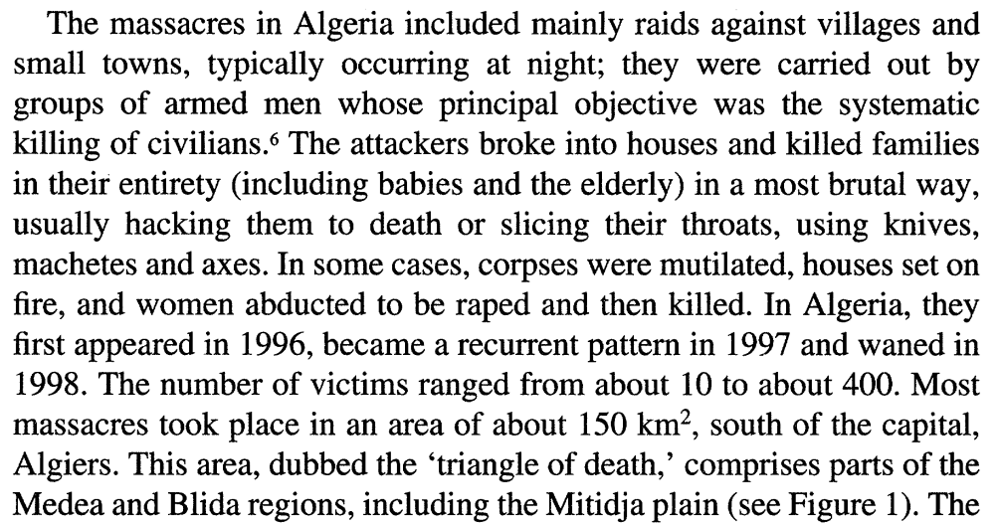
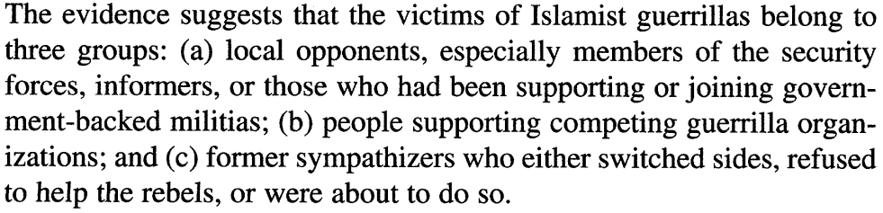
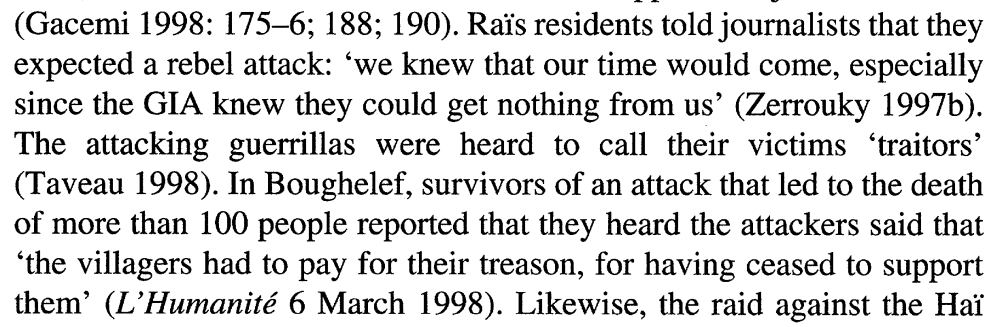
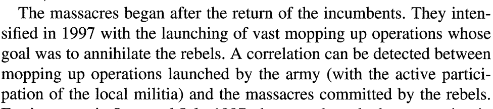

```{r setup, include=FALSE}
knitr::opts_chunk$set(echo = FALSE)
require(knitr)
require(kableExtra)
require(magrittr)
require(ggplot2)
require(data.table)
```

# Logic of Violence

## Outline

- Why do people engage in violence? 
- Consider three perspectives (readings):
    - strategic
    - psychological
    - cultural/symbolic

## Motivation

Describing and explaining **patterns of violence** requires paying attention to **perpetrators** (and would-be perpetrators)

To understand why violence happens (does not happen):

- who are perpetrators of violence?
- what violence are they doing?
- why are they doing it? why choosing a particular form?

## Motivation {.centered}

**Why do people engage in violence?**

**Are they just monstrous/evil?**

---

<iframe width="320" height="240" src="https://charlierose.com/video/player/13707" marginheight="0" marginwidth="0" frameborder="0" allowfullscreen></iframe>

## An Example: Kalyvas (1999)



## An Example:

These massacres took place in the context of a Civil War:

- in 1992, Algerian Army toppled democratic government headed by political party: Islamic Salvation Front (FIS)/
- Armed organizations emerged to challenge the new regime: *Groupe islamique arme* (GIA).
- GIA seized control of large areas in 1993-1994.
- Massacres started later...

**Were these massacres the result of "religious fanaticism"?**


## An Example:






## An Example:



## An Example:

GIA massacres...

- were **selective** (or collective at the level of families)
- **targeted defectors**: former supporters who stopped cooperating 
- started **when the Army was reestablishing control** (GIA no longer exercised full control)

## Strategic Violence:

In Civil Wars, armed groups choose violent techniques strategically:

- using selective violence to deter collaboration with the enemy (incentives)
- but when information/opportunity to be selecting is limited, may select more collective/indiscriminate violence (costs)

More generally:

- there may be strategic benefits that motivate perpetrators to engage in violence. 
- **costs** to violence may also limit violence

#

---

<iframe width="560" height="315" src="https://www.youtube.com/embed/hn1VxaMEjRU" frameborder="0" allow="autoplay; encrypted-media" allowfullscreen></iframe>

## "Are we the baddies?"

**Perpetrators** generally don't think they are morally **wrong**...

much violence is **morally motivated**:

> person doing the violence subjectively evaluates that their actions are right (that they *ought* to be done)

## "Virtuous Violence"

Fiske and Rai (2015)

Relational Models Theory: psychological theory, from the perspective of **perpetrators**:

- **people often judge that to constitute or regulate crucial relationships they are morally required to hurt or kill another person**

- by **moral**, they mean evaluating actions, motives, and intentions with respect to an ideal model of how people *should* relate 

## Relational Models Theory

Four varieties of **moral** relationships; focus on **two**

### 1. **Communal Sharing**/unity: 

relationship with people in the same group as undifferentiated and equivalent

- shared responsibility; shared fate
- threat to one is a threat to all; crime of one is a crime by all
- connection to **essentialism**, **social identity**

## Relational Models Theory

### 2. **Authority Ranking**/hierarchy

rank individuals in a hierarchical relationship

- subordinates are to respect/obey/defer to superiors
- asymmetrical relationships are natural, good, legitimate, necessary
- connection to **social identity theory**, **status**, **ranked systems**

## Relational Models Theory

### 3. **Equality matching**

attend to differences in order to balance relationships

- seek out equality between people, groups, etc.
- reciprocity (eye for an eye; you paid last time)

### 4. **Market pricing**

rates and ratios to compare non-identical goods/actions

- Proportionality... punishment in prison proportional to crime, not eye for an eye

## Relational Models Theory

### Violence is used to **regulate** at least one or more of these moral relationships with the victim *and others*

## Relational Models Theory

### Violence can...

- **create** moral relationships
- **enhance** or **transform** relationships
- **protect** relationships 
- **redress**/**rectify** relationships


## Why use *violence*?

- Violence gets people's attention
- Shows that the stakes are high
    - stronger/more important relationships
    - entire relationship is at stake, not simply its practice

Should imply that:

- violence is more likely when, e.g., there are serious threats to a particular morally important relationship, like racial hierarchy.


## Key insights: Cultural Context

Even through RMT is *psychological* approach to violence, it points to the importance of cultural context:

### Why do we often see violence as **immoral**?

### **Who** evaluates actions as moral?

## Key insights: Audiences

### Violence may be as much about the audience as the victim

- violence to regulate relationship with the audience (prove oneself as a member of a team)
- violence may be constrained if there are multiple, diverse audiences.
- cultural/symbolic content of violence may be important 

## Extra-Lethal Violence

Fujii shows that **extra-lethal violence** often is symbolic action that communicates in complex ways to other perpetrators, audiences, and the victim.

"spectacle lynching"...

- transformed moral status of perpetrators (both enacting and "above the law")
- spectators were "part of the show"
- communicating white supremacy to other African Americans


## Conclusion:

In coming weeks, we examine:

- Strategic Violence
- Media and Violence
    - how are events, relationships given moral salience?
    - how are costs of violence increased/reduced?