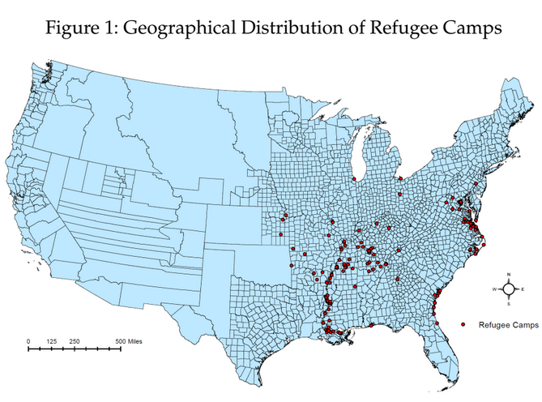
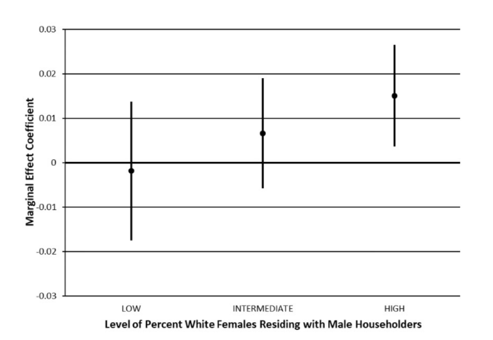

```{r setup, include=FALSE}
knitr::opts_chunk$set(echo = FALSE)
require(knitr)
require(kableExtra)
require(magrittr)
require(ggplot2)
require(data.table)
```

# Psychology and Ethnic Violence

## Outline:

- Psychology and Violence
- Do threats to status lead to violence?
  - End of Slavery (Ramos-Toro)
  - Lynching and "Sexual Threat" (Smangs)
- Are low status individuals more prone to violence?
  - Some case studies

# Review

## Relational Models Theory

People are more likely to use violence to regulate relationship...

- when the stakes are high (people believe this relationship is very important or **essential**)
- when the moral relationships involve Communal Sharing and Authority Ranking morality
- if there is a transgression that threatens the very existence (constitution) of the relationship (e.g. infidelity in marriage)
    - perceived threat to the existence/integrity of the ethnic group (no more group)
    - perceived threat to 'natural' dominant status of the ethnic group (no more hierarchy)

## When is there violence?

When there are "precipitating events" or conditions that lead 

-  in-groups to believe their existence is threatened
-  in-groups to believe there has been a moral transgression against their status 

## Who is doing violence?

- People for whom social identity is more important / stakes of ethnic hierarchical relationship are higher:
    - who are 'lower' status along other dimensions of social identity (e.g. poor whites in the US South)

- People who are persuaded that transgressions/threats against their group have occurred

# Evidence?

## Evidence?

Is there evidence in support of psychological explanations for ethnic violence?

**Status threats induce violence**:

- End of slavery in the United States
- Alleged interracial sexual assaults

## End of Slavery

Slavery in the United States justified in terms of racial superiority

- conditions of political equality among white men
- "moral" position of white manhood citizenship depended on comparison against enslaved African Americans

End of slavery reduced the relative status of whites:

- War diminished economy of the South
- (legally) equal political and civil rights for freed Blacks
- opportunities for Black social advancement
- reduced social deference toward whites

## End of Slavery

African American status increased more in some areas than in others:

**Contraband Camps**/**Refugee Camps**

- self-emancipation, congregation within Union lines
- freed people still faced difficulties, racism from white Northerners
- protection by the Union Army, Freedmen's Bureau
- opportunity to build free Black communities

---



## Contraband Camps

Diego Ramos-Toro shows that these camps

**increased the status of African Americans**

<br>

compared to similar counties in the same states, counties with camps...

- had more and better funded schools for Black children
- higher literacy, socioeconomic status
- elected more Black officials
- had stronger Black churches
- greater Black voting power

## Contraband Camps

These increases in the status of African Americans led to backlash when white Southerners regained power:

- greater voter suppression of African Americans
- more Confederate monuments
- more lynching

## "Sexual Threat"

'Moral' relationships of White supremacy in the South:

- white men shared a Communal Sharing bond as equal citizens
- the status of white men was given by their Authority Ranking
  - over female/child/slave dependents in their household ("masters")
  - this entailed both mastery, but also obligations to provide and protect

## "Sexual Threat"

- end of slavery had challenged Authority Ranking status of white men as "masters" and as "superior race"
  - scientific racism emphasized the dangers of interracial sexual relations ('erasure'/'contamination' of white race)
  - sexual assault of white women undermined status of white men as "protectors" 

## "Sexual Threat"

Alleged sexual assaults of white women **common** and **widely accepted** as justification for racial violence:

precipitating events because...

- this challenged the dominance of white men within household and in racial hierarchy (Authority Ranking)
- a threat to status of one white man a threat to all (Communal Sharing)

## "Sexual Threat"

After the lynching of Tom Jones in 1902, coroner report stated the killing was done...

> "by an outraged public acting in defense of their homes, wives, daughters and children. In view of the enormity of the crime committed by said Tom Jones . . . we think they would have been recreant to their duty as good citizens had they acted otherwise"

## Smangs (2020)

Investigates whether counties with conditions that might intensify concerns about "sexual threat" saw more lynchings in response to alleged sexual assaults:

- greater proportion of white female dependents
- greater proportion of white female children in school
- greater proportion of educated Black men

## Smangs (2020)



## Smangs (2020)

These factors predict lynchings in response to alleged sexual assaults, but *NOT* lynchings justified for other reasons.


# Psychology and<br>Participation

## Evidence?

Is there evidence in support of psychological explanations for ethnic violence?

**Individuals with precarious status within dominant group have greater motive to participate in violence**

## A few examples

Anecdotally, lower status whites were key participants in many instances of racial violence

- **Memphis 1866 Riot**
  - Irish immigrants 
- **Klan Violence in Union County, SC**
  - lower-class whites
- **Chicago 1919 Race Riot**
  - Irish laborers/gangs

## Complications

But this might also be explained through economic competition:

- **Memphis 1866 Riot**
    - Irish immigrants competed with freed Black men for jobs
- **Klan Violence in Union County, SC**
    - poor white whiskey runners threatened by Black political leaders trying to regulate trade
- **Chicago 1919 Race Riot**
    - Irish workers competed with Black labor for jobs, supported rival political parties

## Complications

Lynch mobs often lead by "leading men" in a community

- not clear that this reflects greater participation of "lower-status" whites

## Conclusion

Mixed evidence for psychological theories:

- status threats connected to moral relationships in RMT are linked to racial violence
- people facing **greater** status threats MAY be motivated to use violence

Next week:

- do media messages that amplify perceptions of status threats, moral transgressions drive violence?