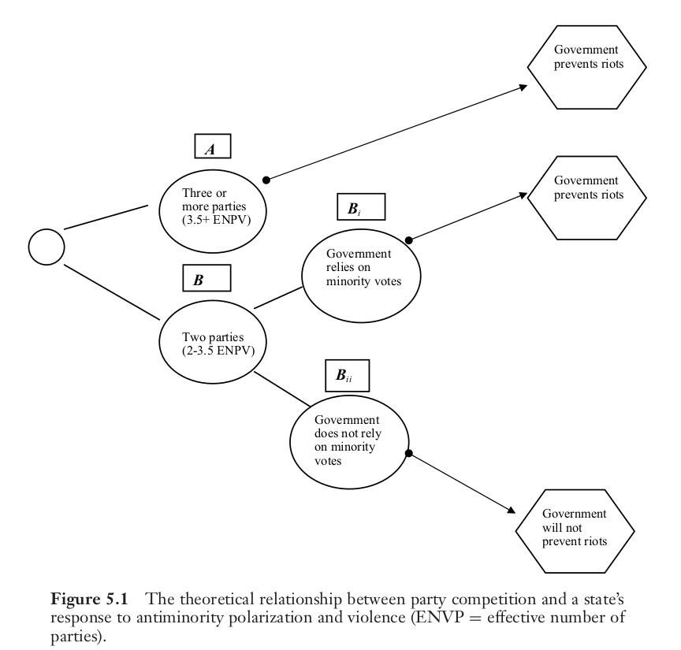

```{r setup, include=FALSE}
knitr::opts_chunk$set(echo = FALSE)
require(knitr)
require(kableExtra)
require(magrittr)
require(ggplot2)
require(data.table)
```

# Strategic Violence

## Outline

- Perspectives on strategic ethnic violence
    - elite vs 'on-the-ground'
- Example: Tulsa Race Riot 
- Wilkinson (2004)

## Strategic Ethnic Violence:

Fearon and Laitin (2000) identify different strategic logics:

- "elite manipulation"
- "on-the-ground"

## Strategic Violence from Below

- Ethnic Security Dilemma (Posen 1993)
    - if offensive/defensive actions indistinguishable; attacking first is advantageous
    - mobilization for self-defense provokes counter-mobilization
    - rational to attack "defensively"
- Policing boundaries:
    - non-elites may use violence to secure their access to resources (e.g. jobs) from new/rival groups (Dancygier)
- Opportunism:
    - exploit ethnic divide for personal gain (Das)

## Elite Manipulation

Political elites may encourage violence for several reasons:

- Win Elections:
    - increase attractiveness of ethnic vs other parties
    - suppress/displace voters for rival parties
- Consolidating power:
    - shift balance of power *within* ethnic group
    - establish political dominance of one ethnic group 
    
Violence as a means to accomplish these goals (directly or *indirectly*)

# An Example

---

<iframe width="560" height="315" src="https://www.youtube.com/embed/JvEGIM0zEgs" title="YouTube video player" frameborder="0" allow="accelerometer; autoplay; clipboard-write; encrypted-media; gyroscope; picture-in-picture" allowfullscreen></iframe>

## Tulsa Race Riot

**What factors seem important in explaining this riot?**

**How important are strategic calculations?**


## Horowitz (2001)

Key causal contributors to "Deadly Ethnic Riots":

1. hostile relationship between ethnic groups
2. an event that elicits anger/outrage from one of these groups (**precipitating event**)
    - typically an even that transgresses ethnic boundary, perceived as threat to moral relationship
3. sense that killings are justified (Relational Models Theory)
4. assessment that the risks of engaging in violence are low (limited retaliation, punishment)

## Horowitz (2001)

Applied to Tulsa:

1. racial tensions in US have a long history
2. alleged sexual assault, 'attack' on white man, armed black men are precipitating events
3. white belief that violence is justified response to  sexual assault, threat of armed African American men
4. mob deputized by police; National Guard mobilized and assisted the mob

## Limits of strategic explanations

Violence too complex to have one cause: purely strategic explanations are lacking:

- moral/psychological responses
- structural/cultural context 
    
BUT moral psychology, cultural context may change too slowly to explain **when** and **where** violence takes place...

## Wilkinson (2004)

Theorizes two different strategic logics for violence, we focus on one today, one Wednesday:

- motives of **perpetrators**
- what about motives of the state (actors able to **stop** violence)?

In Tulsa, the state chose when to stop/allow rioting. National Guard able to stop rioters when committed to that purpose.

Wilkinson wants to explain: what leads governments  to stop or permit riots to continue?

## Gujarat (2002)

In late February 2002, a train carrying Hindu nationalists home to Gujarat from Ayodhya$^*$ caught fire, 58 people died

- the cause of fire is disputed, but allegations that Muslims had set fire to the train
-  Hindu nationalists across India held demonstrations, processions, or attacks against minorities during this period, explicitly linked to the violence in Gujarat.

---

Precipitating events across India (see squares)


---

But... major riots (circles) limited to Gujarat 


## Wilkinson (2004)

As in Tulsa, government in Gujarat did not stop the riots. 

BJP (Narendra Modi) government:

- transferred officials who prevented riots/arrested Hindu militants
- delayed calling the army
- punished people filing police reports
- instructing officials to not act to prevent violence

## Wilkinson (2004)

**Unlike Tulsa**, in other Indian states:

- state governments moved swiftly to quash conflict 
- few riots; places with deaths *entirely* due to police firing on rioters.

**Why did Gujarat permit riots to occur while other states did not?**

## Wilkinson (2004)

Government strategy dictated by elections: will only **stop violence** if they directly or indirectly **depend on votes** of people **targeted by the riots**

This can happen under two sets of conditions:

1. When many parties compete successfully, minority group voters can determine who wins. Permitting riots that target this group may cost **any** ruling party victory at the next election.

2. When only a few parties are competitive, parties that do not win minority votes anyway face no incentive to stop riots against that group.

---




---


## Wilkinson (2004)

- States with **many** competitive parties protected Muslims
    - even in Orissa, Kerala, BJP led coalition stopped riots.
- States with **few** competitive parties yet had ruling coalitions dependent on Muslim voters stopped riots.
- Only in Gujarat was there **few** competitive parties, ruling party did not need Muslim votes

## Wilkinson (2004)

This logic appears to hold more generally.

Examining Hindu-Muslim riots by month in Indian states between 1961-1995...

- when an Indian state has greater electoral competition (more competitive parties), making Muslims more pivotal, they have fewer riots
- this pattern holds, even when other attributes of the state/month are held constant

# Conclusion

## Conclusion

In Gujarat, BJP leaders held meeting during the violence to call early elections, hoping to benefit from the riots.

**If ethnic political parties anticipate benefits from riots, why not foment them directly?**

Brass, Berenschot, Wilkinson all suggest that this happens. We'll explore this next time