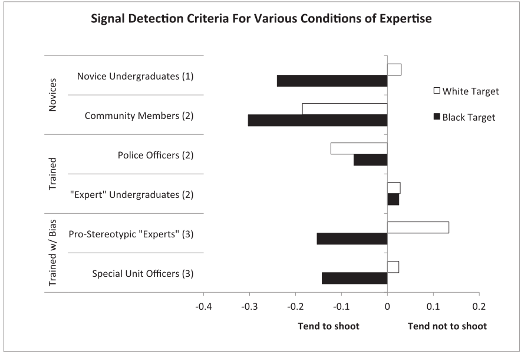

```{r setup, include=FALSE}
knitr::opts_chunk$set(echo = FALSE)
require(knitr)
require(kableExtra)
require(magrittr)
require(ggplot2)
require(data.table)
```

# Psychology and Ethnic Violence

## Outline

- Psychological **motives**?
- Policing
    - **psychology** of racial bias
    - **structure** of racial bias

# Recap

## Psychological Motives

Social Identity Theory and Relational Models Theory ...

- describe why individuals have psychological **motive** to commit violence
- predictions about what sorts of circumstances will trigger these motives
- implication is that violence is **intentionally** ethnic

## Psychological Motives? 

But when we discussed what "ethnic violence" is...

- violence need not be "intentionally" ethnic
- especially when violence **constitutes** the ethnic boundary

# Policing and Race

## Policing and Race

When we considered race and police use-of-force in the US, we saw that:

1. Racial disparities in frequency (Black Americans more likely to be victims)
2. Disparities do not appear to be due to **statistical discrimination**

## Policing and Race

### **statistical discrimination**: 

inequality that exists between demographic groups even though economic agents (consumers, workers, employers, etc.) are rational and non-prejudiced. 

- Discrimination can be "rational" if individual attributes are hard to observe (e.g. propensity toward crime) while group membership is observable and different groups have different behaviors on average.
- Discrimination is "rational" if relevant considerations (threat, criminal activity) objectively correlate with group membership


## Policing and Race

When we considered race and police use-of-force in the US, we saw that:

1. Racial disparities in frequency (Black Americans more likely to be victims)
2. Disparities do not appear to be due to **statistical discrimination**
3. Estimates of discrimination are almost certainly **underestimates**

>- **How do you explain why there is this racial disparity?**


## Policing and Race

### **taste-based discrimination**: 

inequality that exists in treatment demographic groups due to some gain/utility that agents gain **by discriminating**.

- racial hatred, SIT/in-group preference leads people to **value** discrimination
- ethnic discrimination is intentional and based on some kind of animus

## Another possibility... {.build}

### **implicit bias**

> when we have attitudes towards people or associate stereotypes with them without our conscious knowledge. 

<br>

Police may **unconsciously associate** criminality and threatening behavior with Black Americans.

- implicit bias regarding **threat** $\to$ racial disparity in police use of force

## Activity

### **[https://www.projectimplicit.net/](https://www.projectimplicit.net/)**

click on:

- 'Take a Test'
- then 'I wish to proceed' (bottom)
- 'Weapons IAT' (blue buttons)
- 'decline to answer' demographic questions


## Activity

What does this test measure?

What do you think it can tell us about police use of force?

## Implicit Association Test

Assuming that people who hold a stereotype ("Black $=$ Dangerous") are quicker to respond when task is compatible with stereotype than when task is incompatible...

Then, score for Implicit Bias is:

$\mathrm{\overbrace{Speed(Black+Weapon) - Speed(Black+Tool)}^{Positive \ if \ associates \ Black = Dangerous}}$ 

$-$

$\mathrm{\overbrace{Speed(White+Weapon) - Speed(White+Tool)}^{Negative \ if \ associates \ White = Safe}}$

>- What do you think this means?

## Implicit Bias in Policing

Correll et al (2014) describe body of work on implicit bias in policing:

- policing simulation
- portray a person in "naturalistic setting" 
- vary the race of the person
- vary whether person holds weapon, harmless object
- "player" of simulation, chooses to shoot, not shoot

## Implicit Bias in Policing


## Implicit Bias in Policing


## Implicit Bias in Policing

Decision to shoot a function of perceived latent threat:

- do participants correctly detect weapon or not (sensitivity)
- do participants decide whether or not to shoot (criterion)
	
Participants tend to 

- have no racial bias in sensitivity (recognizing weapons)
- have a lower criterion (greater perception of threat) for Black people

## Implicit Bias in Policing

So, it could very well be that implicit stereotypes about threat and criminality drive racial disparities in police use of force.

>- But different people behave differently

## Implicit Bias in Policing



## Implicit Bias in Policing

undergraduates:

- have racial biases in perceiving weapons
- have racial biases in perceived threat
- but with practice, can dramatically **reduce** bias 

police officers

- do not have racial bias in perceived weapons (and fewer errors)
- do not have racial bias in perceived threat
- but have biased reaction times (faster to shoot armed Black person, slower to not shoot unarmed Black person)

## Implicit Bias in Policing

These biased reaction times suggest police have to **work** to undo biases:

Racial bias can creep back in when...

- police are under greater cognitive load (real-world stress?)
- racial stereotypes are primed

# Structure

## Racial Messages and Policing

Implicit biases come from and are activated by the structural context:

- cognitive schemas produced by media, schooling etc.
- stereotypes can be activated by media messages

## Racial Messages and Policing

Grosjean et al (In Press) examine the effect of Trump campaign rallies on racial bias in policing:

- probability that person stopped by police is Black.

## Racial Messages and Policing


## Racial Messages and Policing

Comparing counties **with a rally** to counties **without a rally**, **before and after** the rally...

- did counties with the rally see a **greater increase** in police stops of Black Americans?

## Racial Messages and Policing


## Conclusion:

- Implicit bias may also induce ethnic violence
    - violence constitutive of boundaries
- These implicit biases result of, amplified by **structural conditions**

