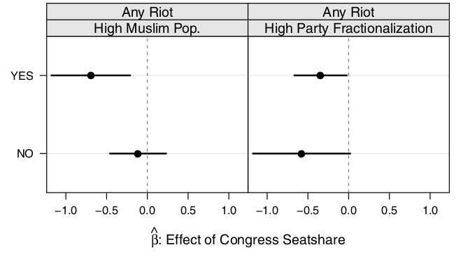

```{r setup, include=FALSE}
knitr::opts_chunk$set(echo = FALSE)
require(knitr)
require(kableExtra)
require(magrittr)
require(ggplot2)
require(data.table)
```

# Strategic Violence

## Outline


- Elite manipulation: **fomenting violence**
    - motive
    - opportunity
- What is the evidence? Does this work?


# Motive

## Motive

Why do elites encourage violence?

- increase chances of winning elections
- why? Anticipate that violence will unify ethnic community behind ethnic party

## Motive

Key empirical implications:

- **ethnic** parties stand to gain from violence, should encourage it
- **non-ethnic** parties stand to lose, should stop violence 
- violence is more likely near elections, and when elections are **competitive** (close)
- violence should **actually affect voting**

# Opportunity

## Opportunity

What enables elites to foment/stop violence? In India...

- Brass (2004): "institutionalized riot networks"
    - patronage networks connecting low-level party officials, Hindu nationalist organizations, criminals, police officials
    - can be used even when *not holding office*

- Nellis et al (2016): MLAs have patronage netorks, power over police, to defuse/stop ethnic violence

## Opportunity

Berenschot (2011):

- "institutionalized riot networks" are really just everyday political networks
    - Patronage and access to state services/resources
    - Political influence over capacities for violence (police/crime)
    - Delhi Riots

- political parties with different interests mobilize these networks differently.


# Evidence

## Evidence:

Ethnic parties have **motive** to foment violence *when elections are competitive* and **opportunity** to foment violence 

Non-ethnic parties have **motive** to reduce violence and **opportunity** to reduce violence **when they hold office** 

## Evidence:

Berenschot (2011):

In Ahmedabad (Gujarat) during 2002 riots:

- Mixed Dalit-Muslim neighborhood with BJP (Hindu party) patronage network saw mobilization for violence
- Mixed Dalit-Muslim neighborhood with Congress (multi-ethnic party) patronage network saw mobilization to defuse violence

## Evidence:

Key empirical implications:

- ethnic parties stand to gain from violence, should encourage it (**anectdotally**)
- non-ethnic parties stand to lose, should stop violence 
- violence is more likely near elections, and when elections are competitive (close) 
- violence should actually affect voting


## Evidence: Competition

Wilkinson (2004) looks at riots in **towns** in Uttar Pradesh

- towns are more likely to experience riots when elections are less than 6 months away 
- towns in which the last MLA election was won by $<5\%$ more likely to experience riots

In small groups: 

- Is this evidence that parties use violence strategically (when elections are competitive)?
- Are there other possible interpretations? (correlation $\neq$ causation)


## Evidence: Competition

Heightened ethnic tensions for another reason (e.g., nationalist propaganda, prior violence, etc.)

- may cause elections to be competitive
- may make additional riots more likely

Hard to know that competition **causes** riots to be more likely.

## Evidence:

Key empirical implications:

- ethnic parties stand to gain from violence, should encourage it (**anectdotally**)
- non-ethnic parties stand to lose, should stop violence 
- violence is more likely near elections, and when elections are competitive (close) (**maybe**)
- violence should actually affect voting

## Evidence: Does Violence Benefit Parties?

How would we know whether riots benefit ethnic / hurt non-ethnic parties at the polls?

>- comparing places with riots to places without?
>- comparing election results in a place before/after riots?
>- comparing changes in election results in places with riots against places without

## Evidence: Does Violence Benefit Parties?

Nellis et al (2016) find that riot in the year prior to an election...

- **decreases** votes for Congress Party  (multi-ethnic) at the next election, compared to places without riot
- **increases** votes for BJP (Hindu ethnic party) at the next election, compared to places without riot

## Evidence: Does Violence Benefit Parties?

Iyer and Shrivastava (2018) exploit "as-if random" riots to find the effect of riots on BJP (ethnic party) voteshare:

- look at riots occurring when Hindu festivals fall on Friday (Muslim holy day)
- these occur due to **arbitrary** overlap in religious calendars, inducing **precipitating events**
- find that riots **increase** BJP voteshare


## Evidence:

Key empirical implications:

- ethnic parties stand to gain from violence, should encourage it (**anectdotally**)
- non-ethnic parties stand to lose, should stop violence 
- violence is more likely near elections, and when elections are competitive (close) (**maybe**)
- violence should actually affect voting (**yes**)

## Evidence: Do non-ethnic parties stop violence?

Nellis et al(2016) find that:

1. riots **hurt** Congress party electorally
2. Congress party historically depends on Muslim voters

Does electing a Congress MLA cause a constituency to have fewer riots?

- when the non-ethnic party has both **motive** and **opportunity**, does it work to inhibit ethnic violence?

## Evidence: Do non-ethnic parties stop violence?

How would we know whether Congress MLAs **stop riots**?

>- compare places with/without Congress MLAs?
>- could there be bias in this comparison?

## Evidence: Do non-ethnic parties stop violence?

Nellis et al (2016) focus on places with **random** exposure to Congress MLA:

- Compare constituencies where Congress **barely won** (by $<1\%$) to where Congress **barely lost** (by $<1\%$) 
- like an experiment, with **treatment** (Congress MLA) and **control** (Non-Congress MLA)
- No significant differences between constituencies where Congress won vs lost close elections.

## Evidence: Do non-ethnic parties stop violence?


## Evidence: Do non-ethnic parties stop violence?





## Evidence:

Key empirical implications:

- ethnic parties stand to gain from violence, should encourage it (**anectdotally**)
- non-ethnic parties stand to lose, should stop violence (**yes**)
- violence is more likely near elections, and when elections are competitive (close) (**maybe**)
- violence should actually affect voting (**yes**)

# Conclusion

## Conclusion:

- Ethnic parties have **motive** and **opportunity** to foment violence
- Substantial evidence that they actually do foment violence, that it is "works"

Questions remain:

- **Why** does violence win support for ethnic parties?

