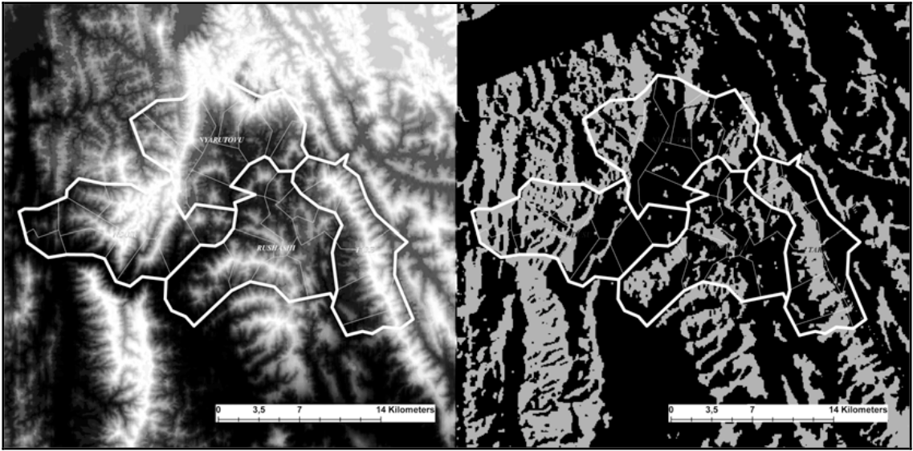

```{r setup, include=FALSE}
knitr::opts_chunk$set(echo = FALSE)
require(knitr)
require(kableExtra)
require(magrittr)
require(ggplot2)
require(data.table)
```

## Outline

- Structures and Violence
- Media and Violence
  - Coordinaton
  - Persuasion
- Evidence

# Structures and Violence:

---


How does media "incite violence"?

<iframe width="560" height="315" src="https://www.youtube.com/embed/a7qgJ4NbJG0" title="YouTube video player" frameborder="0" allow="accelerometer; autoplay; clipboard-write; encrypted-media; gyroscope; picture-in-picture" allowfullscreen></iframe>


## Puzzles:

Strategic Logic:

- Why do voters follow ethnic parties after violence? Why not ostracize party for fomenting violence?

Psychological Logic:

- Why do people perceive their group as under threat?
- Why do people perceive status threats/moral transgression?
- Why do people hold implicit attitudes?

### What is the role of structure in ethnic violence?

## Structural Causes of Violence?

Fearon and Laitin (2000) consider possibilty that discourse (cultural schemas) shape behavior

- discourse of ethnicity/nationalism from colonization $\to$ conflict 
  - but not all colonized places have ethnic violence
- discourse can make some groups appear threatening or naturally subject to violence
  - but how are these discourses sustained?
  - schemas are reinterpretable

How can structures cause violence if structures are complex, overlapping, changeable?

How can structures cause violence if structures are stable?

## Structural Causes of Violence?

Link between structure and ethnic violence focused on schemas/discourse:

Structures are composed of schemas (ways of thinking) and resources (power/material):

- schemas that are endowed with more resources reach more people, shape more action
- schemas made available through parents, neighbors, schools, and media

We can focus on structures embedded in **media** as a cause for ethnic violence.


# Media and Violence:

## Media and Violence 

### Coordination

### Persuasion

These shape the motives, opportunities, and cost of doing violence

---

### **Persuasion**

Framing of events might change how people perceive/what people believe...

- what "problems" are there in society (what moral transgressions have occurred? what moral order ought be imposed?) **diagnostic frames**
- what are the "solutions" to this problem? **prognostic frames**
- what are the "facts" of what has happened? (which frames are credible?)

Media frames activate psychological mechanisms for ethnic violence:

- induce perceptions of threats, status threat, moral transgression; portray violence as "moral solution"
- reinforce stereotypes/implicit bias

## Media and Violence

### **Coordination**

Media messages might reduce...

- transaction costs of organizing violence
  - How to coordinate collective violence (find collaborators)
  - How to acquire information/weapons/targets (find targets)
- costly consequences of violence
  - alter audience perception that violence is "moral" (persuasion of non-perpetrators?)
  - change social pressure (within social network) to do/not do violence
  - Supportive voices offsets risk of condemnation

## Media and Violence

Why might it be difficult to empirically test for effects of media on ethnic violence?

>- When does media messaging that supports ethnic violence emerge?
>- Who is exposed to media messaging that supports ethnic violence?

# Example

## Rwandan Genocide: Background

- Colonial Origins of Hutu/Tutsi divide
- Independence created political struggle
- Civil War in 1980s, Tutsi armed group
- Breakdown of peace process in 1993-4

## Yanagizawa-Drott (2014)

### RTLM

- Government-run radio station

### Framing

**Diagnostic frames**:

- Emphasized RPF (Tutsi armed group) atrocities
- Alleged local Tutsis involved in conspiracy to dominate Hutus
- Dehumanized Tutsis as "cockroaches"

**Prognostic frames**:

- Preemptive violence necessary for "self-defense"

## Rwandan Genocide: Question

### Did radio endorsement of violence cause violence?

### Was it persuasion? Coordination?

## Rwandan Genocide: Question

**Some intuitions**:

### Persuasion

Violence perpetrated by **individuals** could be **coordination** or **persuasion**

### Coordination

Violence perpetrated **collectively** likely the result of **coordination**

Exponential effects suggest **coordination** rather than **persuasion**

"Spill-over"/"neighborhood" effects of radio suggest **coordination**

## Rwandan Genocide: Difficulty

### Selection Effects

Radio transmitters built by government... 

- built in places with disposition toward violence?
- built in places with greater government/party control?

Exposure to radio may be related to **other** factors that might explain participation in violence

## Rwandan Genocide

### "Random Variation" in Radio Exposure

Neighboring villages that are...

- same distance to radio transmitter
- but radio signals arbitrarily disrupted by local terrain

## Elevation and Radio Signal



## Elevation and Radio Signal


## Rwanda: Effects of Radio (RTLM)

Moderate increase in individual violence

**could be coordination**

* government endorsement of violence reduces costs for individuals
  
**could be persuasion**

* convinced of Tutsi threat
* believe dehumanization

## Rwanda: Effects of Radio (RTLM)

### Evidence of **Coordination** if we would observe...

**Increase in collective violence at high radio exposure**

- moving from sporadic to coordinated violence
- increases could be non-linear (exponential)

**Radio exposure in neighboring villages *amplifies*, not *offsets* violence**

- persuasion if nearby radio exposure **offsets** local radio effects on violence (radio exposure in neighboring village has no effect if there is radio in the village)

- coordination if nearby radio exposure **amplifies** local radio effects (neighboring village radio exposure increases collective violence)


## Rwanda: Effects of Radio (RTLM)


# Conclusion

## Conclusion

- Media a key structural factor that might complement:
  - strategic logic/psychological logic for violence
- Media effects may be via:
  - persuasion
  - coordination
- Rwandan Radio:
  - evidence for **coordination** effects
- Does media result in **persuasion**?


