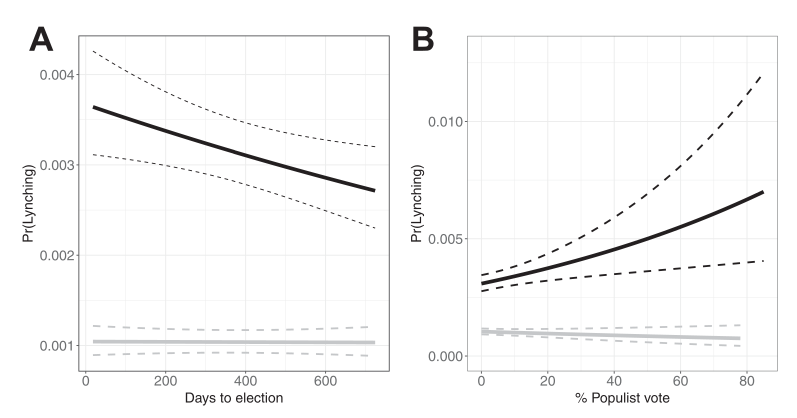

```{r setup, include=FALSE}
knitr::opts_chunk$set(echo = FALSE)
require(knitr)
require(kableExtra)
require(magrittr)
require(ggplot2)
require(data.table)
```

# Strategic Violence


## Outline

Previously: electoral logic of violence

Today: violence for power consolidation

- Wilmington Riot
- Power Consolidation vs Electoral Gain
    - difference in motives?
    - difference in opportunities?
    - difference in techniques?
- Evidence on Lynching in the United States


# Example


## Wilmington Race Riot

1898 Racial Violence in North Carolina:

- 21 years after "end" of Reconstruction, return of whites to power in the South

While you watch, compare this to electoral logic of ethnic violence we discussed earlier this week:

- how are motives for violence similar/different?
- how are opportunities for violence similar/different?
- how are techniques for violence similar/different?


---

<iframe width="560" height="315" src="https://www.youtube.com/embed/LVQomlXMeek" title="YouTube video player" frameborder="0" allow="accelerometer; autoplay; clipboard-write; encrypted-media; gyroscope; picture-in-picture" allowfullscreen></iframe>

---

## Wilmington Race Riot

Discuss with your neighbors: compared to the electoral logic of ethnic violence in India we discussed earlier this week:

- how are motives for violence similar/different?
- how are opportunities for violence similar/different?
- how are techniques for violence similar/different?

# Power Consolidation

## Comparison: Motives

**Electoral logic**: politicians/parties interested in winning office.

- use of ethnic violence is cynical tactic to win support of voters
- goal is to win next election, no agenda to end elections/change the rules
- violence "works" by unifying ethnic group around ethnic party

**Power consolidation**: politicians/parties have specific policy goals (group dominance, or non-ethnic policy around e.g. economy, tax rates)

- use of violence is tactic to secure policy goals, efforts to **change the rules**
- violence "works" by intimidating/disempowering outgroup (as an end in itself)
- violence "works" by unifying ethnic group, to attain policy goals


## Comparison: Motives

**Electoral logic**

- only worth it just before an election
- violence always informal
- primarily aimed at shifting voters preferences

**Power consolidation**

- violence may be useful before or **after** election to overturn/undo  results. 
- violence may be formalized (into violence that constitutes boundaries) with **rule changes**
- often aimed at intimidating "wrong" voters

## Comparison: Opportunity

**electoral logic**: 

- parties exploit existing organizational networks

**power consolidation**: 

- parties exploit existing organizational networks
- need cooperation from the state (or insurgent organizations)

# Evidence

## Race in the US

Before Wilmington Riot, similar events took place in 1870s:

- so-called "Redeemers" violently repressed black voters, overthrew elected legislatures/governors in the 1870s.
- E.g. In Louisiana, laid siege to state capital building.

## Epperly et al (2020)

Epperly et al (2020) examine whether racial violence was used for power consolidation more broadly in the US:

White Southern elites were interested in either or both policy goals 

- white supremacy
- limiting progressive economic policies (taxation, workers rights)

violence is strategically useful to 

- inhibit black political power
- prevent biracial political coalitions that enact progressive economic reforms

## Epperly et al (2020)

Different forms of violence available 

**lynching/mob violence**

- could unify whites (if mob is large), intimidate African Americans
- but costly: arouse national attention, federal civil rights enforcement
- inefficient: sporadic, requiring collective action and coordination

**legal system**

- could legally bar most African Americans from voting
- violence is *less visible*
- *efficient*: enforced by state agencies, easier to coordinate


## Epperly et al (2020)

If lynching served as a form of power consolidation, then

1. should expect lynching to follow electoral logic **when Jim Crow laws not in force**
    - lynchings nearer in time to elections
    - lynchings when bi-racial coalitions are powerful
2.  should expect lynching to no longer follow electoral logic **once Jim Crow laws in effect**
    - lynching no longer needed to take power; legal institutions replace it as form of power consolidation

## Epperly et al (2020)

Comparing counties within the same former slave states with

- similar proportion black population
- similar dependence on cotton production
- in the same year...

---

*before Jim Crow* (black lines)



*during Jim Crow* (gray lines), **flat**... no electoral logic

# Conclusion

## Back to Wilmington

Unresolved questions:

- Why attack Wilmington **after** electoral defeat of Fusion government?
- What is the purpose of extensive media coverage invoking racist fears?
- Why **hide** the history of this event?

## Back to Wilmington

Hints at an answer to Wednesday's question: why do "followers follow" ethnic elites who manipulate votes using violence?

Ethnic violence is often accompanied by messages that:

- provide "facts", narratives, and arguments that **justify** and **encourage** violence
    - highlight threat to **moral relationship**
    - signal support for violence

## Conclusion

Power Consolidation motives for violence:

- involve **policy goals** (including ethnic hierarchy)
- willingness to **change the rules**
- may transition from "violence that transforms boundary" to "violence constitutive of boundary"


