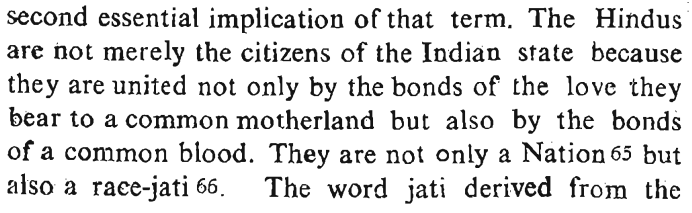
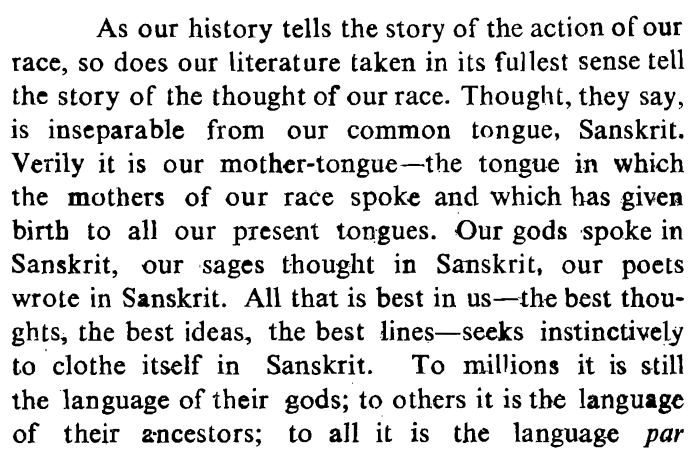
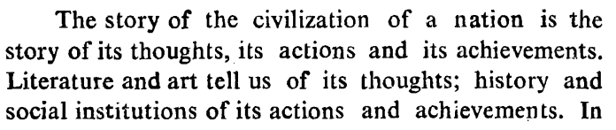
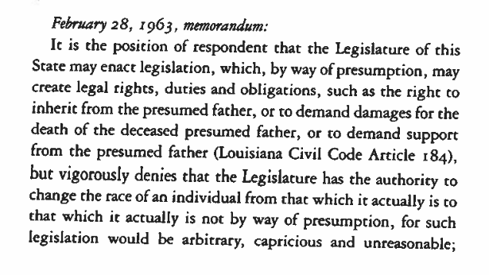
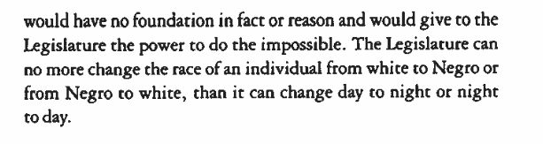

```{r setup, include=FALSE}
knitr::opts_chunk$set(echo = FALSE)
```


# An Introduction

### What is race/ethnicity?

## What is race/ethnicity: Goals

### Definitions

- What do ordinary people think they are?
- What social scientific definition can we use?
- Can race/ethnicity be changed?


### In Practice

- How does ethnicity/race work in reality?
- Prone to conflict? Why?
- Where do these groups come from?

# Today

## Goals

### What is common sense notion of race/ethnicity?

### Essentialist definition

### Primordialist definition

- film heads up

# STOP

## Think and Write

### 2-3 minutes:

### According to "common sense":

### What defines/ what are key attributes of "race" or "ethnicity"

# To the Board

#

## Essentialist definition

### **essentialist definition of race/ethnicity**:

an identity where membership...

- is based on descent
- is inherited at birth
- is an immutable/unchangeable part of who a person is
- is to a group who share some essential similarity
- is to a group that has persisted through time

Thus:

- natural ("blood", "genes")
- shared culture (language, religion), tradition, history

## Essentialist definition

**"based on descent"** and **"inherited at birth"**



---

**essential similarity** 




---

 **persistent** in time



---

**"immutable/unchangable"** ... Dominguez (1986)






# Does this definition <br> match reality?

## 

<iframe width=100% src="https://www.youtube.com/embed/1AkLxLmg-zg?start=140&end=320&autoplay=0" frameborder="0" allowfullscreen></iframe>


##

<iframe width=100% src="https://www.youtube.com/embed/1AkLxLmg-zg?start=1820&end=475&autoplay=0" frameborder="0" allowfullscreen></iframe>


##

<iframe width=100% src="https://www.youtube.com/embed/1AkLxLmg-zg?start=3015&end=80&autoplay=0" frameborder="0" allowfullscreen></iframe>


## Key questions: {.build}

### How does Ava Duvernay's family history complicate the essentialist definition?

### Why does it matter to her that her ancestry is >50% African?

## Rejecting Essentialism

### Checkered history

- White supremacy, slavery, eugenics, genocide

- anti-colonial struggles for self determination

### Empirically and Theoretically flawed

- ethnicity can be changeable (rules for membership/individual membership)
- absence of "essential similarities": ethnic group members often diverse, share traits with non-members
- common origin/common history requires circular reasoning 

## Rejecting Essentialism:

Brubaker and Cooper (2000):

**categories of practice**: categories/concepts of everyday life, used by social and political actors

**categories of analysis**: categories/concepts employed by social scientists attempting to describe and explain phenomena in society


## Rejecting Essentialism:

Essentialist definition of ethnicity/race is a **category of practice** (e.g. used by nationalist activists like Sarvarkar)

but it fails as a **category of analysis**.

- **today** no serious academic research employs essentialist understanding of ethnicity
- but, these categories were **reified** in the past

## Rejecting Essentialism

Thus, social scientific approaches to ethnicity treat it as "constructed". **Constructivism** comes in many flavors. 

**primordialism**

> "The attachment to another member of one’s kinship group is not just a function of interaction... It is because a certain ineffable signicance **is attributed** to the tie of blood"

the psychological attachment to descent-based membership is **innate** in humans (Gil-White 1999)

---

### **primordialist definition of race/ethnicity**:

an identity where membership is based on **perceived** descent such that it is 

- inherited at birth
- even if not in fact, people **believe** that it:
    - is an immutable/unchangeable part of who a person is
    - a group in which all share some essential similarity
    - a group which shares a history and interests

Thus, ethnicity/race:

- durable/hard to change once created; changes are slow
- shared (or imagination of shared) culture (language, religion), tradition, history
- even if not natural, people treat them "as if" they are natural

## Primordialism vs Essentialism:

Primordialist definition of ethnicity differs from essentialism:

- It does not accept essentialist definition of ethnicity, but states that most people in practice adopt an essentialist view of ethnicity.


