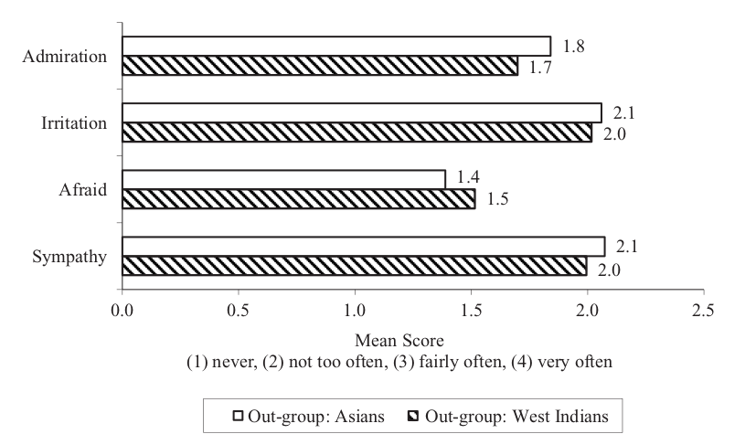
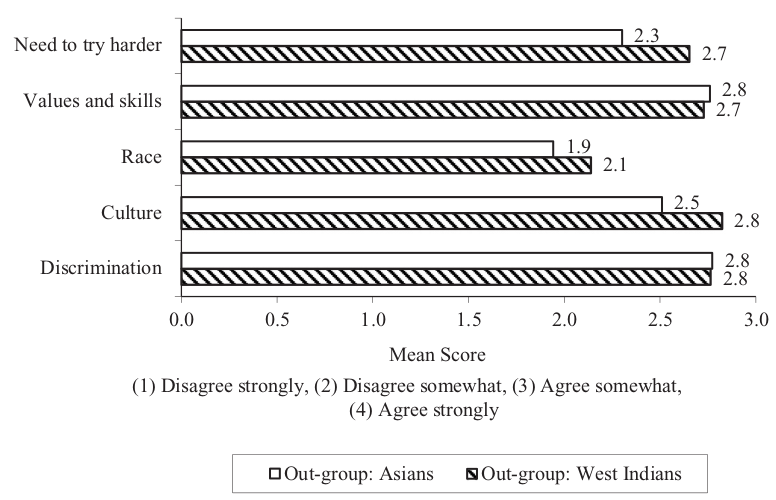
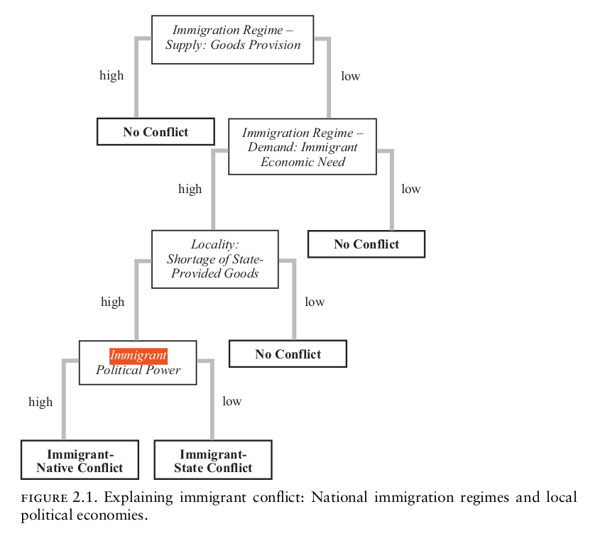
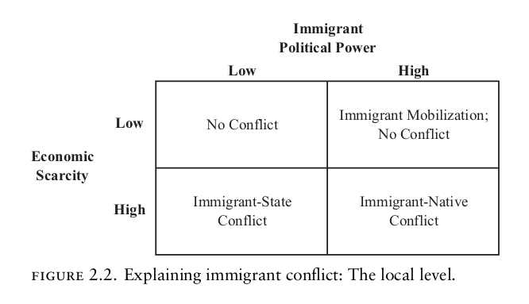
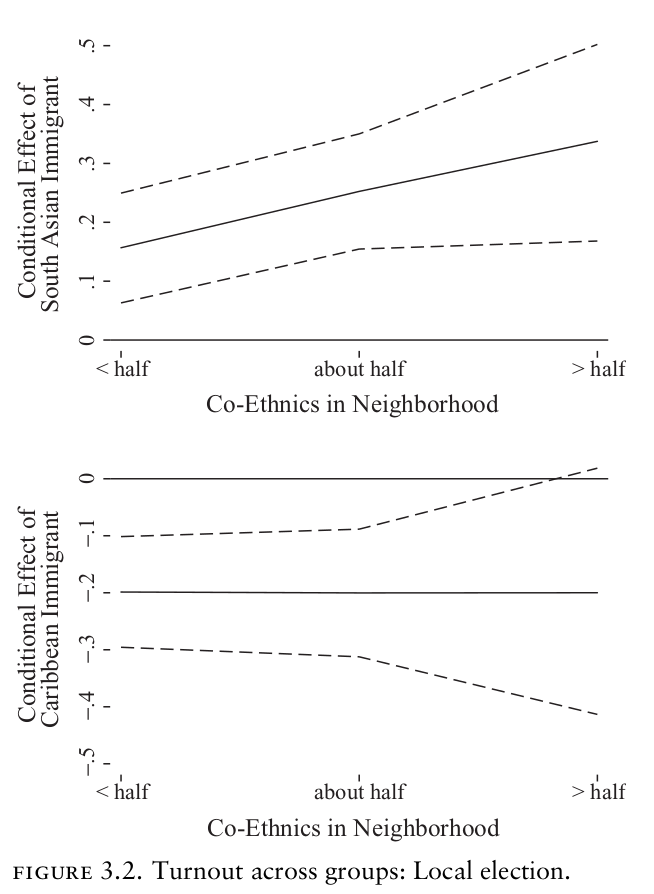
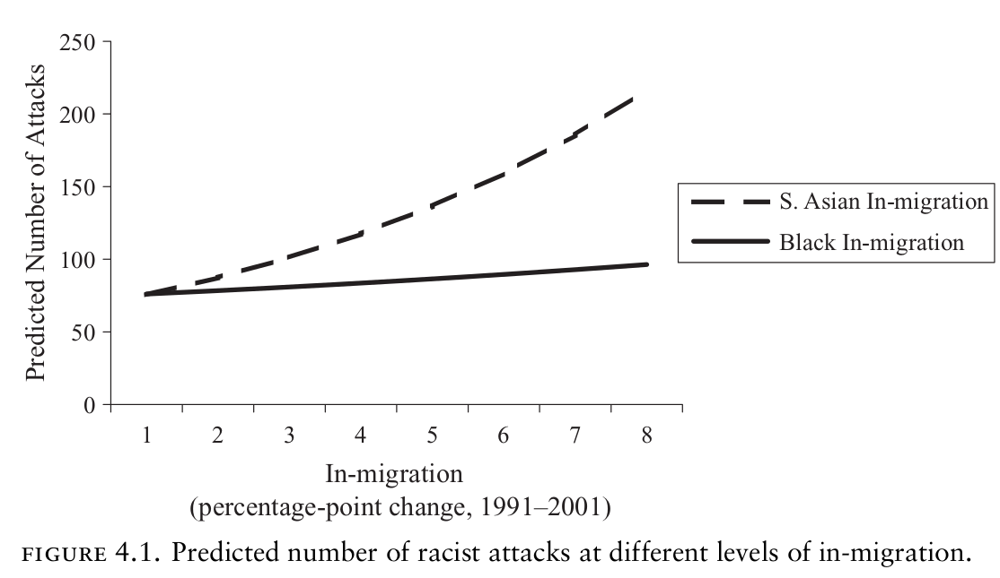

```{r setup, include=FALSE}
knitr::opts_chunk$set(echo = FALSE)
require(knitr)
require(kableExtra)
require(magrittr)
require(ggplot2)
require(data.table)
```

# Immigration and Conflict

## Outline

- Is Immigration distinctive?
- Two examples
- Types of immigrant conflict (Dancygier)
- Final Papers

## Immigration

### **Is ethnic conflict over immigration different from other kinds of ethnic conflict? If so, why?**


## Immigration

**Three perspectives** on why immigration may be different

1. **Strategic**: changing incentives (winning coalitions, economic competition)
2. **Psychological**: changes the salience of ethnic categories (Hale), changes the set of status comparisons (SIT)
3. **Structural**: "encounter" of new groups; new opportunities for structural change: cultural differentiation, institutional separation, marking of difference

# Immigration in the UK

## Two Examples:

Two short clips about different conflicts involving immigrants in the UK.

- Near in time: 1979, 1981
- Different immigrant groups

**As you watch: think about what is different about these events**

- in terms of **the nature of the conflict**

## Example 1: South Asian

<iframe width="560" height="315" src="https://www.youtube.com/embed/5XnHbxyTnIs?start=24" title="YouTube video player" frameborder="0" allow="accelerometer; autoplay; clipboard-write; encrypted-media; gyroscope; picture-in-picture" allowfullscreen></iframe>

## Example 2: West Indian

<iframe width="560" height="315" src="https://www.youtube.com/embed/lrIAexK_FII" title="YouTube video player" frameborder="0" allow="accelerometer; autoplay; clipboard-write; encrypted-media; gyroscope; picture-in-picture" allowfullscreen></iframe>

## Discussion:

### **What is different about these events**

- in terms of **the nature of the conflict**

## Dancygier (2010)

There are **two kinds** of immigrant conflicts that arise:

$1$. **Native-Immigrant conflict**:

- sustained confrontation between members of the immigrant and the native populations in a given locality
- characterized by xenophobic parties protesting against immigration and immigrant inclusion, protests/attacks on people/property on basis of immigrant origin. Includes self-defense mobilization by immigrant communities.

## Dancygier (2010)

There are **two kinds** of immigrant conflicts that arise:

$2$. **Immigrant-State Conflict**:

- the sustained confrontation between immigrant communities and state actors in a given locality
- characterized by immigrant youths opposing state actions and expressing distrust in state institutions.
- conflict with state employees, damage/destruction of state property, sometimes wider property destruction.
- focal point is often perceived discrimination by police as the local representative of a state

## Discussion:

Southall: **Native-Immigrant** conflict

Brixton: **Immigrant-State** conflict

### **What is different about these events**

- in terms of **their causes?**

## Dancygier (2010)

Many similarities between South Asian, West Indian communities:

- Similar immigration history (same immigration laws, same time period, non-white, came as economic migrants)
- During the 1970s and 1980s: 

  - both groups employed in primarily manual labor/working class jobs
  - both groups had similar male unemployment rates, both significantly higher than among white Britons
  - had settled in areas with similar unemployment

---

Many similarities between South Asian, West Indian communities:



Racial/ethnic attitudes towards these group very similar.

---

Many similarities between South Asian, West Indian communities:



Racial/ethnic attitudes towards these group very similar.

## Dancygier (2010)

Broadly, these groups had different experiences:

Paralleling the two events we learned about;

- South Asians reported far higher levels of racial attacks/harassment
- West Indians reported far lower approvals of the police

## Dancygier (2010): Theory

1. People are motivated to secure access to scarce resources
2. Immigration *can* lead to competition over access to scarce government resources (e.g. housing, school seats, welfare)
3. Both immigrants and natives seek to make demands on democratic governments to access to resources.
4. Political parties seeking to win office decide who to help through cost-benefit calculation

    - if immigrants can supply more votes than native votes that are lost, parties will help, provoking nativist backlash
    - if immigrants not politically effective, they face exclusion/discrimination, provoking immigrant anger at the state

---



---



## Dancygier (2010): Evidence

In the UK, levels of resources scarcity are held the same, but political efficacy of ethnic groups are different:

**South Asian**:

- migrants come from specific areas; bring dense village, kinship networks; more concentrated settlement
- In elections: Concentration $\xrightarrow{}$ electorally pivotal. Dense networks $\to$ higher turnout

**West Indian**:

- migrants have only family networks; settle in lower concentrations; often divided by class, different country of origin.
- less political influence, lower organizational capacity


---

Voter Turnout




## Dancygier (2010): Evidence

In the Greater London Area:

- Even though more West Indian/African residents than South Asians in early 2000s
- By 2006, only 84 West Indian/African candidates had won in local elections, compared to 199 South Asian.

## Dancygier (2010): Evidence

Major immigrant conflicts involving each group:

- South Asians involved in ten events, ~80% are native-immigrant
- West Indians involved in twenty-two events, ~80% are immigrant-state, against police

## Dancygier (2010): Evidence

Comparing wards within London:

- with similar population, wealth, and male unemployment
- wards with greater in-migration of South Asians have higher rates of racist violence (against South Asians)
- wards with greater in-migration of West Indian and Africans see no change in rates of racist violence (against those groups)

---



# Conclusions

## Strategic Logic

Dancygier explains divergent outcomes due to strategic interests:

- competition over economic resources
- variation in political power makes immigrant groups influential/excluded
- results in different strategies for seeking resources from the state
- results in different responses from natives.

## Final Project

On the syllabus: Deadline in December 7th

In reality: **No late penalty** for papers turned in by December 14th at midnight
