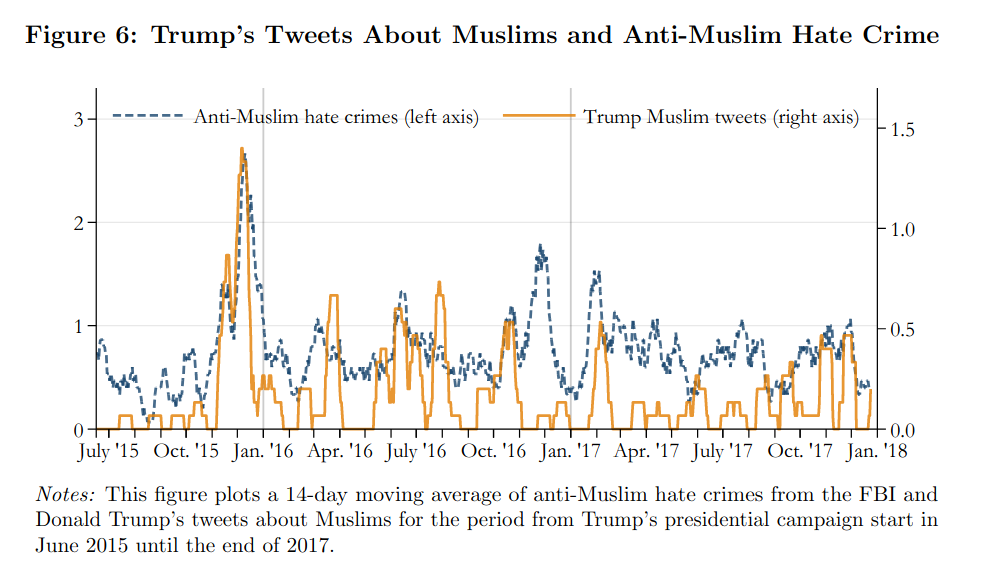
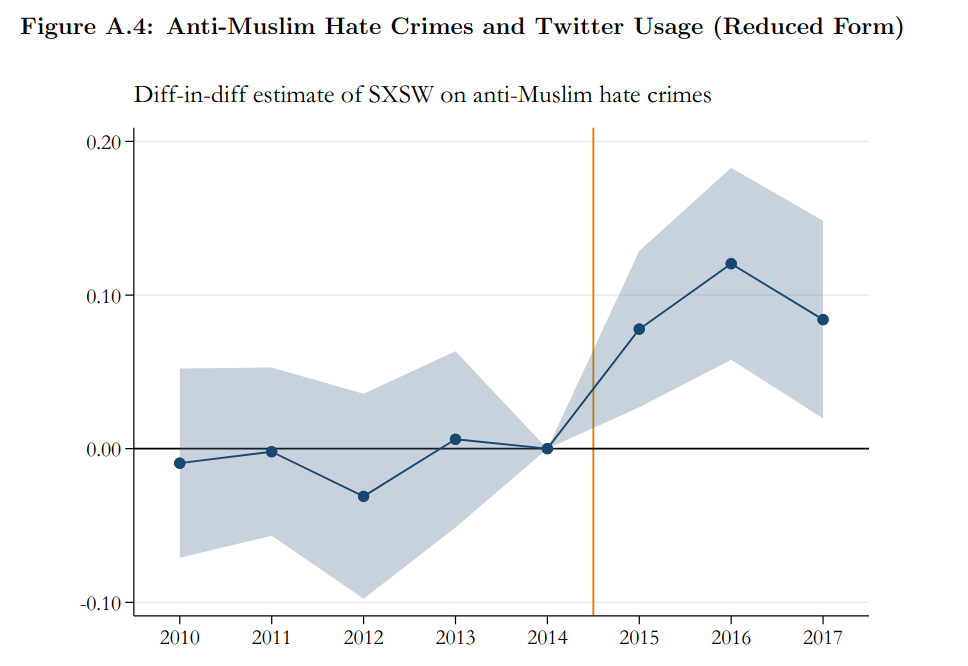
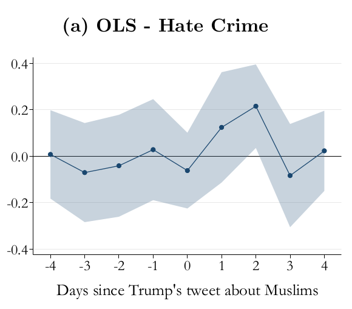
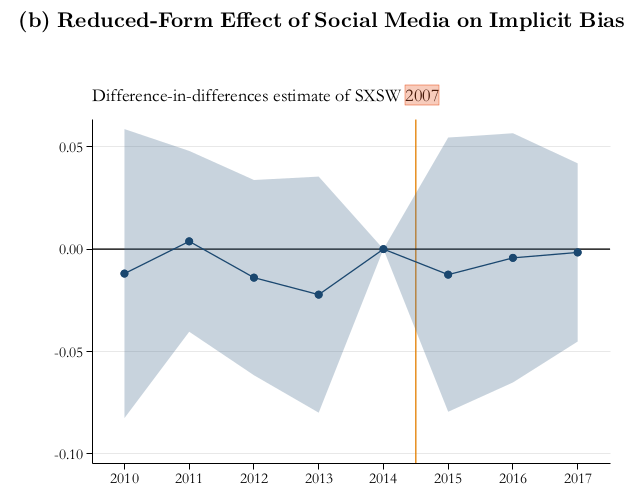

```{r setup, include=FALSE}
knitr::opts_chunk$set(echo = FALSE)
require(knitr)
require(kableExtra)
require(magrittr)
require(ggplot2)
require(data.table)
```

## Outline

- Media and Violence
  - Persuasion
- Evidence:
  - Nazi Radio
  - Russian Social Media
  - Trump on Twitter

# Media and Violence

## Media and Violence 

### **Persuasion**

Framing of events might change how people perceive/what people believe...

- what "problems" are there in society (what moral transgressions have occurred? what moral order ought be imposed?) **diagnostic frames**
- what are the "solutions" to this problem? **prognostic frames**
- what are the "facts" of what has happened? (what frames are credible?)

## Media and Violence

### **Coordination**

Transaction costs of organizing violence

- How to coordinate collective violence
- How to acquire information/weapons/targets

Consequences of violence

- Social pressure (within social network) to not/do violence
- Supportive voices offsets risk of condemnation

## Evidence:

**Coordination** definitely explains some effects of media on violence:

- Rwandan Genocide:
  - reduced costs of organizing violence
  - reduced perceived social costs of violence

## Evidence:

Is there evidence of **persuasion**?

**Difficulties**:

Do people with pre-existing ethnic bias/hatred select into media messages promoting violence?

# Nazi Radio

## Nazi-Era Radio:

### Did exposure to the radio increase violence against Jews?

Examine two time periods: 

- 1928-1932 (Moderate control over radio)
- 1933-1945 (Nazi control over radio)

## Nazi-Era Radio:

During 1920s, radio, a new technology, regulated by Germany government

- When Weimar government ruled, forced moderate, pro-democracy messages on radio
- When Nazis take control, anti-semitic propaganda on the radio

### **What are the effects?**

- on voting for Nazi party?
- on anti-semitic activities?

## Nazi-Era Radio:

How do Adena et al get around selection into radio exposure?

- Compare effects of same radio exposure when message **changes**
- Local, arbitrary variation in exposure to radio signals:
  - exposure to radio signal, net of expected radio given population, proximity to major cities, elevation

## Radio Effects

In analysis of radio exposure and...

### Nazi Voting

**Increasing radio exposure when messages are Moderate**

$\rightarrow$ fewer Nazi votes

**Increasing radio exposure when messages favor Nazis**

$\rightarrow$ more Nazi Votes

## Radio Effects

In analysis of radio exposure and...

### Antisemitic Behavior (1929-1934)

**Increasing radio exposure when messages are *Moderate***

$\rightarrow$ less anti-Semitic violence/harassment (not statistically significant)

**Increasing radio exposure when messages sent by *Nazis***

$\rightarrow$ more anti-Semitic violence/harassment

## Radio Effects

Effects on voting could be **persuasion**, since it is individual choice

Effects on anti-Semitic violence could be **persuasion** or **coordination**:

- persuasion if it induced more people to adopt anti-Semitic views, perceive imminent threat posed by Jews
- coordination if it facilitated rallies, "normalized" anti-Semitic violence

## Radio Effects

Coordination or Persuasion?

### Antisemitic Behavior (Late 1930s)

**Increasing radio exposure when messages favor Nazis**

$\rightarrow$ 

- **increased** denunciations/deportations of Jews
- **increased** letters to anti-Semitic newspapers
- no effect on attacks on Synagogues

## Radio Effects

### **Persuasion** or Coordination?

(1) **No effects** on attacks on synagogues (*collective* action)

(2) Exposure to radio caused more denunciations of Jews, open letters to Nazi newspapers (*individual* actions)

## Radio Effects

### **Persuasion** or Coordination?

(3) Effects of Nazi radio **different** in places with **different** histories of anti-Semitism
  
14th century pogroms against Jews predict Nazi-era violence, and
  
- Radio exposure **increased** anti-Semitism in places with medieval anti-Jewish pogroms
- Radio exposure **decreased** anti-Semitism in places without medieval anti-Jewish pogroms

## Radio Effects

### Most likely *Persuasion* and *Dissuasion*

**persuasion**: frames are *resonant* (consonant) with local norms and lead to violence, more antisemitism

- Nazi radio elicits anti-semitic violence in places with **history of antisemitism**

**dissuasion**: frames thare are **dissonant** with local norms provoke a **backlash**, less anti-semitism

- Nazi radio elicits less anti-semitisc violence in places with **history of Jewish inclusion**

## Persuasion and *Dissuasion*

### Serbian Radio in Croatia

Della Vigna et al (2014) examine local variation in exposure of Croation communities to Serbian nationalist Radio due to topography

Croatian cillages with greater exposure to Serbian nationalist Radio see:

- Increased vote for extremist Croatian parties 
- Increased anti-Serb graffiti

Must be **dissuasion**, backlash against messages, not coordination.


# Social Media

## Social Media in Russia:

Bursztyn et al (2019) examine the effect of exposure to social media networks on:

- incidence of ethnic hate crimes
- prevalence of ethnic hatred

## Social Media in Russia:

In Russia, main social media platform is VKontakte (VK)

- similar to Facebook; launched in 2006.
- 90% of social media users in Russia by 2011.

We could compare cities with more VK users vs those with less...

>- but, how do we know it is VK that drives differences? Could be **other reasons** cities have more VK users, have different rates of hate crimes.

## Social Media in Russia:

"Random" exposure to VK social network:

- founder attended Saint Petersburg State University in 2006
- first users were students attending this University at the same time, their friends and families back home
- cities which sent more students to SPSU during 2006 have more VK users between 2007 and 2016. No relationship between VK users and cities that sent more students before/after 2006.


## Social Media in Russia:

### Effects on Hate Crimes

Hate crimes with ethnic motivation **increased** in places with more VK users:

- increased **more** where pre-existing support for xenophobic political parties
- increased hate crimes with **multiple perpetrators**

Suggests that this is not persuasion, but **coordination**.

- people who share xenophobic views, able to collaborate

## Social Media in Russia:

### Effects on Ethnic Hatred

Ethnic hatred  **increased** in cities with more VK users.

- measure ethnic hatred using list experiment (reveals hidden beliefs)
- effects are **strongest** for men, younger people, people with lower education
- no effects on women
- does not appear to affect public expression of ethnic hatred

This suggests there also is **persuasion**:

- personal beliefs about ethnic hatred increased

## Social Media in the US

Mueller and Schwarz (2020) examine the effect of anti-Muslim tweets by Donald Trump on hate-crimes against Muslims.

## Trump's Twitter and Hate Crimes

We can't observe the US in the absence of Trump tweeting against Muslims, so authors use correlation...

## Trump's Twitter and Hate Crimes

Trump's Twitter gained attention as he ran for President.


Trump made nearly 300 negative tweets about Muslims.


## Trump's Twitter and Hate Crimes

When Trump gained prominence, anti-Muslim hate crimes increased


## Trump's Twitter and Hate Crimes

Trump's anti-Muslim tweets, anti-Muslim hate-crimes track each other over time



## Trump's Twitter and Hate Crimes

Nevertheless...

- could be that something **other than Trump's Twitter changed** between 2014 and 2015 that increased hate crimes 
- Days with more Trump Tweets could be different in other ways; maybe news cycle focused on ISIS terrorism, driving both Trump tweets and hate crimes.
- Could compare changes in hate crime in communities with more vs less twitter users, but... *why do they have more twitter users?*

## Trump's Twitter and Hate Crimes

"Random" exposure to Twitter due to early joiners in 2007

- Twitter offered incentives to attendees at 2007 SXSW music festival
- Places with SXSW attendees in 2007 have more Twitter users for years afterward
- SXSW attendance likely unrelated to hate crimes.


## Trump's Twitter and Hate Crimes



Counties with more SXSW Twitter Joiners (treated) see larger increase in hate crimes following rise of Trump's Twitter

## Trump's Twitter and Hate Crimes


Days when Trump **golfed** followed by more anti-Muslim tweets. Hate tweets **unrelated** to news cycle.

## Trump's Twitter and Hate Crimes

Mueller and Schwarz compare hate crimes counties with more/fewer Twitter users when Trump tweets about Muslims.

- Compares changes in counties, over time.
- Any patterns cannot be explained by...
    - unchanging differences between counties (same counties over time)
    - different news events (same dates, tweets induced by golfing)
    - different trends in counties with high/low Twitter usage (SXSW attendees)


## Trump's Twitter and Hate Crimes



Trump anti-Muslim tweets (induced by golfing) increase anti-Muslim hate crimes in places with more SXSW Twitter users

---

Coordination or Persuasion?



**No changes in bias against Muslims in places with more twitter users, after Trump gains fame on Twitter**

## Trump's Twitter and Hate Crimes

Coordination or Persuasion?

- Effects of tweets **only for hate crimes with solo assailants**

---

Coordination or Persuasion?


- Effects of twitter users **only** in places with hate groups, history of hate crimes.

## Trump's Twitter and Hate Crimes

Coordination or Persuasion?

Twitter effects...

- Likely not **coordination** to plan violence, b/c effects are on solo attacks, in places where capacity for violence already present
- likely not **persuasion**, b/c no effects on anti-Muslim attitudes
- possibly changing social norms: changing **perceived social costs** of violence

# Conclusion

## Conclusion:

Media may cause ethnic violence by...

- enabling perpetrators to **coordinate** their actions
- **persuading** people to take action against ethnic others
- altering the perceived social acceptability of violence against ethnic others

Strong empirical evidence that **all three mechanisms** operate in the real world.

- social media affects all three