```{r setup, include=FALSE}
knitr::opts_chunk$set(echo = FALSE)
require(knitr)
require(kableExtra)
require(magrittr)
require(ggplot2)
require(data.table)
```

# Immigration and Conflict

## Outline

- South-North vs South-South immigration
- Refugees and identity formation in Tanzania
- Evidence

# Immigration Context

## Different patterns of immigration

- Dancygier (2010) looked at immigration to UK, Europe
- But refugee and immigrant flows by far **between** countries in the Global South, not to Europe/North America

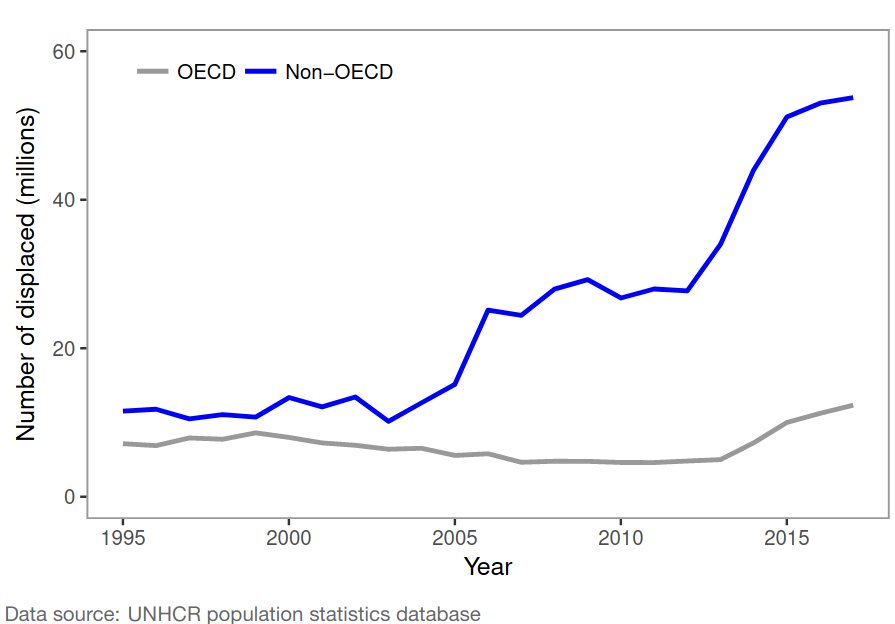


## Different patterns of immigration


What might be **different** about immigration in this context compared to immigration to places like UK, Canada?

## Different patterns of immigration

Possible differences:

- immigration driven more by conflict/displacement?
- immigrants/refugees enter already ethnically diverse societies
    - weaker states, weaker national identity
- immigrants/refugees may have co-ethnics in the host country
- assistance from UN/humanitarian organizations?

## Different patterns of immigration

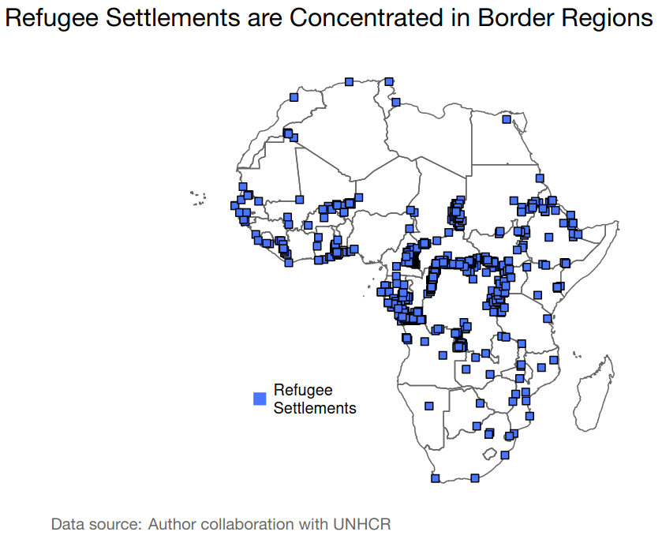

## Different patterns of immigration

Thinking about explanations for ethnic conflict we've discussed...

**How might the influx of refugees across a border affect ethnic identification and ethnic politics?**

## Example: Tanzania

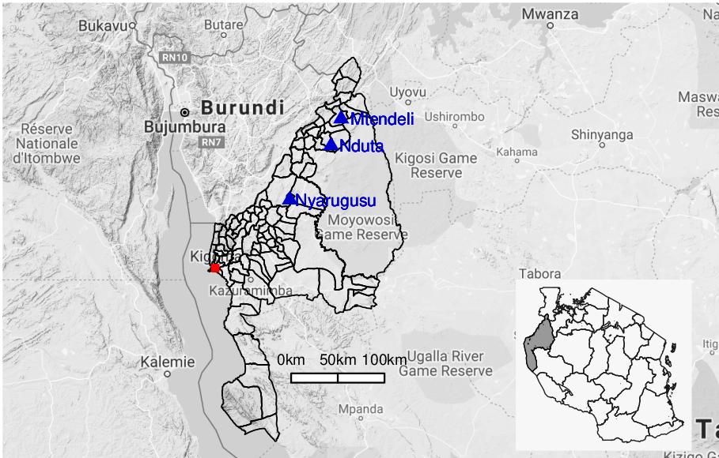

## Example: Tanzania

Kigoma region of Tanzania

- home to 35 ethnic groups
- border with Burundi
- colonial border divided linguistic-cultural group
- Ha (ethnic majority in Kigoma) share language, culture, intermarriage, trade  with Hutu population in Burundi
 

## Example: Tanzania

Repeated ethnic  violence in Burundi has displaced hundreds of thousands (1972, 1993)

- The displaced were primarily Hutus 
- Political crisis in Burundi 2015 triggered protests and violence:
    - 230,000 people fled Burundi into Kigoma
    - Kigoma region is only 2 million people
    - 10% shock in population over 1-2 years

## Example: Tanzania

Refugee influx:

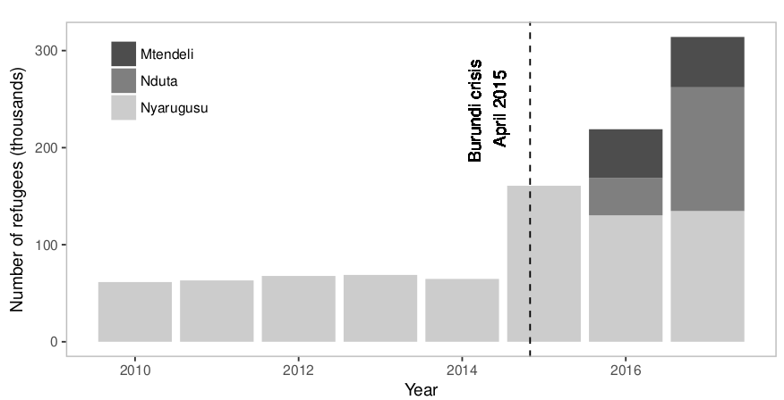

## Example: Tanzania

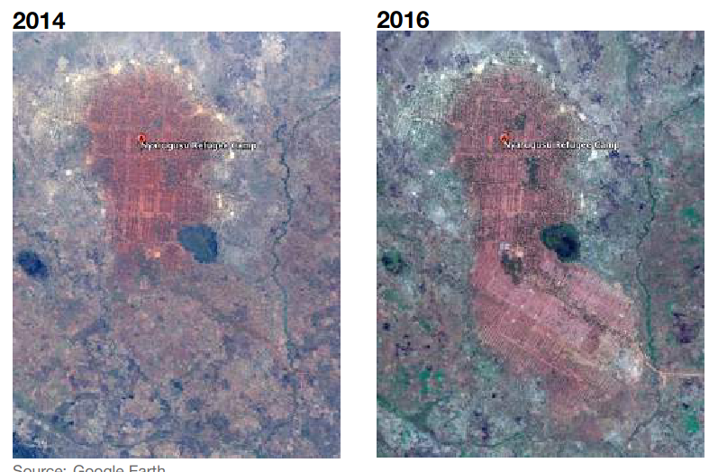

## Example: Tanzania

What are your expectations?

Will refugee inflow...

- increase salience of Ha-Hutu ethnic group identity vs others?
- increase salience of insider (national) vs outsider (refugee)?
- fail to change salient ethnic identities?

## Zhou (2019)

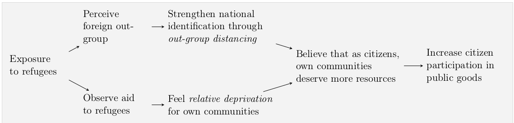

## Zhou (2019)

Building on Social Identity Theory:

- Refugees perceived as a threat (destabilizing, competing for resources)
- Co-ethnicity with refugees lowers ethnic group status
- To maintain positive status $\to$ emphasize *national* over *ethnic* identity
- Humanitarian aid to refugees $\to$ demands for public goods as *national citizens*

## Zhou (2019): Evidence

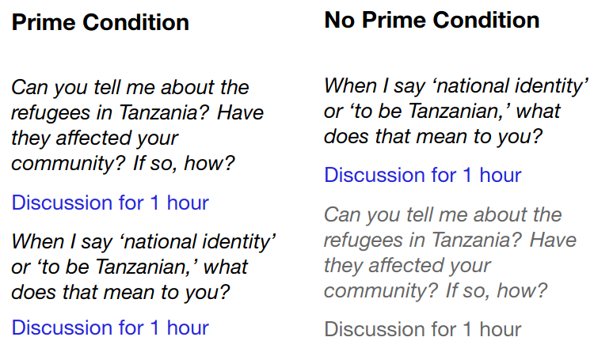

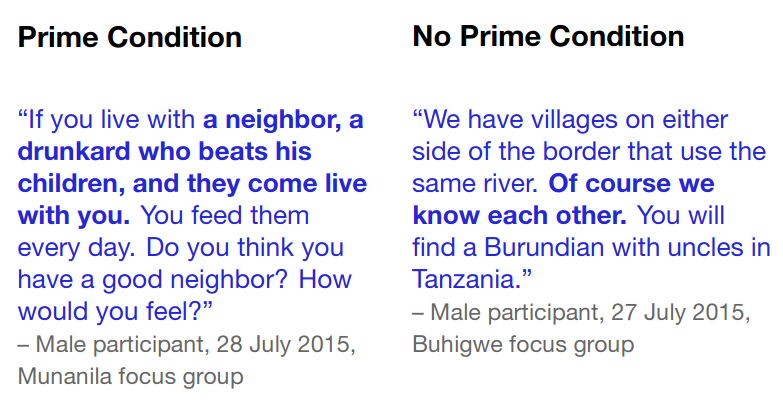


## Zhou (2019): Evidence

Surveyed people in 2016:

- after refugee influx
- before creation of additional refugee camps

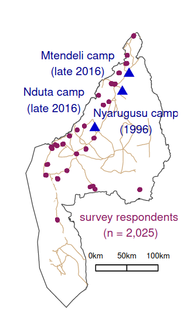

## Zhou (2019): Evidence

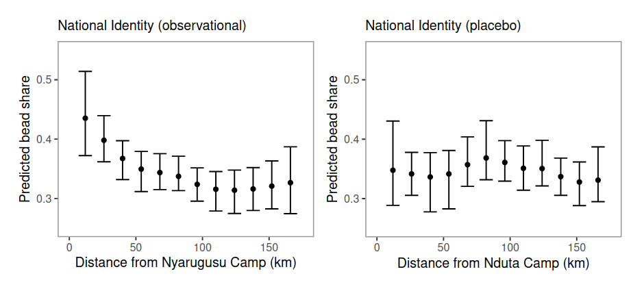

Greater national identification near **existing** refugee camps
## Zhou (2019): Evidence

Experiment: what if you remind people about refugee camps?

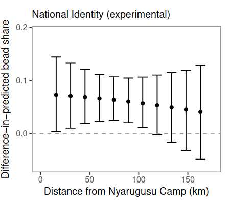

## Zhou (2019): Evidence

In focus groups, when reminded of refugees

- made more demands about public goods
- emphasized schooling
- schools depend on local committees to raise funds, monitor performance

## Zhou (2019): Evidence

Comparing schools in 2017 (post-influx) against 2012...

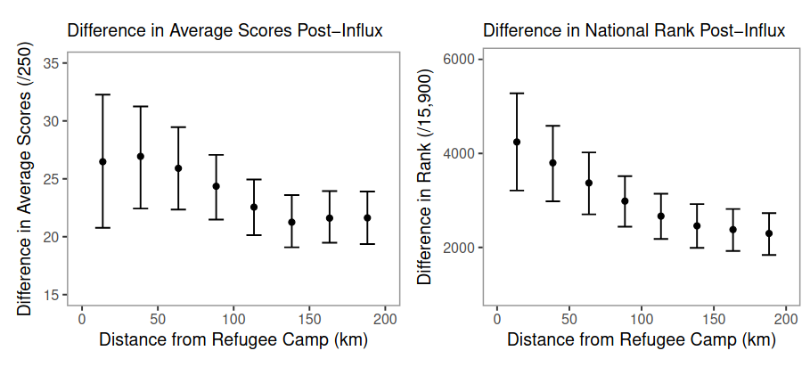

Bigger improvement in performance near refugee camps

## Conclusion:

- In-migration of co-ethnics can lead to emphasizing national identity
- Antagonism toward refugees
    - leads to overcoming ethnic divisions within a country
    - solving collective action problems

- This is a psychological story... where are the institutions?
    - Tanzanian government hostile toward refugees in multi-party era (strategic)
    - History of nation-building policies in Tanzania (structural)