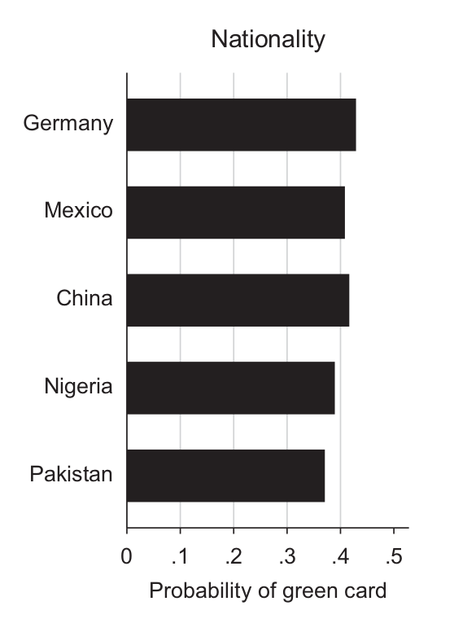
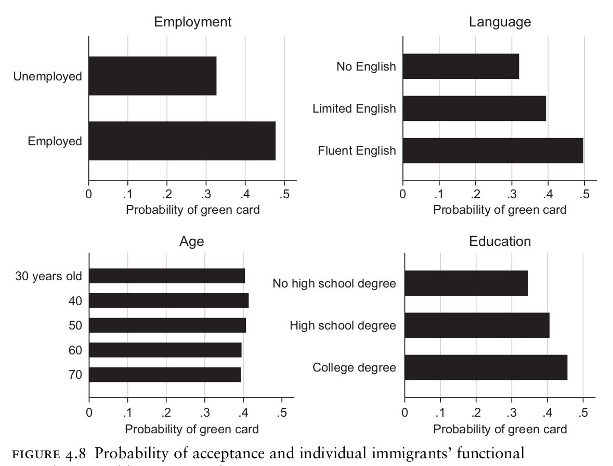
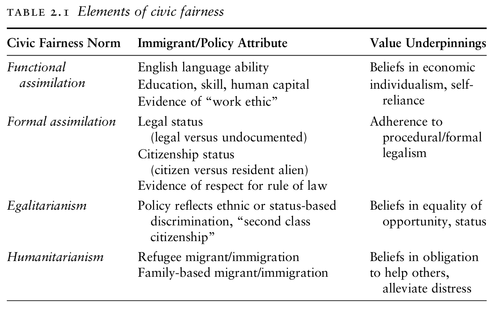
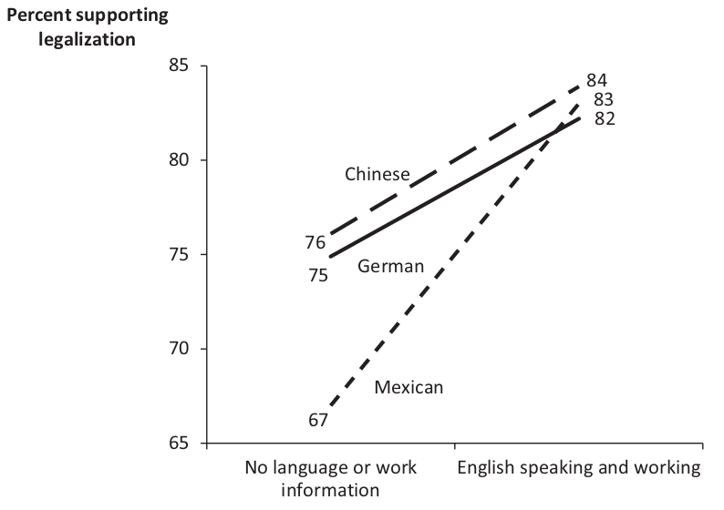
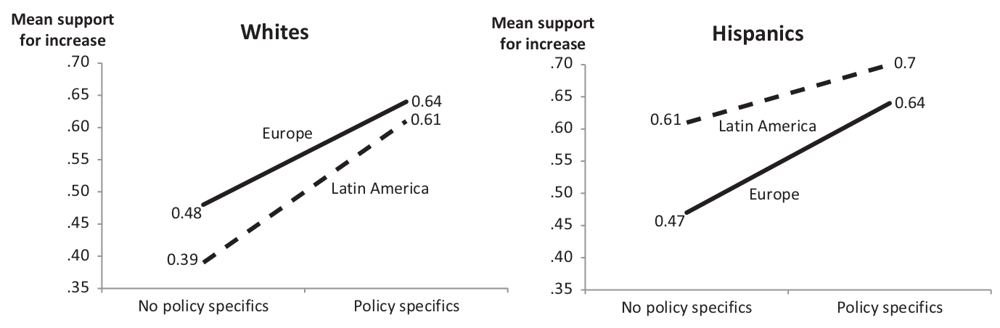
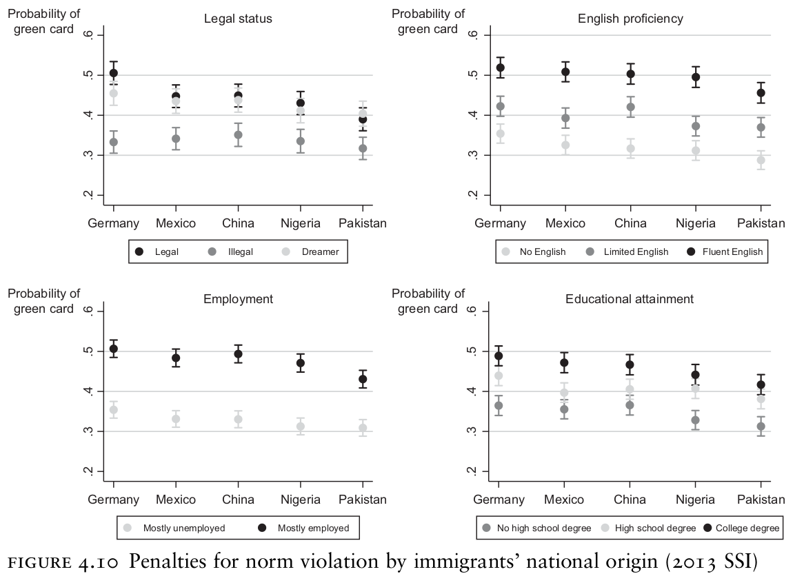

```{r setup, include=FALSE}
knitr::opts_chunk$set(echo = FALSE)
require(knitr)
require(kableExtra)
require(magrittr)
require(ggplot2)
require(data.table)
```

# Immigration and Conflict

## Outline

- Example: Immigration attitudes in the US
- In-group preference?
- Experimental Evidence (Levy and **Wright** 2020)

# Immigration in the US

---

<iframe width="560" height="315" src="https://www.youtube.com/embed/A8dL-uaqv_M" title="YouTube video player" frameborder="0" allow="accelerometer; autoplay; clipboard-write; encrypted-media; gyroscope; picture-in-picture" allowfullscreen></iframe>

---

<iframe width="560" height="315" src="https://www.youtube.com/embed/1DhAzZ4jVuU" title="YouTube video player" frameborder="0" allow="accelerometer; autoplay; clipboard-write; encrypted-media; gyroscope; picture-in-picture" allowfullscreen></iframe>

## {.centered}

<br>

<br>

### **What drives anti-immigration attitudes in the United States?**

## Group-Centrism

Social Identity Theory and related psychological theories suggest people

- support policies that help/raise status of groups they identify with
- support politices that harm or inhibit out-group/groups they dislike/groups they feel are threatening

Anti-immigration attitudes could be driven by:

- general opposition to out-groups
- ethnic/racial animosity
- fear of other ethnic/racial groups

These group-centric responses can be mobilized by politicians (e.g. Trump ad)

## Some Data Points (Levy and Wright 2020)

> $1.$ "more Americans prefer to decrease immigration than to increase it. But majorities nowadays also reject major cuts to the admission of refugees, skilled workers, and close relatives of US citizens, categories that account for 95% of green cards that the government issues each year."

> $2.$ "Most Americans express negative views about illegal immigrants and support efforts to crack down on unauthorized border crossings and hiring. But strong majorities – in some polls approaching 90% – support giving millions of illegal immigrants a way to become US citizens and oppose mass deportation"

>- Is this consistent with a group-centric explanation for immigration attitudes?

## A Direct Test:

Levy and Wright (2020) directly test whether people exhibit biases against ethnic out-groups:

- 2013 survey with $>2500$ respondents
- Respondents asked to evaluate five pairs of immigrants in
terms of whether one of the pair, neither, or both should get a green card.
- The national origin of each immigrant in a pair was **randomly** chosen from among (Mexican, German, Chinese, Pakistani, Nigerian)

**If white Americans' immigration attitudes are driven by SIT/group-centrist psychology, what patterns would you expect to observe?**

---

Proportion of immigrants accepted by national origin:



**How do these results compare to your expectations?**

## A Direct Test:

In this experiment, they also randomly varied six *other* attributes of the immigrants:

- legality of immigration status
- recent employment status (mostly employed, mostly unemployed)
- English proficiency (fluent English, broken English, does not speak
English)
- education (high school degree or less, some university, university degree)
- age (30–70)
- religion (Christian, Muslim, or not religious)

---

These other attributes matter quite a bit more...



What is going on here?

## Civic Fairness

Levy and Wright argue that:

1. People have a set of value around *civic fairness*: "a set of normative beliefs about what current and aspiring members owe their political communities and what these communities owe them in return."
2. When making decisions about immigration, they draw upon their civic fairness values **and** the informational context (what is the choice/policy; what do they know about the immigrants?) to make a decision.

## Civic Fairness

There are several different sets of civic fairness values; norms about **functional** and **formal** assimilation are widely prevalent. 



## Civic Fairness

Because civic fairness values are (a) important to people (emotional) and (b) easily accessible (cognitive):

- political elites frame messages about immigration and immigration policy in terms of these values.
- people infer which fairness values are relevant from political messages
- take a position based on *where they stand on the "relevant" values*

Recall: Trump ad, Prop 187

## What About Ethnicity?

In a random sample of 888 news stories about immigration:

- 74% included some kind of ethnic cue (nationality/ethnicity of migrants)
- 94% contained one or more references to civic fairness values

Political messaging may work to conflate values and ethnicity:

- When politicians or media stigmatize Latino immigrants (unemployed, illegal, not speaking english, dangerous), it may generate ethnic stereotypes about **civic fairness norm compliance**
- These negative stereotypes are still a form of ethnic prejudice

## Role of Prejudice

If Group-centric accounts are correct:

- negative stereotypes result from cognitive need to elevate in-group over out-group
- information that runs counter to stereotype should not matter, because people **prefer to discriminate**

If Civic Fairness account is correct:

- people will draw upon available ethnic stereotypes about civic fairness compliance when they lack  information about specific immigrants/immigration policies
- when specific information about immigrants/policy compliance with civic fairness is available, ethnicity should not matter (people engage in **statistical discrimination**) 


## A Direct Test:

If Levy and Wright are correct, and civic fairness values are what drive immigration attitudes:

- May observe that when there is **absence** of information with value compliance (legal, employed), there may be discrimination against ethnic others (stereotypes inform beliefs about value compliance)
- When information on value compliance is **present**, discrimination should disappear (stereotypes no longer "useful" information)

## A Direct Test:

In another experiment, survey respondents are asked to decide whether one immigrant should be given path to legal status.

Randomly assign...

1. Race/Ethnicity of immigrant:
    - either: German (Johan), Mexican (Juan), or Chinese (Yuan)
2. Information about the immigrant:
    - half **only learn** immigrant is 30 y/o, in US illegally for 2 years
    - other half **additionally learn** immigrant *speaks english*, *works as waiter*


---



Information erases ethnic bias $\xrightarrow{suggests}$ ethnic stereotypes as heuristic

## A Direct Test:

In another experiment:

Respondents are asked to choose whether to support a policy of admitting 100,000 more immigrants per year.

Randomization:

- whether they are told the immigrants will be from (Europe/Latin America)
- whether they are told no further details/told that policy requires immigrants to have job, know English, pass criminal background check


---



When immigration policy details more clear, ethnic bias disappears

## Are value applied unevenly:





Maybe norms about civic fairness are applied unevenly across ethnic/racial groups?

# Conclusion

## Conclusion:

1. SIT/out-group bias does not explain immigration attitudes well
2. Other cultural values about civic fairness matter
3. **BUT** negative stereotypes about groups determine **how values are applied**

Raises key question:

- How do people develop/change stereotypes?
- Puts a focus on **structural** understanding of ethnicity
    - media representations, ways of thinking/talking about ethnic groups
