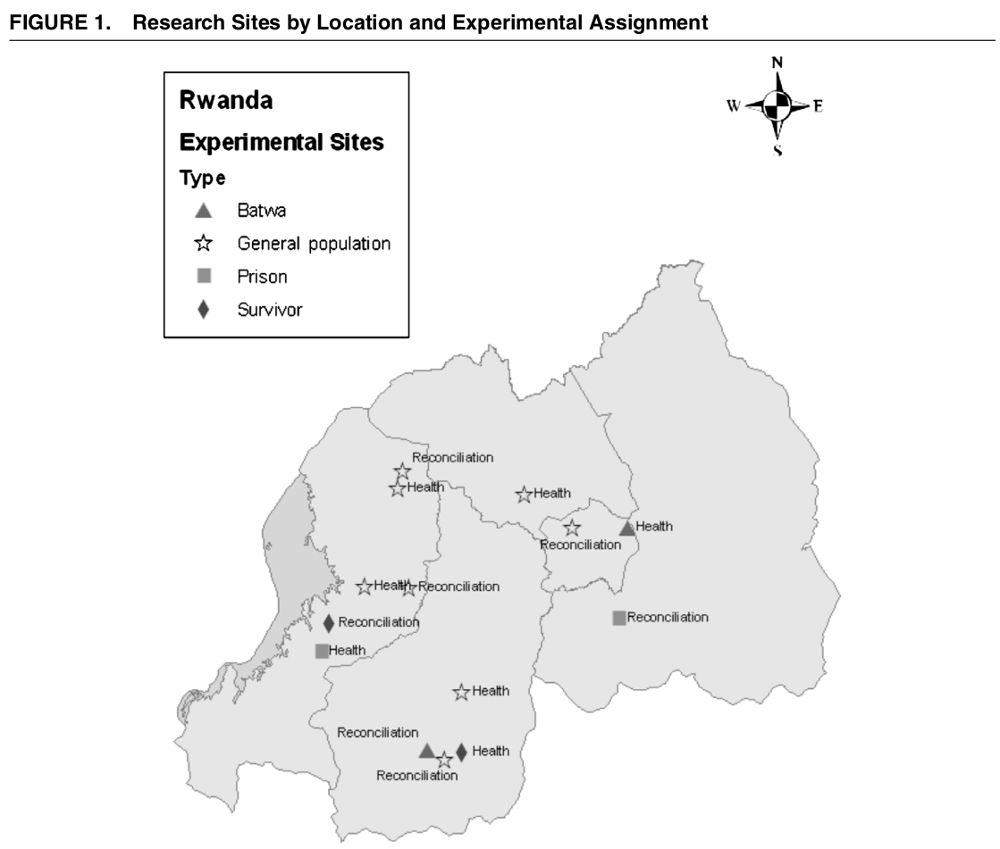
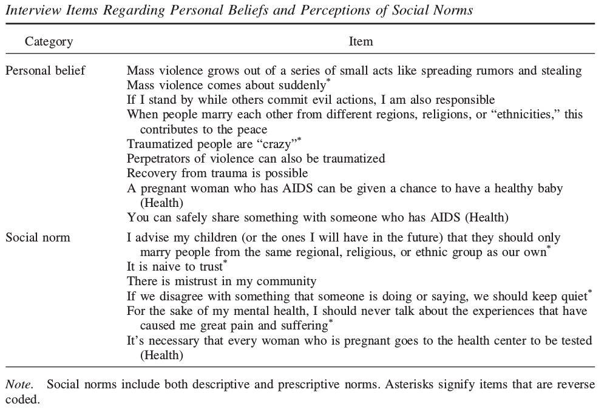
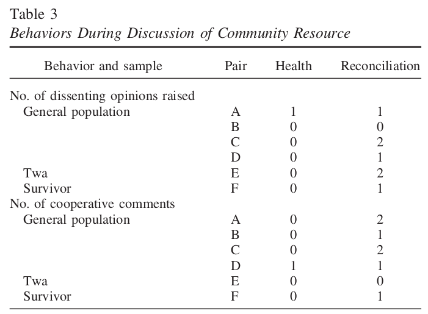

```{r setup, include=FALSE}
knitr::opts_chunk$set(echo = FALSE)
```

# Ethnic Cooperation

## Outline

- Reducing Conflict
  - reducing prejudice?
  - reducing violence?
  - possible strategies
  
- Media Interventions

  - changing inter-ethnic *attitudes*
  - changing *social norms*
  - evidence from Rwanda
  
# Recap

## Causes of Ethnic Violence:

- Strategic incentives for elites, ordinary people
- Psychological motives for individual violence
  - perceived moral threat/loss of status
- Media messages (cultural/structural)
  - affect costs/benefits of violence
  - persuade people of justness/necessity of violence
  

---

### **How can we *reduce* ethnic conflict?**

## Possible Solutions:

Consider interventions that change **individuals**

- Media to reduce prejudice
- Contact to reduce prejudice
- Durable institutions/culture that resists prejudice

# Media and Prejudice Reduction

## Media and Prejudice

Like media as cause of violence, media could...

**persuade**: influence people's beliefs about ethnic groups (including their own) and the relationship between them.

**coordinate**: influence people's perception of social norms dictating what is **appropriate** to say/do to other ethnic gorups (alter perceived social costs and consequences of behavior)

## Media and Prejudice

In groups:

**What kinds of media interventions do you think would be most effective at reducing ethnic prejudice? Violence?**


**Why are these media interventions potentially effective?**

## Media and Prejudice

Entertaining narratives likely to be effective at...

**persuasion**

- people less likely to opt in or out b/c of prior attitudes
- emotionally compelling $\to$ greater attention / understanding
- vicarious connection with out-group characters $\Downarrow$ prejudice

**changing social norms**

- characters show how pervasive are social norms 
- provide "scripts" for real-life interactions/conversations

# Does this really work?

---

<iframe width="560" height="315" src="https://www.youtube.com/embed/g6Z6mYZ26yc" title="YouTube video player" frameborder="0" allow="accelerometer; autoplay; clipboard-write; encrypted-media; gyroscope; picture-in-picture" allowfullscreen></iframe>

# Evidence

## Paluck (2009)

Can a soap opera improve inter-ethnic trust and cooperation in the wake of major ethnic violence?

- Rwanda ~15 years after the genocide
- Violence, in part, driven by radio
- Can "feel good" radio story overcome legacy of trauma, fear, distrust?

---

<iframe width="560" height="315" src="https://www.youtube.com/embed/RiPnE-hIIcU" title="YouTube video player" frameborder="0" allow="accelerometer; autoplay; clipboard-write; encrypted-media; gyroscope; picture-in-picture" allowfullscreen></iframe>


## Paluck (2009)

- Rwandan-produced soap-opera, *New Dawn* follows fictional events similar to 1994 genocide
- In this story, citizens work across ethnic lines to defy political leaders encouraging violence

### Soap Opera (New Dawn) messages

**beliefs**: violence a result of psychological need for security, belonging, group status, as well as lack of independent thought and dissent, insufficient inter-group interactions

**norms**: positive portrayal of inter-ethnic cooperation, expression of dissent (against in-group)

## Paluck (2009)

Paluck randomly assigned different communities to gather and listen to *New Dawn* or another soap opera about health and HIV.

### Experiment:

- 14 communities; 7 pairs with strong similarities, randomly assigned within pairs
- "Treatment" gets reconciliation soap-opera; "Control" gets health-themed soap opera
- Listened to show over course of a month in groups

---



## Paluck (2009)

Using surveys, field observation, measures...

- changes in beliefs
- changes in norm perception
- changes in empathy for others
- changes in behaviors

---



## Paluck (2009)

### No effects on beliefs:

- causes of violence (no change)
- bystanders responsible for violence (no change)
- intermarriage brings peace (no change)
- views on trauma (no change)
- views on reconciliation (no change)

## Paluck (2009)

### Reconciliation Soap Opera altered norms:

- in favor of inter-ethnic marriage
- trusting ethnic out-group not naive
- more willing to publicly discuss lack of trust
- more support for expressing dissent

## Paluck (2009)

### Empathy:

- During shows, verbal expressions of empathy for characters
- surveys showed more empathy for various groups in Rwandan society

## Paluck (2009)

### Behavior:

Did changing norms translate to action?

At end of study, groups were given the stereo. Asked to decide how to share the stereo and supply the batteries.


- In health soap opera groups: first person would suggest to give stereo to local village authority to control
- In reconciliation groups: people dissented against government control, preferred to work collaboratively to organize stereo use among themselves.

---




## Limits of Media

Paluck (2010) ran a similar experiment in Democratic Republic of the Congo:

- Treatment group gets soap opera + talk-show; control group gets soap opera
- Talk show asked people to
  - discuss inter-group cooperation/friendship
  - imagine themselves in the position of the outgroup

### Does discussion after a show increase its efficacy (reducing prejudice)?

## Limits of Media

"Treatment"/Discussion group showed:

- more contentious discussions
- more negative attitudes toward outgroup
- less willingness to help ethnic outgroup

## Limits of Media

Media received *in context*:

- with whom are people discussing the soap opera?
- do discussions complement or undo the narrative of the story?

## Conclusion

### Media interventions to reduce prejudice more effective if they...

1. Engage attention (more persuasion)
2. Subtle / not too obvious messages (more persuasion)
3. Show audience what others believe (social norms)
4. Create behavioral channels (social norms $\to$ behaviors)


## Conclusion

Narratives work well

- emotional attachment to characters in story
- may help reduce prejudice by humanizing outgroup

What about contact with **real people** in the outgroup?
