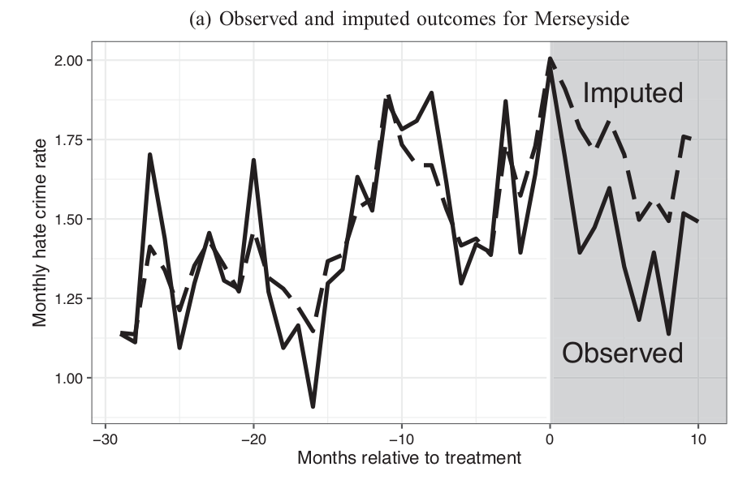
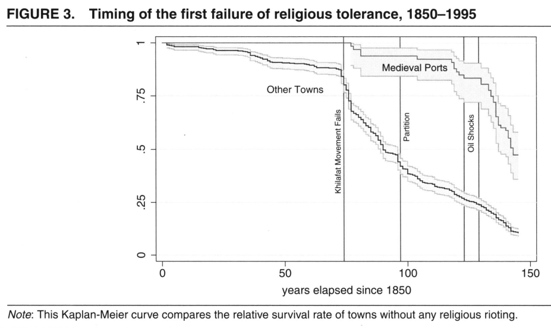
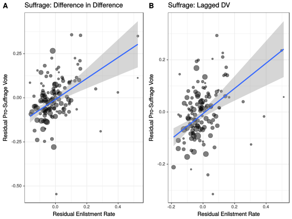

```{r setup, include=FALSE}
knitr::opts_chunk$set(echo = FALSE)
```

# Conclusion

## Outline

- Course Evaluations
- Key Lessons
- Limiting Ethnic Conflict
- What can we do?

# Course Evaluations

# Key Lessons

## Lessons:

We started off trying to answer:

- What is ethnicity?
- Why does ethnic conflict occur?
- Why does ethnic violence occur?

## Lessons:

Answers to these questions vary across contexts, but we have three sets of tools to explain:

- Strategic 
- Psychological
- Structural

## What is Ethnicity?

Ethnicity takes a variety of forms:

- We have to see how people label themselves and others strategically
- Ethnic choices reflect cognitive limits and social esteem
- Ethnicity embedded in shared understanding, relations of power

## Why Ethnic Conflict?

- Ethnic groups more effectively mobilized in competition over resources/power
- Zero-sum status competition between ethnic groups generate conflict
- Structures that institutionalize and generate disparities between ethnic groups lead to conflict

## Why Ethnic Violence?

- Violence can be used to win elections, extract resources
- Perceived status threats, moral transgressions, stereotypes drive individuals to participate in violence
- Media that justifies or encourages violence also increases ethnic violence

# Reducing Violence and Conflict

---

<br> 

### **Can these same tools *reduce* violence and conflict?**

## Incentives

**Electoral incentives** to win votes of ethnic out-group leads parties to limit violence against them. (Wilkinson 2004; Nellis, Weaver & Rosenzweig 2016)

Rules/procedures that ensure fair distribution of state "goodies" limits incentives for ethnic conflict (Chandra 2004)

Constitutional/electoral rules that encourage vote-pooling, limits consequences of losing elections reduce conflict (Horowitz 1985)

## Psychology

**Contact Hypothesis:** Allport (1954)

prejudice/negative stereotypes of other groups may be *reduced* by personal contact with members of the group when that contact...

- is among people of equal status 
- involves pursuit of common goals
- is sanctioned by institutions (law, custom)
- can reveal common interests

## Evidence is Mixed

Paluck, Green, and Green 2019

Focus on results of studies where contact is **randomly assigned** and prejudice measured at least 1 day later.

- Only 27 contact studies that were experiments
- Who is studied? (~ 1/4 study adults over age 25)
- What kind of prejudice (~3/5 study ethnicity)
- What kind of contact? (mostly short, scripted, lacking common goal or cooperation)
- What outcome? (explicit/implicit prejudice, behaviors)

## Evidence is Mixed

Overall:

- 24 out of 27 find reductions in prejudice ($p < 0.001$)
- Effect is very weak in larger, better designed experiments
- Effect is smaller in ethnic prejudice studies
>- Few studies attempt to explore sustained, collaborative contact in realistic settings

## Lowe (2020)

Caste in Rural India

- Can cooperative contact vs adversarial contact reduce caste prejudice?
- Randomized experiment in local cricket league
- Cooperation reduces prejudiced attitudes and behavior

---


## Mo and Conn (2018)

Race in the United States:

- Teach For America: community service organization
- place top university graduates as teachers in low-income schools
- 80% of students in these schools are African American or Latinx
- use TFA admission score threshold for "natural experiment"

Does participation in TFA reduce racial prejudice, increase empathy with racial outgroup?

##  Mo and Conn (2018)

As-if random assignment to TFA...

- **increases** perceptions of systematic injustice and inequality
- **decreases** racial prejudice
- **increases** positive assessment of racial minorities

## Structure

Do these psychological findings have an effect at a larger scale?

Need to investigate whether structural changes can reduce conflict.

## Sport

Mohamed Salah, Muslim star for FC Liverpool 

- high profile public image reduces Islamophobia?
- Compare change in hate crimes in Liverpool vs other similar cities

## Alrababa'h et al (2021)



## Trade

Medieval Trade in India and Hindu-Muslim Violence

- Coastal towns saw collaborative trade between Muslims and Hindus due to Hajj
- What if Muslim traders picked towns that were already more welcoming?
- Compare coastal towns with and without natural harbors for "random" allocation of Muslim traders
- Does legacy of inter-group collaboration reduce violence?

## Jha (2013)

Medieval port cities (Muslim traders) had fewer riots in 19th-20th century: 



## War

Civil War and Black Freedom

- Republican party abolished slavery, laws granting/protecting new rights
- Why did racist white voters accept this?
- Union Army vets and Black Americans: shared enemy, wartime collaboration, what was won?

## Weaver (2022)

In places with more soldiers support for Black voting rights $\uparrow$



# What can we do?

## Conclusion

**Strategic Incentives**: Difficult to change, especially when conflict is present

**Psychology**: We *can* promote and take part in inter-group contact

**Structure**: As individuals, we can't overturn existing ethnic structures...

... but, with cooperation, structure is changeable


