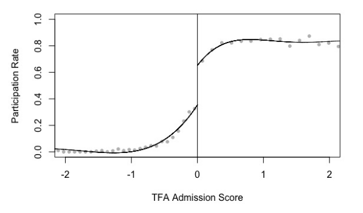

```{r setup, include=FALSE}
knitr::opts_chunk$set(echo = FALSE)
```

# Ethnic Cooperation

## Outline

Reducing Prejudice:

- Contact Hypothesis
- Does contact work?
- What kinds of contact work?


# Contact

## An example:

<iframe src="https://www.npr.org/player/embed/544861933/544891980" width="100%" height="290" frameborder="0" scrolling="no" title="NPR embedded audio player"></iframe>

---

Beyond media interventions, what about **face-to-face** contact with people of different ethnic groups?

### **Why do you think Daryl Davis's efforts worked?**

<br>

### **Do you think this kind of contact reduces prejudice more generally?**

<br>

### **What *kinds* of intergroup contact do you think might reduce prejudice?**

## Contact Hypothesis

Articulated by Gordon Allport (1954):

prejudice/negative stereotypes of other groups may be *reduced* by personal contact with members of the group when that contact...

- is among people of equal status 
- involves pursuit of common goals
- is sanctioned by institutions (law, custom)
- can reveal common interests

## Contact Hypothesis

Is there real world evidence that contact reduces prejudice?

Combining hundreds of studies, Pettigrew and Tropp 2(006) find it does, but consider this study...

> Researchers surveyed 3806 people in France, Great Britain, the Netherlands, and West Germany in 1988. They found that self-reported contact with members of immigrant outgroups was strongly associated with more positive evaluations of those groups.

Does contact **cause** less prejudice?

## Paluck, Green, and Green 2019

Focus on results of studies where contact is **randomly assigned** and prejudice measured at least 1 day later.

- Only 27 contact studies that were experiments
- Who is studied? (~ 1/4 study adults over age 25)
- What kind of prejudice (~3/5 study ethnicity)
- What kind of contact? (mostly short, scripted, lacking common goal or cooperation)
- What outcome? (explicit/implicit prejudice, behaviors)

## Paluck, Green, and Green 2019

Overall:

- 24 out of 27 find reductions in prejudice ($p < 0.001$)
- Effect is very weak in larger, better designed experiments
- Effect is smaller in ethnic prejudice studies
>- Few studies attempt to explore sustained, collaborative contact in realistic settings

## Contact: Evidence

New research explores sustained contact in realistic settings:

- Caste prejudice and cricket in India (Lowe 2020)
- Racial prejudice and Teach for America (Mo and Conn 2018)

# Example 1: Cricket

## Lowe (2020)

Caste in Rural India

- Varna, Jati vs OBC, SC
- Persistent discrimination against OBC, SC/ST
- networks segregated by caste
- intercaste interactions adversarial

Can contact reduce prejudice, foster cooperation?

## Lowe (2020)

An Experiment:

Assign young men, aged 14 to 30 to play in local cricket leagues

- 1200 men participate. 400 control. 280 in same-caste teams. 520 in mixed-caste teams.
- Teams of 5 play 8 40-minute matches over a month

---


## Lowe (2020)

Two forms of contact:

**collaborative**: mixed caste teams have contact in collaboration for common goal, "equal" status, sanctioned (official league)

**adversarial**: if opponents are other caste, then contact is toward opposing goals

---


---

Collaborative contact increases cross-caste friendship


Adversarial contact reduces cross-caste friendship

---

Collaborative contact increases positive cross-caste interactions


Adversarial contact reduces positive cross-caste interactions

## Lowe (2020)

Key findings:

- collaborative contact reduces prejudice, increases inter-caste friendship and cooperation
- adversarial contact increases prejudice, reduces intercaste friendship/cooperation
- **any** contact due to league reduces prejudice, but less for adversarial contact.

---


# Example: TFA

## Mo and Conn (2018)

**Teach For America**

- community service organization
- place top university graduates as teachers in low-income schools
- 80% of students in these schools are African American or Latinx
- 50k teachers through 2015

Does participation in TFA reduce racial prejudice, increase empathy with racial outgroup?

## Mo and Conn (2018)

A big problem:

**Who joins TFA? How are they different from people who don't join?**

## Mo and Conn (2018)

Natural Experiment:

- TFA applicants scored on assessment of teaching ability
- Scoring above/below cutoff has huge effect on admission to the program.
- Using TFA records, compare applicants just above and below this cutoff
- Survey applicants from 2007-2013 (admitted and not) in 2015-16.
- Assess beliefs about class inequality, racial injustice, racial prejudice

##  Mo and Conn (2018)

Score cut off affects **participation** in TFA:



---


---


##  Mo and Conn (2018)

As-if random assignment to TFA...

- **increases** perceptions of systematic injustice and inequality
- **decreases** racial prejudice
- **increases** positive assessment of racial minorities

---

Prejudice is reduced more when in contact with specific outgroup


# Conclusion

## Contact Hypothesis

Lowe (2020), Mo and Conn (2018) show that sustained contact reduces prejudice when:

- is among people of equal status $\checkmark -$
- involves pursuit of common goals $\checkmark$
- is sanctioned by institutions (law, custom) $\checkmark$
- can reveal common interests $?$

## Contact Hypothesis

These effects hold in **real world** situations

- team sports
- teacher-student relationships

But how easy is it to foster these kinds of interactions?