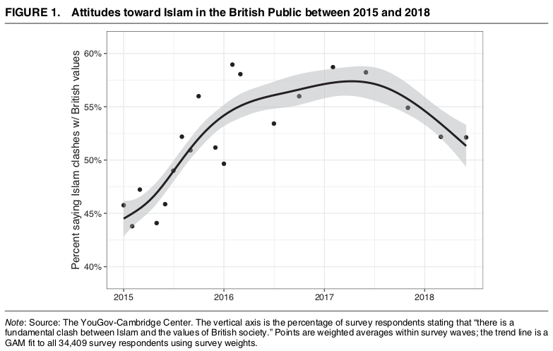
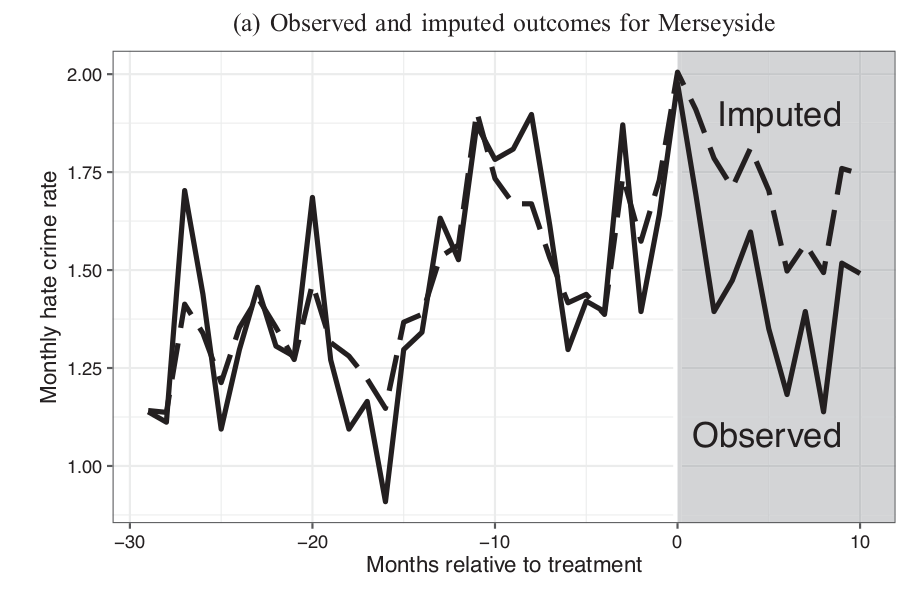
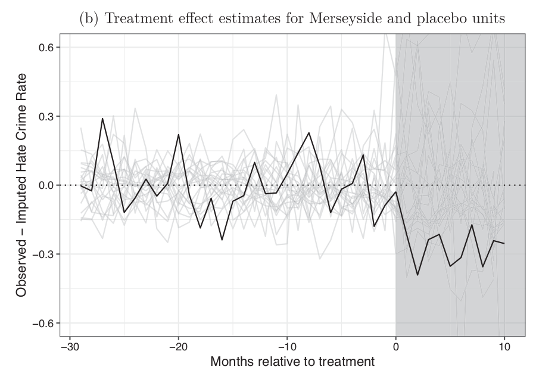
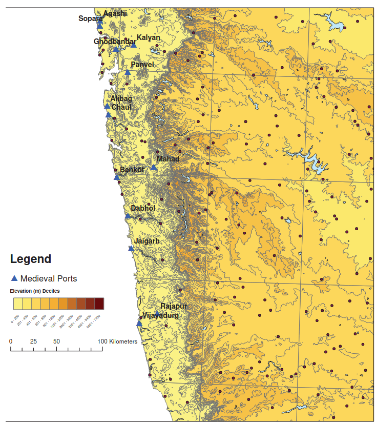
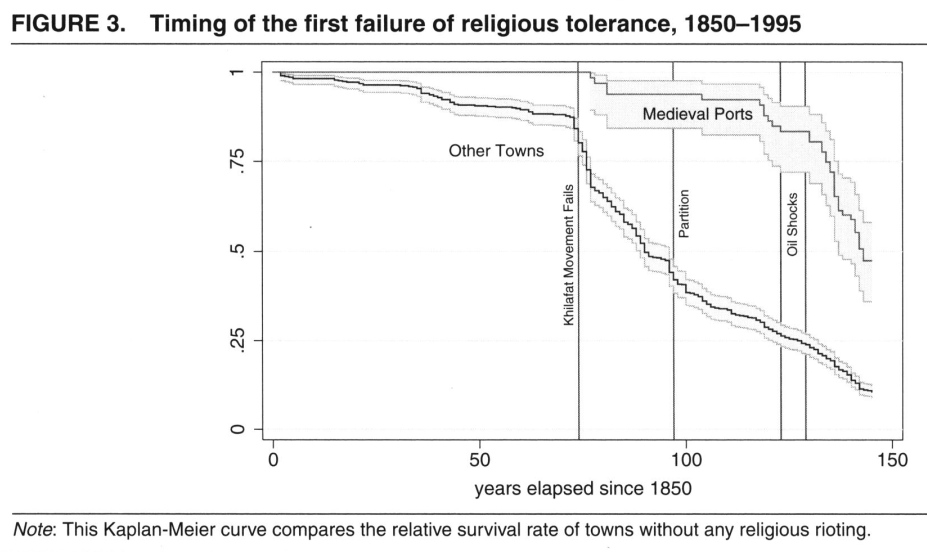

```{r setup, include=FALSE}
knitr::opts_chunk$set(echo = FALSE)
```

# Ethnic Cooperation

## Outline

Contact Can Reduce Conflict

<br>

What real-world conditions produce collaborative contact?

<br>

Examples:

- Sport
- Trade
- War

# Sport

---

<iframe width="560" height="315" src="https://www.youtube.com/embed/tK18ZXcKg8I" title="YouTube video player" frameborder="0" allow="accelerometer; autoplay; clipboard-write; encrypted-media; gyroscope; picture-in-picture" allowfullscreen></iframe>

## Football Star

How is Mohamed Salah playing for Liverpool similar to conditions laid out in **contact hypothesis**?

<br>

How is it **different**?

## Football Star

"Contact" that reaches far more people:

- not just those who elect to join intensive service organization (e.g. TFA)
- not just those who elect to join inter-group sports league (cricket in India)
- easier to overcome physical obstacles to "contact"
- potentially millions of fans of football club

## Football Star

Beyond anecdotal accounts we've seen:

<br>

**How would we know whether Mohamed Salah has reduced Islamophobia in Liverpool?**

>- prior evidence that African football matches increased national vs ethnic identity

## Alrababa'h et al (2021)



## Alrababa'h et al (2021)

Compare **changes** in anti-Muslim hate crimes and Twitter posts:

- from the time period before vs after Salah started at Liverpool
- compare changes in Liverpool (*treated*) against changes in rest of UK (*untreated*)
- Construct a "synthetic" Liverpool (other UK areas most similar in trends before Salah)
  - What would Liverpool have done in absence of Salah

## Alrababa'h et al (2021)



---

If we create compare trends in *every* region in UK to "synthetic" versions of itself, **Liverpool stands out**



---


## Alrababa'h et al (2021)

Compared to other places in UK, Liverpool **after Salah** saw

- greater reductions in hate crimes (but not other crimes)
- greater reductions in anti-Muslim speech on Twitter

# Trade

## Contact through Trade

Inter-group contact can occur in trading relationships

Paralleling Lowe (2020), trading contact can be:

**collaborative**: if trade mutually benefits both groups

**adversarial**: if groups compete in the same markets

## Jha (2013)

When two ethnic groups produce **complementary** goods and services:

- ethnic groups not competing over same market for goods
- gains made by one group, benefit the other group (and vice versa)
- and complementarities are costly to acquire (one group cannot "steal" or produce on its own the other group's goods/services)

Then inter-ethnic contact likely to be **collaborative**, not **adversarial**

## Jha (2013)

In medieval India, Muslim traders and Hindu communities had complentary trade relationships (**collaborative**):

- Muslims had unique access to Indian Ocean trade due to Hajj
- Hindus could not duplicate these networks, due to cost of the pilgrimage
- Muslims benefitted from trading Hindu-produced goods; Hindus benefitted from intra-Muslim competition in reducing price of imports

But this form of contact was concentrated in towns with **direct acccess** to the Indian Ocean

- in landlocked towns, Muslims lacked unique trading opportunities, competed with Hindu merchants and artisans (**adversarial**)

## Jha (2013)

How do we know whether medieval Muslim trading communities reduced Hindu Muslim conflict?

- What if Muslim traders picked towns that were already more welcoming?
- A solution: presence of natural harbors:
  - medieval ocean-going vessels required harbors that protected them from weather
  - compare coastal towns with and without natural harbors
  - "random" geography induces medieval Muslim traders
  
---



## Jha (2013)

Medieval port cities (Muslim traders) had fewer riots in 19th-20th century: 



## Jha (2013)

But medieval Muslim trade networks dissipated in the 17-18th century. Why persistence?

- collaborative trade contact led communities to develop institutions, culture that protected inter-group harmony
- e.g. Muslim traders funded local endowments, public goods, disaster relief
- Hindu communities created protections for Muslim minorities

## Jha (2013)

Sustained collaborative contact can produce **durable** inter-group peace.

# War

## Weaver (Forthcoming)

After the American Civil War, Republican legislators voted to:

- abolish slavery
- extend equal civil, political rights to African American (men)
- use the military, federal agents to enforce these changes

## Weaver (Forthcoming)

Before the war...

- most Republicans in no rush to abolish slavery, advocated for resettlement of freed people.
- most Northern voters were racist.

**Why did Republicans come to support and enforce African American civil rights?**

## Weaver (Forthcoming)

Union veterans:

- large share of post-war voters
- in their wartime experience...
  - increased animosity toward the South
  - collaborated with enslaved and freed African Americans against Confederacy
  - sense that African Americans had "earned" status as citizens

## Weaver (Forthcoming)

Soldiers (compared to non-soldiers) from Iowa and Wisconsin became more supportive of African American suffrage after the war

## Weaver (Forthcoming)


## Weaver (Forthcoming)


# Conclusions:

## Inter-group Contact Happens

Outside of experiments, elective service programs, collaborative inter-group contact does happen.

- mixed ethnic sports teams are common.
- collaborative trade relationships can happen
- other political conflicts can overcome ethnic divide

## Inter-group Contact Happens

Our ability to **produce** favorable inter-group contact is less clear

