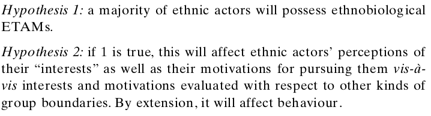
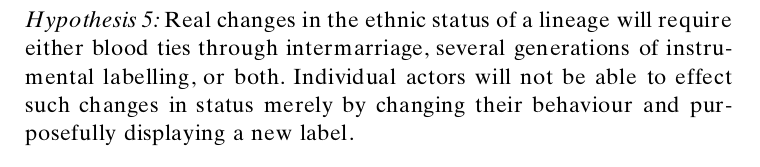
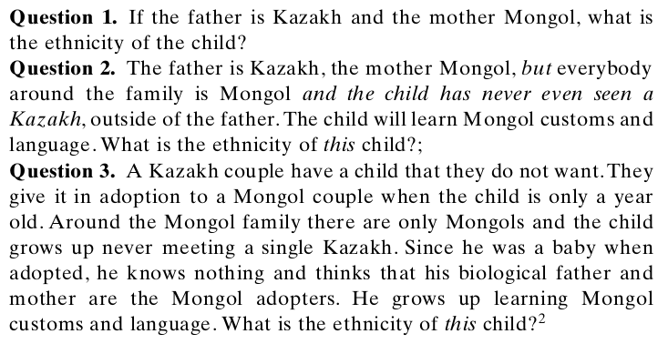
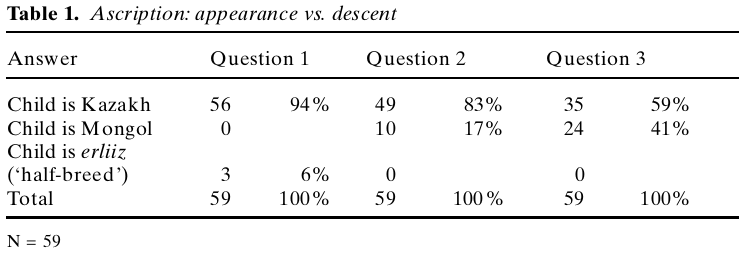

```{r setup, include=FALSE}
knitr::opts_chunk$set(echo = FALSE)
```


# Today

## Goals

### Primordialist definition

- Is there evidence for primordialism?

### Identification vs Identity

- 

# Beyond Essentialism

## Rejecting Essentialism

### A Checkered history (morally fraught)

### Category of **practice** not of **analysis**

- Does not fit social reality

## Rejecting Essentialism

Moving toward "primordialism"

> "The attachment to another member of one’s kinship group is not just a function of interaction... It is because a certain ineffable signicance **is attributed** to the tie of blood"

the psychological attachment to descent-based membership is **innate** in humans (Gil-White 1999)

**People** use the essentialist definition.

---

### **primordialist definition of race/ethnicity**:

an identity where membership is based on **perceived** descent such that it is 

- inherited at birth
- even if not in fact, people **believe** that it:
    - is an immutable/unchangeable part of who a person is
    - a group in which all share some essential similarity
    - a group which shares a history and interests

Thus, ethnicity/race:

- durable/hard to change once created; changes are slow
- shared (or imagination of shared) culture (language, religion), tradition, history
- even if not natural, people treat them "as if" they are natural

## Primordialism vs Essentialism:

Primordialist definition of ethnicity differs from essentialism:

- It does not accept essentialist definition of ethnicity, but states that most people in practice adopt an essentialist view of ethnicity.

## Primordialism



## Primordialism


## Primordialism



## Evidence for Primordialism?




## Evidence for Primordialism?



Is this sufficient to support primordialism?

## Does ethnicity change rapidly?

Let's consider Waters (1994)

- African Americans
- Afro-Caribbean immigrants

How do ethnic identifications among second generation change?

## Identification

**identification**: the active process of categorizing a person as a member of a group or category

- may be done as self-identification
- may identify others

## Limits of identification:

Can anybody identify as any ethnic/racial category?

What limits are there to identifying as a member of a group?


