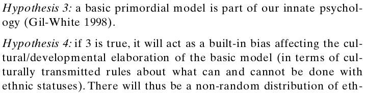

```{r setup, include=FALSE}
knitr::opts_chunk$set(echo = FALSE)
```


# Today

## Goals

### Primordialist definition

- What is primordialism vs. essentialism?
- Is there evidence for primordialism?

### Identification

# Beyond Essentialism

## Rejecting Essentialism

### A Checkered history (morally fraught)

### Category of **practice** not of **analysis**

- Does not fit social reality

## Rejecting Essentialism

Moving toward "primordialism"

> "The attachment to another member of one's kinship group is not just a function of interaction... It is because a certain ineffable signicance **is attributed** to the tie of blood"

the psychological attachment to descent-based membership is **innate** in humans (Gil-White 1999)

**People** use the essentialist definition.

---

### **primordialist definition of race/ethnicity**:

an identity where membership is based on **perceived** descent such that it is 

- inherited at birth
- even if not in fact, people **believe** that it:
    - is an immutable/unchangeable part of who a person is
    - a group in which all share some essential similarity
    - a group which shares a history and interests

Thus, ethnicity/race:

- durable/hard to change once created; changes are slow
- shared (or imagination of shared) culture (language, religion), tradition, history
- even if not natural, people treat them "as if" they are natural

## Primordialism vs Essentialism:

Primordialist definition of ethnicity differs from essentialism:

- It does not accept essentialist definition of ethnicity, but states that most people in practice adopt an essentialist view of ethnicity ("ethno-biological Ethnic Transmission and
Acquisition Model").

- Gil-White proposes several hypotheses that derive from this.


## Primordialism


- Most people are "essentialists"

- Belief in essentialism 

$\to$ acting as-if groups are essential

$\to$ even behavior of those w/out essentialist beliefs is essentialist


## Primordialism



- Ethno-biological/essentialist way of thinking is **innate** in human psychology $\to$ will repeatedly emerge, not a function of historical context

## Primordialism


- Changes in ethnicity can only occur slowly over time; not a result of individual choice

## Evidence for Primordialism?

Gil-White surveys people's "essentialist beliefs" in Mongolia


## Evidence for Primordialism?


Is this sufficient to support primordialism?

## Concerns

- **Is this "innate"?**: limited sample,in one context, at one time
- **Is essentialist view dominant?**: nearly half of people open to 'switching' ethnicity of adopted child
- **What do survey responses mean**: answering survey questions $\neq$ behavior in real-world settings
- **Why *these* essential descent based rules?**: why isn't ethnicity inherited from mother? or why isn't there a special mixed-group category (e.g. "mulatto")?

## Another context: Waters (1994)

Interviews with teens and young adults who are second generation Afro-Caribbean immigrants

- How do they experience and identify with ethnic and racial categories?

- Most choose between "African American" and a Afro-Caribbean (e.g. Jamaican, Haitian) identity

## Waters (1994)

### **First-generation (Parents)**

- distinguish themselves as different ethnic group than African Americans (black Americans)
- invoke cultural/value distinctions (often negative racial stereotypes)
- perceive themselves as having "higher" ethnic/racial status

## Waters (1994)

### **Second-generation**: 'Ethnic' Response

People who embraced ethnic status as "Afro-Caribbean": Jamaican, Haitian, etc.

- in 2nd generation, loss of visible/audible cues lead them to be categorized as "black"
- **work** to get others to recognize them in chosen identity, not as "black"
- compare themselves to Black Americans; explain success because whites view them as different group

Distinguish themselves from Black Americans

- continue to espouse negative views of Black Americans
- do not view racism as a problem, does not affect them

## Waters (1994)

### **Second-generation**: 'Ethnic' Response

Face pressure to conform in all black settings, so engage in code-switching: able to belong as "black" in some contexts, not "black" in others.
  
  
  

## Waters (1994)

### **Second-generation**: 'American' Response

People who reject ethnic status as "Afro-Caribbean", embrace "Black" identity

- adoption of Black identity and culture
- understand that they are seen as "black" by others
- reject parents' negative views of Black Americans
- acknowledge Afro Caribbean heritage, but do not emphasize it

## Waters (1994)

### **First-generation**: 'Immigrant' Response

For people who recently arrive as immigrants and who maintain connections in home country:

- Don't view "black American" or "Afro-Caribbean" identities as relevant
- Invoke identities that are relevant to their country of origin

## Disrupting Primordialism

1. Change in ethnicity takes place rapidly, often a result of individual choice

2. Individuals can shape how others perceive/label them: not constrained by 'essentialist' mindset

3. Same individuals may be categorized differently by different people, in different contexts

4. Immigrants are explicitly aware of these issues: essentialist mindset is not "innate" psychologically

## Disrupting Primordialism

One key reason that primordialism fails:

- there are many *possible* identities that people could claim:
    
  - e.g.: black, African, American, Haitian/Jamaican, Afro-Caribbean, Catholic?, and possibly even White, Afro-Caribbean Immigrant (e.g. Muhajir)

- if primordialism is correct, which one will innately be seen as "Essential"?

## Identification

**identification**: the active process of categorizing a person as a member of a group or category

- may be done as self-identification
- may identify others

To understand ethnicity, need to focus on  how people identify themselves, how they are identified by others

## Limits of identification:

Can anybody identify as any ethnic/racial category?

What limits are there to identifying as a member of a group?


