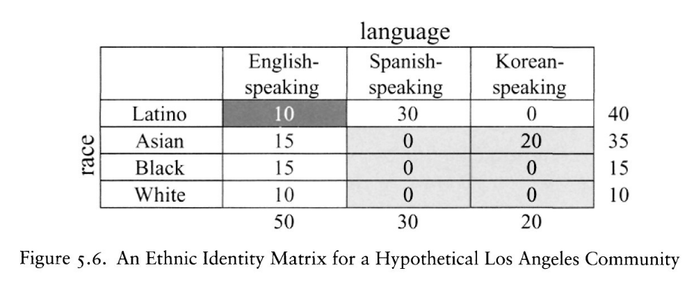

```{r setup, include=FALSE}
knitr::opts_chunk$set(echo = FALSE)
```


# Ethnic Choices


## How do ethnic identities change?

recall our definition...

**ethnic identity** categories are those in which membership is determined by:

- descent based attributes (either actually or *believed* to be associated with descent)
    - restricted to those deriving from "genetic... features or pertaining to language, religion, place of origin, tribe, region, caste, clan, nationality, or race of one's parents and ancestors" 
- which is an "imagined community"/impersonal (i.e. members don't all know each other) 

## How do ethnic identities change?

From this perspective, ethnicity is "constructed" but cannot be invented out of nothing, nor infinitely changeable... 

- Chandra (2012) finds 5 ways ethnic identities can change
- some ways are **faster**; some are **slower**

## How do ethnic identities change?

$1.$ **change in the repertoire of descent-based attributes**

what descent-based attributes are seen as "relevant" in defining ethnic membership 

- what attributes are "relevant"?
    - e.g. skin color; ear length; birth-place;
- understandings of **how** they are relevant
    - e.g. what counts as "light" or "dark"?
- This is changeable... 
    - but must be variation for attributes to be relevant
    - hard to make a new attribute relevant to all
    
## How do ethnic identities change?

$2.$ **change in the "full" repertoire of "nominal" ethnic identity categories**

- "nominal" ethnic categories are a bundle of descent-based attributes + label
- "full" repertoire is all **possible** combinations of descent-based attributes
- creation of new labels/set of possible combinations of attributes
    - e.g. "Helen": birth in Trinidad, birth in Africa

## How do ethnic identities change?

$3.$ change in the repertoire of "operative" ethnic identity categories;

- not all **possible** identities "make sense" to people, not "usable"
- Examples:
    - "South-east side of Chicago"
    - *jati* in India vs Canada

## How do ethnic identities change?

$4.$ change in individual descent-based attributes:

- passing/switching
- Individuals can mis-represent or alter one's descent based attributes.

## How do ethnic identities change?

$5.$ change in the ethnic identity categories **activated** from the repertoire.

- which identity categories are we using or are others using to identify us in a specific context...

## Ethnic repertoires

### Metaphor of playing cards:

- repertoire of descent attributes : suit, number
- nominal ethnic identities : all combinations of suit, number
- operative ethnic identities : subset of cards that can be used in a game
- passing : altering the suit, number on card
- activating identities : the card played on a given turn

## How do ethnic identities change?

Explanations for ethnic change

- repertoire of descent attributes : **structural**
- nominal ethnic identities : **structural**
- operative ethnic identities : **structural, psychological, strategic**
- passing : **strategic, psychological**
- activating identities : **strategic, psychological**

## Exercise

**On your own**

- what is repertoire of possible ethnic identities you could select from?
- think: do you ever use more than one of these? how so?

**Together**, let's discuss:

- what categories **could you use**
- what determines when and how you employ these categories?

# Ethnicity as Strategic

## Strategic Ethnicity

Many scholars attempt to understand ethnic politics by taking the choice of ethnic identity from a repertoire as a **strategic**/**instrumental** choice.

- take "repertoire" of "operative ethnic identities" as given
- choose one to maximize some utility/gain
    - political power
    - economic gains
    - personal well-being

## Strategic Ethnicity

Posner (2005) formalizes/generalizes these arguments:

- there are mutually exclusive sets of identities along the same dimension (e.g. language-, racial-groups)
- these "sets" of identities form a "cleavage"... "cut" through society

## Example 1: Posner (2004)

|           | Language (1) | Language (2) | Language (3) |
|-----------|--------|--------------|--------------|
| Tribe (a) |   **YES**   |         no     |     no         |
| Tribe (b) |    **YES**   |       no       |      no        |
| Tribe (c) |    no    |       **YES**      |      no        |
| Tribe (d) |    no    |       **YES**      |      no        |
| Tribe (e) |    no    |       no       |       **YES**      |
| Tribe (f) |    no    |       no       |       **YES**      |

## Nested Cleavage

**nested cleavage**: when multiple dimensions of ethnic identities are organized such that *membership in a smaller group implies membership in a specific larger group*

## Example 2: Laitin (1985)

|          | Religion (1) | Religion (2) | Religion (3) |
|----------|-------------|-----------|--------|
| City (a) | **YES** | **YES** | **YES** |
| City (b) | **YES** | **YES** | **YES** |
| City (c) | **YES** | **YES** | **YES** |
| City (d) | **YES** | **YES** | **YES** |

## Crosscutting

**crosscutting cleavage**: when multiple dimensions of ethnic identities are organized such that membership in a group along one dimension  **does not** imply membership in  **one specific group** along the other dimension

## Strategic Ethnicity

Posner says, assuming that...

1. People emphasize ethnic identity to maximize resources
2. Resources distributed by sole "winner" of election, only to members of winner's group
3. Winner decided by who gets most votes
4. Everyone knows how many people in each ethnic category...

People choose ethnicity to form **minimum winning coalition**

- choose to emphasize ethnic identity that is **large enough to win** but **as small as possible** to reap the most benefit

## Strategic Ethnicity



## Strategic Ethnicity

Result of this process may vary depending on the size of groups, nature of cleavage structure (nested, cross-cutting), argues there is underlying rational process driving ethnic identification.

- We'll revisit the evidence for this later in the course.

## Strategic choice of ethnicity

How does this logic resonate with your own decisions about which ethnic identity categories you use in everyday life?


