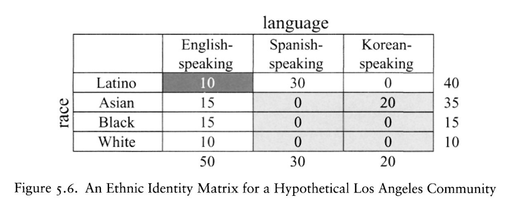
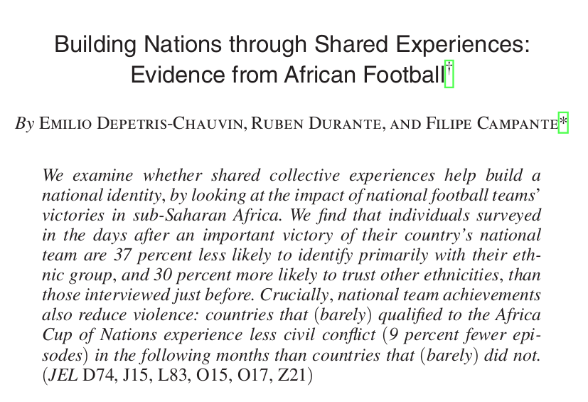
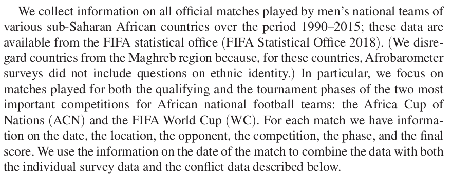
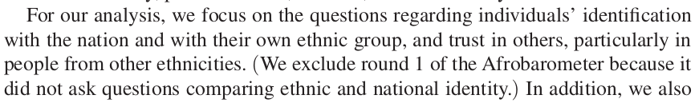
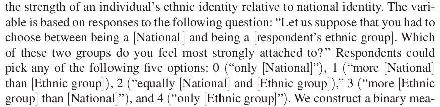
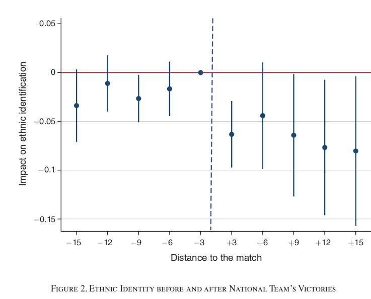

```{r setup, include=FALSE}
knitr::opts_chunk$set(echo = FALSE)
```


# Ethnic Choices

## Rational vs. Psychological 

- Instrumental choice of ethnic identification
- Are people actually rational?
- Psychological approaches

# Ethnicity as Strategic

## Strategic Ethnicity

Many scholars attempt to understand ethnic politics by taking the choice of ethnic identity from a repertoire as a **strategic**/**intrumental** choice.

- take "repertoire" of "operative ethnic identities" as given
- choose one to maximize some utility/gain
    - political power
    - economic gains
    - personal well-being

## Strategic Ethnicity

Posner (2005) formalizes/generalizes these arguments:

- there are mutually exclusive sets of identities along the same dimension (e.g. language-, racial-groups)
- these "sets" of identities form a "cleavage"... "cut" through society

## Strategic Ethnicity

Posner says, assume that...

1. People emphasize ethnic identity to maximize resources
2. Resources distributed by sole "winner" of election, only to members of winner's group
3. Winner decided by who gets most votes
4. Everyone knows how many people in each ethnic category...

People ethnicity to form **minimum winning coalition**

- choose to emphasize ethnic identity that is **large enough to win** but **as small as possible** to reap the most benefit

## Strategic Ethnicity



## Strategic Ethnicity

Result of this process may vary depending on the size of groups, nature of cleavage structure (nested, cross-cutting), argues there is underlying rational process driving ethnic identification.

- Nested Example: Pakistan
- Cross-cutting Example: Language and Religion in India

## How do ethnic identities change?

Forms of ethnic change

- repertoire of descent attributes : structural
- nominal ethnic identities : structural
- operative ethnic identities : structural, psychological, **strategic**
- passing : **strategic**, psychological
- activating identities : **strategic**, psychological

## Strategic Ethnicity?

**Are you this rational in choosing ethnic identity categories in everyday life?**

**Are people in general this rational?**

>- Digression: ultimatum games (Bowles and Gintis)

## Strategic Ethnicity?

It may be that political elites/leaders use ethnic identification **strategically**...

... even if most people do not think strategically.

>- What explains how non-elites behave?

# Cognitive Ethnicity

## Cognitive Ethnicity

Hale (2004) describes how to think about ethnicity as a **psychological** phenomenon (differentiate from primordialism).

Like rational accounts, psychological approaches to ethnicity focus on the **individual**

- but people's cognitive capacities are not always rational, prone to bias/taking cognitive shortcuts

## Cognitive Ethnicity

Hale: 

- Humans are motivated to reduce uncertainty

    - need to feel greater certainty about the world around them
    - social categories that "group" people reduce uncertainty

- Social categories more useful at reducing uncertainty if:

    - they are readily "accessible"
    - they "fit" reality well
    
## Cognitive Ethnicity

Compared to other social categories ethnic categories may be... 

#### **more accessible**: 

- attributes of membership are easier to see/detect... 
- e.g. physical features, language, correlation to real world experiences, accessibility of shared symbols

#### **"fit" real-world situations**

- ethnic categories correlate with many other differences: e.g. economic/social status
- sometimes these correlations are objective: they are an empirical reality
- sometimes these correlations are "mediated":
        - "fit" may be informed by **representations** of reality. (e.g., representations of crime)


## Cognitive Ethnicity

Thinking "ethnically" may not be conscious

- racial bias in threat-perception in first-person shooter simulations
- racial bias in hiring experiments
- framework for interpreting events

---

### **Are we "hardwired" to think ethnically?**

---

Some ethnic (non-ethnic) categories might become more **accessible** or **fit** better.

Forms of ethnic change

- repertoire of descent attributes : structural
- nominal ethnic identities : structural
- **operative ethnic identities** : structural, **psychological**, strategic
- passing : strategic, **psychological**
- **activating identities** : strategic, **psychological**

## Social Identity Theory

### **Assumptions**

1. people desire positive self-esteem
2. social groups/categories have positive/negative connotations that reflect a person's **social identity**
3. group status is based on favorable/unfavorable comparison with **other groups**

## Social Identity Theory

### **Implications**

1. people want to increase or maintain positive social identity
2. positive social identity based on positive comparison between **in-group** and relevant **out-group**
3. Individuals will leave group, change their group, alter the comparison to make identity more positive


# An application:

## Football Wins



## Football Wins

Football victories:

- Does a positive change in status of **national** identity induce people to emphasize that identity?
- SIT suggests that this should occur to increase self esteem

## Football Wins



## Football Wins



Afrobarometer: multi-wave survey, same questions, dozens of countries

## Football Wins




## Football Wins

Compare:

- change in ethnic vs. national identification of people in countries whose team **wins** from before to after the game 

vs.

- change in ethnic vs. national identification of people in countries whose team **loses** from before to after the game 


69 official matches played between 2002 and 2015 with survey responses in window of 15 days before or after each match. Of these, 31 were wins by the respondent's national team, 29 were losses, and 9 were draws

## Football Wins



## Football Wins

Consistent with SIT:

- Football victories induce greater national vs ethnic identification
- Effects are **stronger** when match is against a rival (comparison group more relevant)
- Effects are **stronger** when national team is more ethnically diverse (team identity must be seen as national, not ethnic)


