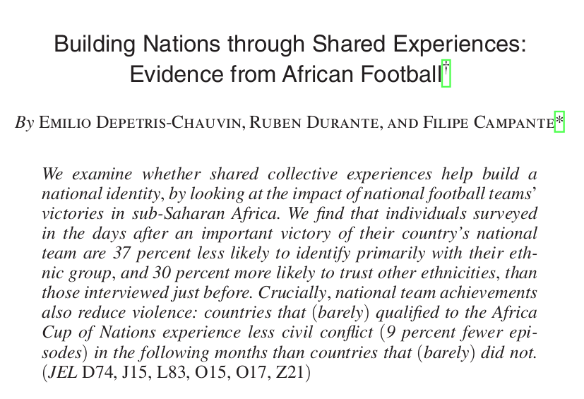
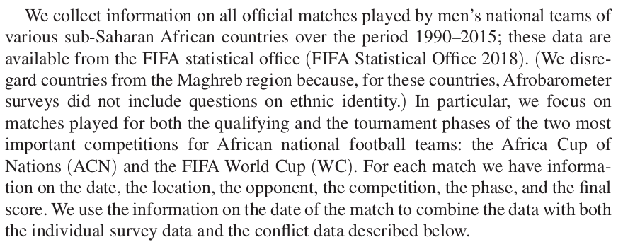
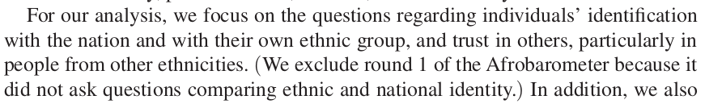
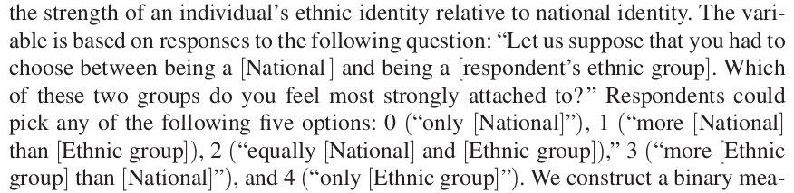
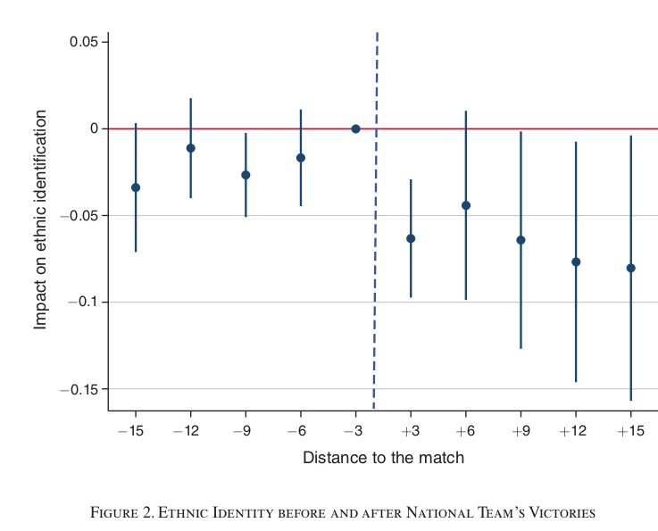

```{r setup, include=FALSE}
knitr::opts_chunk$set(echo = FALSE)
require(knitr)
require(kableExtra)
require(magrittr)
```


# Ethnic Choices

## Psychological Perspective

### Exercise

### Social Identity Theory

### An application

# Exercise

## Exercise

On the upcoming essay assignment, bonus points are available.

>- But there is a catch
>- You have to decide how these points are allocated

## Exercise

Two groups in the class:

- Left siders
- Right siders

You need to decide how to allocate bonus points to a two people: (other than yourself)

- one person randomly chosen from the left side 
- one person randomly chosen from the right side


## Exercise:

Use the QR code or Link corresponding to your side of the room:

```{r}


```

Left: https://www.menti.com/heu3ckeudp

<br>

Right:  https://www.menti.com/so7ovorsc4


---

Left Side

<div style='position: relative; padding-bottom: 56.25%; padding-top: 35px; height: 0; overflow: hidden;'><iframe sandbox='allow-scripts allow-same-origin allow-presentation' allowfullscreen='true' allowtransparency='true' frameborder='0' height='315' src='https://www.mentimeter.com/embed/859218f58069683dc7d44f0b99c64c0e/747b8416e3df' style='position: absolute; top: 0; left: 0; width: 100%; height: 100%;' width='420'></iframe></div>

---

Right Side

<div style='position: relative; padding-bottom: 56.25%; padding-top: 35px; height: 0; overflow: hidden;'><iframe sandbox='allow-scripts allow-same-origin allow-presentation' allowfullscreen='true' allowtransparency='true' frameborder='0' height='315' src='https://www.mentimeter.com/embed/faf02086a1e1c070d3656bdc379ef0bd/f7fc8ad3d3a1' style='position: absolute; top: 0; left: 0; width: 100%; height: 100%;' width='420'></iframe></div>

## Exercise:

Maximizing between-group difference:

```{r results = 'asis', echo = F, warning=F, message=F}

my_tab = rbind(3:7, seq(1,9,2)) 
diff = my_tab[1,] - my_tab[2,]
rownames(my_tab) = c("In-group", "Out-group")
colnames(my_tab) = as.character(1:5)
my_tab %>% t %>%
  kbl() %>%
  kable_paper(full_width = F) %>%
  column_spec(1, color = "white",
              background = spec_color(diff, option = 'C', direction = -1 ),
              popover = paste("Diff:", diff)) %>%
  column_spec(2, color = "white",
              background = spec_color(diff, option = 'C', direction = -1),
              popover = paste("Diff:", diff)) 

```

bluer is **more**

## Exercise:

Maximizing in-group profit:

```{r results = 'asis', echo = F, warning=F, message=F}

my_tab = rbind(3:7, seq(1,9,2)) 
profit = my_tab[1,] 
rownames(my_tab) = c("In-group", "Out-group")
colnames(my_tab) = as.character(1:5)
my_tab %>% t %>%
  kbl() %>%
  kable_paper(full_width = F) %>%
  column_spec(1, color = "white",
              background = spec_color(profit, option = 'C', direction = -1 ),
              popover = paste("In-group Profit:", profit)) %>%
  column_spec(2, color = "white",
              background = spec_color(profit, option = 'C', direction = -1),
              popover = paste("In-group Profit:", profit)) 

```

bluer is **more**

## Just an exercise

Sorry, No actual bonus points! 

# Social Identity Theory

## Minimal Group Experiments:

- Groups randomly assigned
- Never meet in person
- Anonymous games allocating money

### How do people behave?

- discriminate against **out-group** 
- maximize inter-group **difference**, not **in-group** profit

## Social Identity Theory

From these results, Tajfel and others build out a theory:

### **Assumptions**

1. people desire positive self-esteem
2. social groups/categories have positive/negative connotations that reflect a person's **social identity**
3. group status is based on favorable/unfavorable comparison with **other groups**

## Social Identity Theory

### **Implications**

1. people want to increase or maintain positive social identity
2. positive social identity based on positive comparison between **in-group** and relevant **out-group**
3. Individuals will leave group, change their group, alter the comparison to make identity more positive


## Social Identity Theory

### Strategies of improving status:

1. mobility (unavailable? in race/ethnicity)

2. new dimension of comparison (what is the metric?)

3. use of different evaluative rules (how do we interpret?)

4. change comparison-group

5. direct competition

# An application:

## Football Wins



## Football Wins

Football victories:

- Does a positive change in status of **national** identity induce people to emphasize that identity?
- SIT suggests that this should occur to increase self esteem

## Football Wins



## Football Wins



Afrobarometer: multi-wave survey, same questions, dozens of countries

## Football Wins




## Football Wins

Compare:

- change in ethnic vs. national identification of people in countries whose team **wins** from before to after the game 

vs.

- change in ethnic vs. national identification of people in countries whose team **loses** from before to after the game 


69 official matches played between 2002 and 2015 with survey responses in window of 15 days before or after each match. Of these, 31 were wins by the respondent's national team, 29 were losses, and 9 were draws

## Football Wins



## Football Wins

Consistent with SIT:

- Football victories induce greater national vs ethnic identificaiton
- Effects are **stronger** when match is against a rival (comparison group more relevant)
- Effects are **stronger** when national team is more ethnically diverse (team identity must be seen as national, not ethnic)

## Some questions about SIT:

Both experimental and real world evidence:

As a theory, depends on **cultural context**:

- Which are "relevant" groups for comparison?
- What dimensions are groups compared on?
- What value-rules do we use to assign status?
- What kinds of comparisons are **legitimate**?


