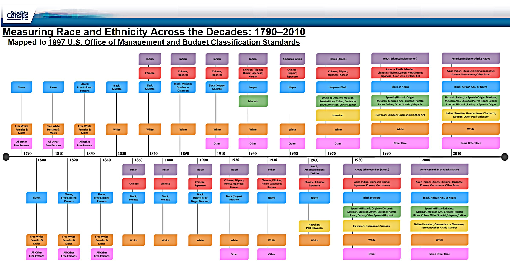
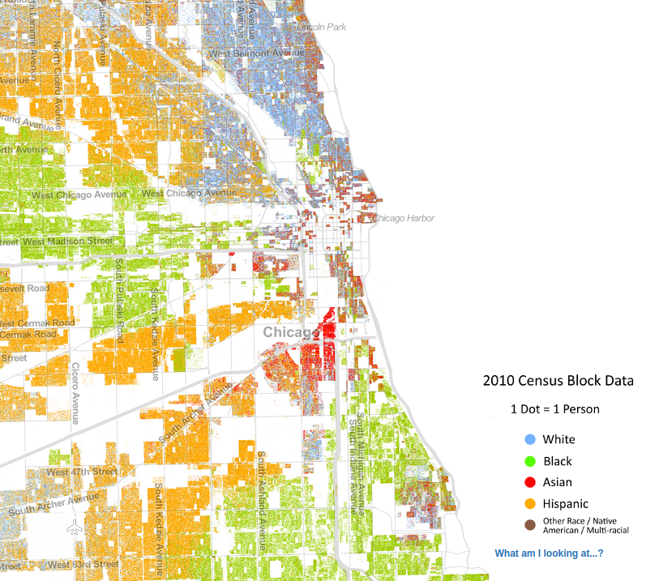

```{r setup, include=FALSE}
knitr::opts_chunk$set(echo = FALSE)
require(knitr)
require(kableExtra)
require(magrittr)
```


# Ethnicity and Structure

## Outline

- Assignment 1
- Why look at structures?
- Exercise
- Ethnic boundaries

# Assignment:

## Assignment 1:

- Due October 7 at 11:59 pm
- 3-5 pages, double spaced, Times New Roman
- Required readings; use of **key terms**
- Don't put your name on it (blind grading)
- Citations: be consistent, cite required readings
- References: not required to do additional research, but it is permitted

## Assignment 1:

- Thesis 
- Evidence to support Thesis
- Evidence to refute counter-arguments
- Use of sources

# Why structures?

## How does ethnicity "work"?

Ethnicity is not essential, it is an active process of 'identification'

- rational/strategic
- psychological
    
## Two problems:

$1)$ **Instrumental/Psychological perspectives assume:**

- repertoire of descent attributes
- nominal ethnic identities 
- operative ethnic identities

Where do these come from?

## Two problems:

$2)$ **Identification approach implies individual choice of ethnicity: how easy is ethnic change?**


>- What stops you from just successfully identifying as a different ethnicity?

# Ethnicity as Structure

## Ethnicity as Structure

Viewing ethnicity as **structure** may solve these problems, but we need a definition that is not...

- essentialist (structures do not come from 'nature')
- immutable (structures do not change)
- deterministic (structures override human agency)


## What are 'structures'?

Sewell (1992):

social **structures**...

- shape and direct human activity by enabling and constraining certain forms of action
    - but also created/changed by human activity
- **dual**: 
    - necessarily made up of two (possibly) mutually-reinforcing components: **schemas** and **resources**
    - schemas shape resources
    - resources shape schemas

## What are 'structures'?

**schemas**: categories and concepts, as well as recognized "rules", "recipes", or behavioral scripts for how to use those categories/concepts.

- "virtual", in that they aren't limited to one point in space and time
- they are "ways of thinking", and they are powerful insofar as they are shared with/*intelligible* to others
- may be used by anyone, transposed into new contexts, new uses
- examples: 
    - gender categories vs memes
    - *jati* in India vs Canada; honorifics/familiarity in language

## What are 'structures'?

**resources**: are both human capabilities of thought/action, as well as natural and human-produced materials that can be used to maintain or enhance power

- "actual" in the sense that they can be used to enhance power in a particular place and time
- only enhance power through **using** capacities/materials 
- examples:
    - nonhuman: gold, livestock, property
    - human: physical skills, social media metadata, certification
    
    
## What are 'structures'?

**schemas** shape **resources**:

- property is resource, depends on schemas
- ethnic stereotypes, behavior scripts have economic, political, bodily consequences...

**resources** shape **schemas**:

- income/educational/housing inequality can reinforce stereotypes
- control over census, jobs, school curricula, etc. can reinforce use of ethnic categories, stereotypes

## What are 'structures'?

Solves problem $(1)$: helps to understand where these come from...

- repertoire of descent attributes
- nominal ethnic identities 
- operative ethnic identities

## What are 'structures'?

Solves problem $(2)$: how can ethnicity be "socially constructed", yet hard to change?

## What are 'structures'?

social structures are **intersubjective**

- $S_2O$: two subjects (people), one object (material world)
- mutual intelligibility and shared understanding of material world
- people understand the categories, rules for membership, and how they are used, even if they DO NOT CONSENT/AGREE WITH these practices.

Ethnicity may be difficult to change because categories/rules for membership...
  - are still enforced by many other people... (schema)
  - are embedded in material world (segregation, media, etc.)

## What are 'structures'?
    
This definition of structure is not:

- essentialist (multiple, conflicting structures... nation vs. ethnicity)
- immutable (because resources $\to$ schemas and schemas $\to$ resources, structures can change)
- deterministic (schemas applied in new ways, e.g. human rights; resources have unpredictable consequences, e.g. slave revolts)
  
## Ethnic Boundaries

Identification is only **one part** of how ethnicity. Helpful to think of ethnic boundaries as a **structure**.

To explain why some descent-based categories are used, some ethnic categories operative, need to know 

- how are ethnic categories/schemas propagated/reinforced culturally?
- how are they invested with power/resources?

## Ethnic Boundaries

### **ethnic boundaries** (Wimmer)

### 1. ethnic categories for people and category rules

- "labels" and "definitions" (Chandra)

### 2. real-world practices that use those categories

- what we "do" with those labels
    - in thought and speech; 
    - in action/in shaping our material world

# Exercise

## A fictional ethnic boundary

As you watch the following, think about the following:

- what are the "ethnic identity categories"?
- in what ways are those ethnic categories **used** in thought/speech/action? (be as specific as possible)

In small groups: share the ways ethnic categories are **used**

- for each way ethnic categories are **used** in the story, think of a real world example that is similar

---

<iframe width="560" height="315" src="https://www.youtube.com/embed/PdLPe7XjdKc?start=46" title="YouTube video player" frameborder="0" allow="accelerometer; autoplay; clipboard-write; encrypted-media; gyroscope; picture-in-picture" allowfullscreen></iframe>

## Exercise:

- what are the "ethnic identity categories"?
- in what ways are those ethnic categories **used** in thought/speech/action? (be as specific as possible)

In small groups: share the ways ethnic categories are **used**

- for each way ethnic categories are **used** in the story, think of a real world example that is similar

#

# Ethnic Boundary Practices

## Ethnic Boundaries: Institutions

**institutional use**: the use of ethnic/racial categories by formal institutions to label people (not necessarily in a discriminatory manner)

- examples: census forms, school forms, voting rules, government social service records

**institutional separation**: the presence of distinct formal institutions for people labelled as members of different ethnic/racial categories (not necessarily *unequal*)

- examples: churches/houses of worship, stores, schools, private associations, voting constituencies, governments, political parties, newspapers

## Ethnic Boundaries: Institutional Use




## Ethnic Boundaries: social closure

**social closure**:  the use of ethnic/racial categories to separate or organize personal/informal interactions between people (not **necessarily unequal**)

- examples of separation: neighborhoods, use of space (e.g. pools), marriage, reproduction (endogamy), friendship, the **types** of interaction (e.g. equal/unequal status)

## Ethnic Boundaries: social closure



## Ethnic Boundaries: power
  
**power disparity**: the use of ethnic/racial categories to discriminate in access to goods, services, rights, recognition (e.g. in institutional use, institutional separation, social closure) that enhances/restricts the life choices

- legal examples: property rights, marriage/inheritance, education, government jobs, government services, elected representation, criminal law, affirmative action

- market: housing discrimination, job discrimination, restricting spaces (e.g. private clubs, gated communities)

- interpersonal: employer/employee relations; customer/client relations; formal/informal modes of address; non-reciprocity in forms of interaction; status hierarchy

## Ethnic Boundaries: power


## Ethnic Boundaries: cultural difference

**cultural differentiation**: the use of ethnic/racial categories to differentiate cultural practices (food, clothing, traditions), language, and religious belief.

*Note*: Sometimes cultural difference is used to *define* category membership. Sometimes cultural difference is a way to *use categories*:

examples: choice of alphabet/spellings; changing vocabulary (Hindustani vs Urdu vs Hindi)

## Ethnic Boundaries: cognitive

**marking**: using category labels for some groups as distinct from a "reference" or "unmarked" category that is the unspoken default (e.g. in Canada, "white" is often an unspoken default)

**groupness**: using category labels to proclaim or invoke the existence and unity of a group (parades, mass performances, history, education, assigning blame)

## Ethnic Boundaries: cognitive

**explain behavior**: using ethnic/racial category labels to explain behavior or **outcomes** (basically, stereotyping)

- you are group X, you must believe/do Y
- you did Y BECAUSE you are group X
- you are in status Y because you are in group X

**exemption**: use of ethnic/racial categories to claim or identify exemption (stereotypes by "exception proves the rule"):

- you are group X, but you are "all right" (implicitly group X is not "all right")
- I am an X, so I can criticize other people within X (implicitly outsiders cannot legitimately criticize)

## Ethnic Boundaries: cognitive

**behavioral scripts**: use of racial/ethnic categories to differentiate the "proper" or "default" way of interacting with a person

- e.g., policing, code switching, academic research (race vs racial practices)


