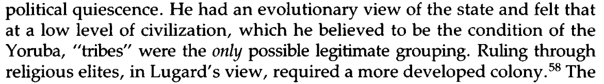

```{r setup, include=FALSE}
knitr::opts_chunk$set(echo = FALSE)
require(knitr)
require(kableExtra)
require(magrittr)
```


# Ethnicity and Structure

## Outline

- Ethnic boundaries

# Why structures?

## Why structures:

Structural approach to ethnicity solves problem $(1)$: helps to understand where these come from...

- repertoire of descent attributes
- nominal ethnic identities 
- operative ethnic identities

## Why structures:

Structural approach to ethnicity solves problem $(2)$: how can ethnicity be "socially constructed", yet hard to change?

## Ethnic Boundaries

### **ethnic boundaries** (Wimmer) are social structures

### 1. ethnic categories for people and category rules

- "labels" and "definitions" (*schemas*)

### 2. real-world practices that use those categories

- what we "do" with those labels
    - in thought and speech (*schemas*)
    - in action/in shaping our material world (*resources*)

# Ethnic Boundary Practices

## Boundary Practices

Wimmer (2008) identifies several dimensions of ethnic boundaries 

## Ethnic Boundaries: Institutions

**institutional use**: the use of ethnic/racial categories by formal institutions to label people (not necessarily in a discriminatory manner)

- examples: census forms, school forms, voting rules, government social service records

**institutional separation**: the presence of distinct formal institutions for people labelled as members of different ethnic/racial categories (not necessarily *unequal*)

- examples: churches/houses of worship, stores, schools, private associations, voting constituencies, governments, political parties, newspapers

## Ethnic Boundaries: Institutional Use


## Ethnic Boundaries: power
  
**power disparity**: the use of ethnic/racial categories to discriminate in access to goods, services, rights, recognition (e.g. in institutional use, institutional separation, social closure) that enhances/restricts the life choices

- 'legal' examples: property rights, marriage/inheritance, education, government jobs, government services, elected representation, criminal law, affirmative action

- market: housing discrimination, job discrimination, restricting spaces (e.g. private clubs, gated communities)

- interpersonal: employer/employee relations; customer/client relations; formal/informal modes of address; non-reciprocity in forms of interaction; status hierarchy

## Ethnic Boundaries: power


## Ethnic Boundaries: Networks

**social closure**:  the use of ethnic/racial categories to separate or organize personal/informal interactions between people (not **necessarily unequal**)

- examples of separation: neighborhoods, use of space (e.g. pools), marriage, reproduction (endogamy), friendship, the **types** of interaction (e.g. equal/unequal status)

## Ethnic Boundaries: social closure


## Ethnic Boundaries: cultural difference

**cultural differentiation**: the use of ethnic/racial categories to differentiate cultural practices (food, clothing, traditions), language, and religious belief.

*Note*: Sometimes cultural difference is used to *define* category membership. Sometimes cultural difference is a way to *use categories*:

examples: choice of alphabet/orthography; changing vocabulary (Hindustani vs Urdu vs Hindi)


## Ethnic Boundaries: cognitive use

**marking**: using category labels for some groups as distinct from a "reference" or "unmarked" category that is the unspoken default (e.g. in Canada, "white" is often an unspoken default)

**groupness**: using category labels to proclaim or invoke the existence and unity of a group (parades, mass performances, history, education, assigning blame)

---

<iframe width="560" height="315" src="https://www.youtube.com/embed/QEw_H43yhDI?start=297" title="YouTube video player" frameborder="0" allow="accelerometer; autoplay; clipboard-write; encrypted-media; gyroscope; picture-in-picture" allowfullscreen></iframe>


## Ethnic Boundaries: cognitive

**explain behavior**: using ethnic/racial category labels to explain behavior or **outcomes** (basically, stereotyping)

- you are group X, you must believe/do Y
- you did Y BECAUSE you are group X
- you are in status Y because you are in group X

**exemption**: use of ethnic/racial categories to claim or identify exemption (stereotypes by "exception proves the rule"):

- you are group X, but you are "all right" (implicitly group X is not "all right")
- I am an X, so I can criticize other people within X (implicitly outsiders cannot legitimately criticize)

## Ethnic Boundaries: cognitive

**behavioral scripts**: use of racial/ethnic categories to differentiate the "proper" or "default" way of interacting with a person

- e.g., policing, code switching, academic research (race vs racial practices)

## Ethnic Boundary Practices:

Wimmer argues that altering ethnic boundary practices (structures) depends on:

- **power** of individuals/groups/organizations
- ability to create/shape **institutions** (rules/laws)
- existence of political/social networks 

# A Puzzle

## Yoruba in Nigeria

**Ancestral City Identity**

Pre-Colonial Origins:

- Oyo Empire (15th-19th Cent.): coalition of cities, each with an identity
- *alaafin* (king) in Oyo-Ile (dominant city)
- tribute from lesser "kings" in other "ancestral cities", protecting trade
- *basorun* (army leaders) acquired wealth through conquest
- shared religious practice legitimized Oyo leadership

## Yoruba in Nigeria

**Ancestral City Identity**

- 19th century: internal war between *alaafin* and *basorun*
- alliance between *basorun* and Islamic armies, challenged traditional Oyo authority
- war $\to$ new city Ibadan, populated by Yoruba from many ancestral cities

## Yoruba in Nigeria

**Competing identities**

at end of 19th century...

- increasing awareness of unified **Yoruba** identity
- rise of identities tied to military factions
- **rapid spread of Christianity and Islam**

## Yoruba in Nigeria

Even though, at turn of the 20th century

- Oyo political power had disappeared
- War refugees settled outside ancestral cities
- Political mobilization of Yoruba as a group
- Most Yoruba are Christian (40%) or Muslim (40%)

    - divided by religious practice, limited intermarriage
    - Christians more educated, wealthier, politically influential


## Yoruba in Nigeria

By late 20th century...

- ancestral cities primary political form of identification
- ancestral city competition informed political parties in Nigeria
- city-specific rituals/festivals, pilgrimages to visit ancestral city
- competition for civil service jobs/university spots by ancestral city
- outright denial/refusal of possibility of politics around religion, despite strategic reasons to do so

## A puzzle:

What might explain the **persistence** of ancestral cities as both a operative ethnic category **and** as the **activated** ethnic identity?

#

## Colonial State:

British Colonial State intervened, using a system of indirect rule:

- delegated powers to "traditional" political institutions


## Colonial State:

Power of British Colonial State/ Existing political networks in Nigeria 

"available" schema of ancestral cities $\to$ institutional use


## Colonial State:

"available" schema of ancestral cities $\to$ institutional use


## Colonial State:

Institutional role of Oyo $\to$ Power


## Colonial State:

institutional use and power disparity $\to$ strategic activation of ancestral identity


## Colonial State:

institutional use and power disparity $\to$ psychological salience of identity


## Colonial State:

The colonial state changes not just resources, but schemas: cognitive boundary practices (groupness, stereotypes, practices to sustain them)


## Colonial State:




Local institutions $\to$ colonial thought $\to$ power/institutions $\to$ local thought

- Structures: both material resources, but also thoughts/ideas

## Conclusion

Transformations in ethnic structures can shape the operative and activated ethnic categories.

- How are ethnic structures produced/transformed?
- States play an important role

