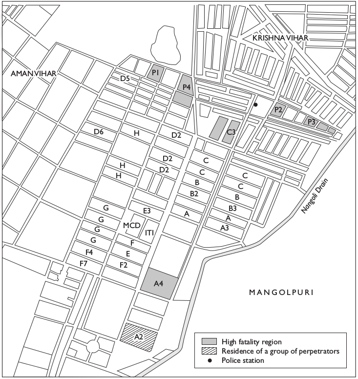

```{r setup, include=FALSE}
knitr::opts_chunk$set(echo = FALSE)
```

# Why does ethnic violence happen?

## Plan:

1. Recap
2. Example
3. Causes of ethnic violence

# Example:<br> 1984 Delhi Riots

## Background

### Political Conflict in state of Punjab 

### Rise of Sikh Nationalists

### Amritsar and Operation Blue Star

## **Precipitating Event**

### Assassination of Indira Gandhi by Sikh Bodyguards

### Widespread killing of Sikhs in Delhi

# Obviously Ethnic?

## {.centered}



## What is this violence about?

### In Sultanpuri

- Intra-party factional dispute?
- Free reign given to criminals / police?
- Conflict between two caste groups?
- Opportunistic violence (looting, settling scores)?
- Ethnic violence against Sikhs?

#

## What causes ethnic violence?

### Motive

### Opportunity

### Push and Pull

## Motives: Ideas

### Which Moral relationships 

- Horowitz: aggressive/dangerous opponent

### What is a boundary transgression

- Horowitz: **precipitating events**

### Ethnic Hatred

- Essentialist thinking

## Opportunity: Ideas

### Ritualization / Routinization of Violence:

Tambiah:

- processions, rallies
- standard intimidation
- widely accepted "triggers"

## Motives: Interests

### Elections

### Security

### Territorial Control

### Opportunism

## Opportunity: Interests

### Capacity for Violence

### Risk of Violence (or lackthereof)

### **master cleavage** vs. **local cleavage** (Kalyvas)

