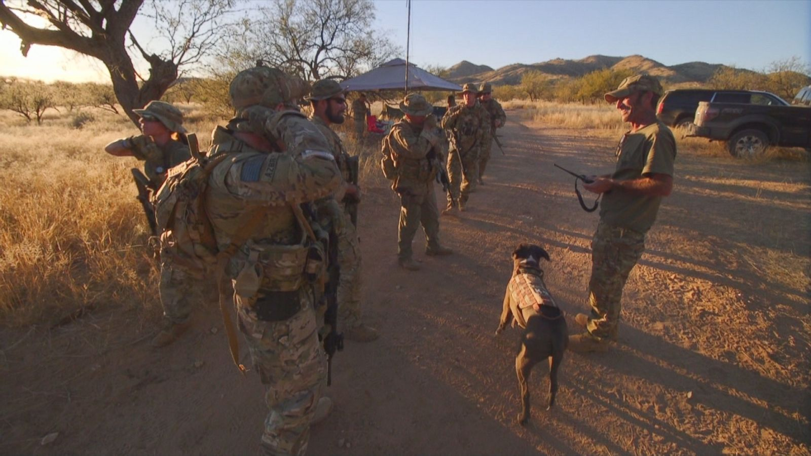

```{r setup, include=FALSE}
knitr::opts_chunk$set(echo = FALSE)
```

# Media and Violence

# Introduction: Media

## How does media affect violence?

### **Persuasion**

Convincing people of:

- "Facts"/Narratives about the world (Lippman)
- What *is* the problem
- What are "solutions" to the problem
- Why  *they* should take action


## How does media affect violence?

### **Coordination**

Media conveys information to people that changes behavior:

- Media informs people of like-minded others, better able to plan violence
- Convey costliness of violence (e.g. lynching)
- Convey low cost of violence (many supporters, others willing to use violence)

# Framing

## Framing

###  ***framing***

the assignment of meaning and interpretations to events and social conditions in ways that are designed to mobilize supporters, win new supporters, and demobilize opponents

#### Who does framing?

Governments, political parties, organizations, individuals

## Framing

### Frames and Violence

Frames *about violence*

- e.g., framing lynching 

Frames that *contribute to violence*

- e.g., Babri Masjid as site of Ram Temple

## Framing: 3 Varieties

### **diagnostic framing**

frames that identify a problem and attribute blame to individuals, groups, or structural factors

## Framing: 3 Varieties

### **prognostic framing**

frames that give solutions to the "problem" and the identification of strategies, tactics, and targets for political action or violence

*Note: usually corresponds with the cause or blame assigned in diagnostic frame*

## Framing: 3 Varieties

### **motivational framing**

frames that give a call to action or a particular reason for individuals to take action

*Note: emphasizes why individuals in the audience need to do something about the problem*

# An Application

### Which kinds of frames are present here?

# 

<iframe width="560" height="315" src="https://www.youtube.com/embed/1V5HLRWzZB0" frameborder="0" allow="autoplay; encrypted-media" allowfullscreen></iframe>

# Discuss

#

#
### Motivational Frames



# Frames in Practice

### Next Week


## What kinds of frames work?

- Frames more effective if they are "inclusive" or "master" frames?
- What kinds of frames actually persuade? (Resonance)

## What kinds of frames linked to violence?


