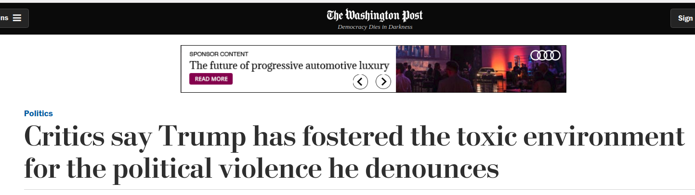
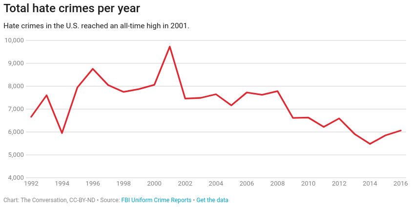
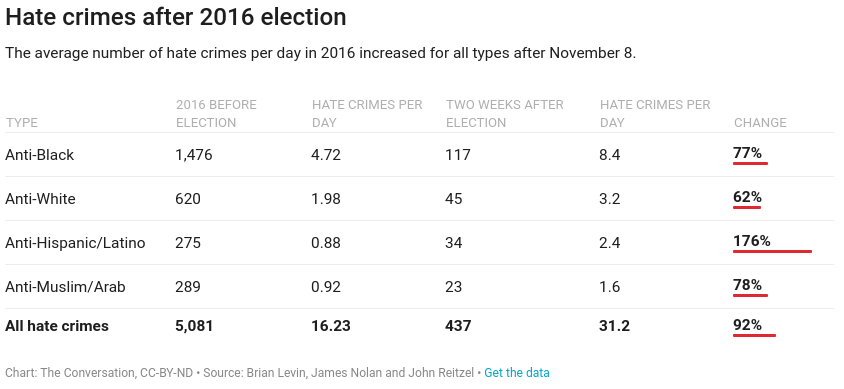
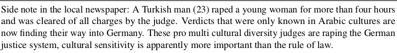
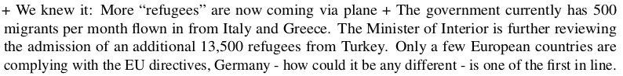

# Media and Violence

### Persuasion and Coordination

## Today

### **1) Recap**
### **2) Nazi-Era Radio (Persuasion)**
### **3) Contemporary Context**

# Recap

## Rwanda, Radio, Coordination

### Key finding

> Radio messages with anti-Tutsi diagnostic frames, pre-emptive violence prognostic frames **caused** more genocidal violence

## Rwanda, Radio, Coordination

### Coordination Effects (for sure)

Stronger effects on **collective violence**

**Non-linear** "tipping point" in effect of radio

"**Spill-over**" effects from radio exposure of neighboring villages

## Rwanda, Radio, Coordination

### Persuasion Effects (maybe)

Increases in **individual violence**?

# Inter-war Germany

## Nazi-Era Radio:

### Did exposure to the radio increase violence against Jews?

Examine two time periods: 

- 1928-1932 (Moderate control over radio)
- 1933-1945 (Nazi control over radio)

## Nazi-Era Radio:

### **How do they find effects?**

1) Local variation in exposure to radio signals;

2) Change in content of radio

## Effects

### Nazi Voting

**Increasing radio exposure with Moderate messages**

$\rightarrow$ fewer Nazi votes

**Increasing radio exposure with Nazi messages**

$\rightarrow$ more Nazi Votes

## Effects

### Nazi Voting

**Increasing radio exposure with Moderate messages**

$\rightarrow$ fewer Nazi votes

**Increasing radio exposure with Nazi messages**

$\rightarrow$ more Nazi Votes

## Effects

### Antisemitic Behavior (1929-1934)

**Increasing radio exposure with Moderate messages**

$\rightarrow$ less anti-Semitic violence/harassment

**Increasing radio exposure with Nazi messages**

$\rightarrow$ more anti-Semitic violence/harassment

## Effects

### Antisemitic Behavior (Late 1930s)

**Radio exposure with Nazi messages**

$\rightarrow$ 

- more denunciations/deportations of Jews
- more open letters to anti-Semitic newspapers
- no effect on attacks on Synagogues

## Nazi-era Radio

### **Persuasion** or Coordination?

(1) **No effects** on attacks on synagogues (more coordination required)

(2) Exposure to radio **caused** more denunciations of Jews, open letters to Nazi newspapers (individual actions)

## Nazi-era Radio

### **Persuasion** or Coordination?

(3) Effects of Nazi radio **different** in places with **different** histories of anti-Semitism
  
14th century pogroms against Jews predict Nazi-era violence, and
  
- Radio exposure **increased** anti-Semitism in places with medieval anti-Jewish pogroms
- Radio exposure **decreased** anti-Semitism in places without medieval anti-Jewish pogroms

## Persuasion

### Must be *Persuasion* and *Dissuasion*

**persuasion**: frames are *resonant* (consonant) and lead to violence, antisemitism

**dissuasion**: frames are opposite of *resonant* (*dissonant*), provoke a **backlash**

## Persuasion and *Dissuasion*

### Serbian Radio in Croatia

Using local variation in radio exposure...

Croatian communities with Serbian nationalist Radio see:

- Increased vote for extremist Croatian parties 
- Increased anti-Serb graffiti

#

# Today in the US

# Trump language "Dangerous"?

# 

## Hate crimes? {.centered}

## Hate crimes? {.centered}

#

<blockquote class="twitter-tweet" data-lang="en">
It is outrageous what the Democrats are doing to our Country. Vote Republican now! <a href="https://t.co/0pWiwCHGbh">https://t.co/0pWiwCHGbh</a> <a href="https://t.co/2crea9HF7G">pic.twitter.com/2crea9HF7G</a>
&mdash; Donald J. Trump (@realDonaldTrump) <a href="https://twitter.com/realDonaldTrump/status/1057728445386539008?ref_src=twsrc%5Etfw">October 31, 2018</a></blockquote>

<a href="https://twitter.com/realDonaldTrump/status/1057728445386539008?ref_src=twsrc%5Etfw">click here</a>

#

<iframe width="560" height="315" src="https://www.youtube.com/embed/hJbO_irIgkg" frameborder="0" allow="accelerometer; autoplay; encrypted-media; gyroscope; picture-in-picture" allowfullscreen></iframe>

# 

<iframe width="560" height="315" src="https://www.youtube.com/embed/4Q4F1blU_GY" frameborder="0" allow="accelerometer; autoplay; encrypted-media; gyroscope; picture-in-picture" allowfullscreen></iframe>

#

<iframe width="560" height="315" src="https://www.youtube.com/embed/lr1rIoSvGIE" frameborder="0" allow="accelerometer; autoplay; encrypted-media; gyroscope; picture-in-picture" allowfullscreen></iframe>

#

<iframe width="560" height="315" src="https://www.youtube.com/embed/eVMPvuiNnlE" frameborder="0" allow="accelerometer; autoplay; encrypted-media; gyroscope; picture-in-picture" allowfullscreen></iframe>

#

<iframe width="560" height="315" src="https://www.youtube.com/embed/Ou3mUSQuvrY" frameborder="0" allow="accelerometer; autoplay; encrypted-media; gyroscope; picture-in-picture" allowfullscreen></iframe>

#

<iframe width="560" height="315" src="https://www.youtube.com/embed/Foj-ZJvb5QQ" frameborder="0" allow="accelerometer; autoplay; encrypted-media; gyroscope; picture-in-picture" allowfullscreen></iframe>

# Any different from AfD?

# {.centered}

# Can we attribute violence (at least in part) to Trump/politician rhetoric?

### Discussion

### Given what we've seen this week...