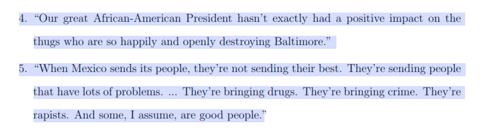
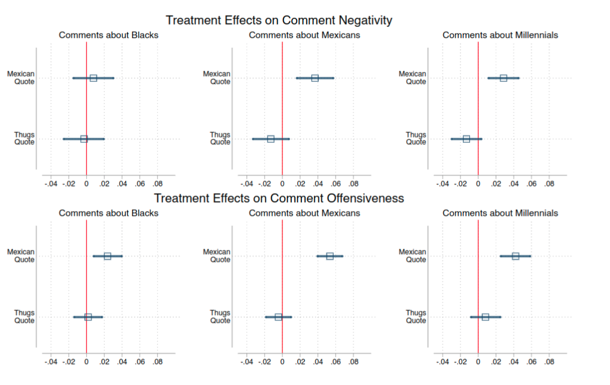
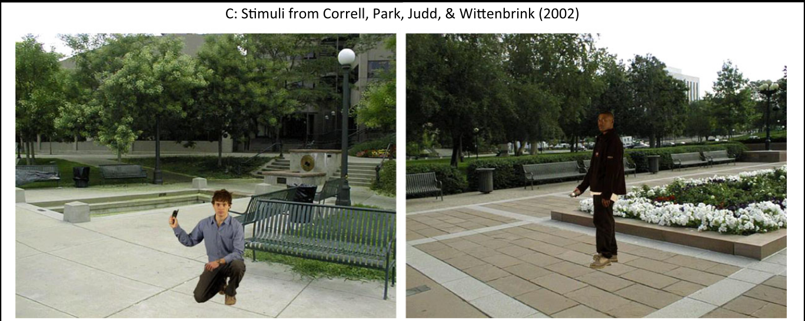
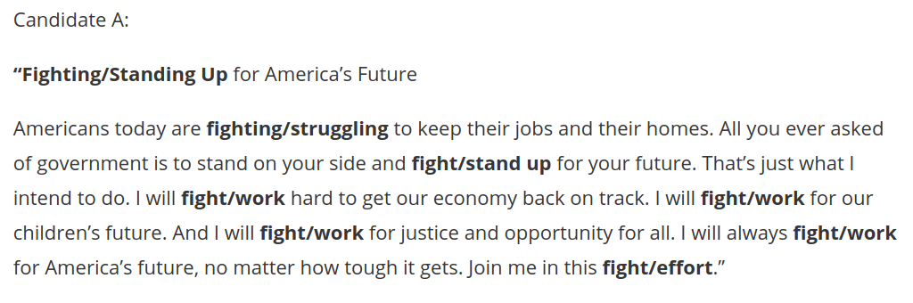

# Media and Violence

### Persuasion and Coordination

## Today

### **1) Priming**
### **2) Priming Effects**
### **3) Narratives**

#

<blockquote class="twitter-tweet" data-lang="en">
It is outrageous what the Democrats are doing to our Country. Vote Republican now! <a href="https://t.co/0pWiwCHGbh">https://t.co/0pWiwCHGbh</a> <a href="https://t.co/2crea9HF7G">pic.twitter.com/2crea9HF7G</a>
&mdash; Donald J. Trump (@realDonaldTrump) <a href="https://twitter.com/realDonaldTrump/status/1057728445386539008?ref_src=twsrc%5Etfw">October 31, 2018</a></blockquote>

<a href="https://twitter.com/realDonaldTrump/status/1057728445386539008?ref_src=twsrc%5Etfw">click here</a>

#

# Priming

## Implicit vs Explicit 

### Ethnic/Racial messages

**explicit**: use of ethnic/racial nouns or adjectives to endorse in-group prerogatives, to express anti- out-group sentiment, to represent ethnic/racial stereotypes, or to portray a threat from the out-group. 

- In the US, an explicit message uses such words as “blacks,” “race,” or “racial” to express anti-black sentiment or to make racially stereotypical or derogatory statements.

**implicit**: a message that endorses in-group prerogatives, expresses anti- out-group sentiment, represents ethnic/racial stereotypes, or portrays a threat from the out-group **without** ethnic/racial nouns/adjectives using either words or images 

## Priming

*in psychology*:  exposure to one stimulus influences a response to a subsequent stimulus, without conscious guidance or intention

### "dog whistle"

- implicit message, not necessarily conscious shift in behavior

# Priming: Does it work?

## Priming: Classic Examples

### Crime in the US:

- Over-representation of African Americans in television crime reporting

#

<iframe width="560" height="315" src="https://www.youtube.com/embed/Io9KMSSEZ0Y" frameborder="0" allow="accelerometer; autoplay; encrypted-media; gyroscope; picture-in-picture" allowfullscreen></iframe>

## Priming: Classic Examples

### Social Welfare

Experiments show Americans:

- more likely to support "assistance to the poor"
- less like to support "welfare"

Words "mean the same", but different racial connotations...

## Priming: Complications

**BUT**: not always sure that "words means the same thing"

Huber and Paris: people think of **different policies** when they hear "assistance to the poor" vs. "welfare"

## Priming and Racial/Ethnic Attitudes

### Random exposure to Trump Quotes

- Effects on negative/offensive statements about groups

#

# 

## Priming and Violence:

### Shooter Experiments

- Police Simulator
- Decide whether "suspect" is armed or unarmed
- Time pressure (less than 1 second)

#

## Priming and Violence:

### Violent Language

Exposure to "Fighting" words in ad **increases** support for political violence

Exposure to "Fighting" words  **increases** support for policies that harm ethnic out-group in India/Israel

## Priming and Violence:

## Priming and Violence:

“When politicians are damaging the country, citizens should send threats to scare them straight.”

“The worst politicians should get a brick through the window to make them stop hurting the country.”

“Sometimes the only way to stop bad government is with physical force.”

“Some of the problems citizens have with government could be fixed with a few well-aimed bullets.”

“Citizens upset by government should never use violence to express their feelings.” (reverse-coded)

Responses were made on a 5-point scale  from strongly agree to strongly disagree.

## Limitations:

### Compared to evidence last week:

- Doesn't measure real-world violence/behavior
- How long do these effects last?

### But...

Priming "Treatment" is very small yet has an effect