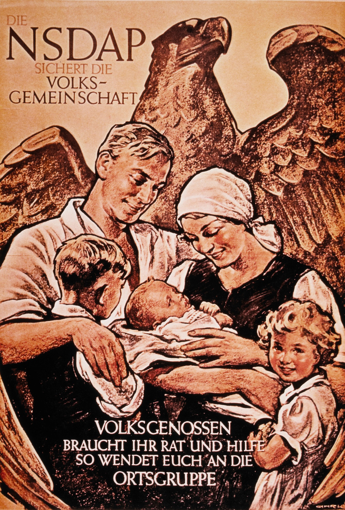
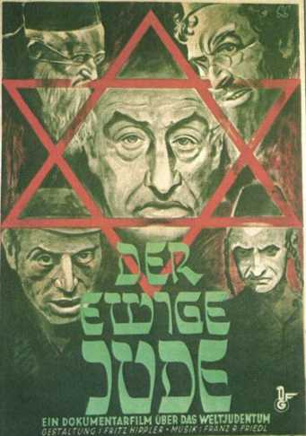
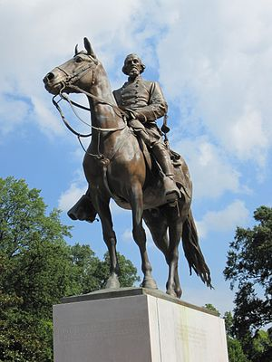
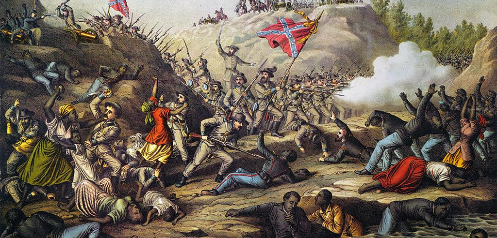

# Media and Violence

## Today

### **1) Narratives**
### **2) Exercise**

# Narrative Features

## Narrative Features

### **Actors**

How are ...

- Perpetrators
- Victims
- Bystanders

... **described** or **portrayed**

## Narrative Features

### **Actions**

How are the

- events leading up to 
- the violence itself 

**described** or **narrated**

## Narrative Features: Actors

### **Rationalization**/**Repudiation**

**rationalization**: portrayal of actor as being rational, sensible, or logical

**repudation**: portrayal of actor as being irrational, illogical, or erratic

## Narrative Features: Actors

### **Rationalization**

## Narrative Features: Actors

### **Inclusion**/**Expurgation**

**inclusion**: language and symbols that connects actor with wider community and encourages audience identification with the actor (e.g. humanizing actor, having desirable attributes)

**expurgation**: symbols/language that make actors into scapegoat or otherwise evil, strange, or not part of the community shared by the audience (e.g. dehumanizing language, emphasis on undesirable traits)

#

#

## Narrative Features: Actors

### **Euphemism**/**Dysphemism**

**euphemism**: description of actor with valorizing or positive adjective instead of neutral or negative terms (describing drunkenly destroying property as "had a little too much fun")

**dysphemism**: description of actor with negative or pejorative adjective instead of neutral or positive terms (calling someone a "butcher" rather than they "committed homicide"")

#

**"Erected by his countrymen in honor of the military genius of Lieutenant General Nathan Bedford Forrest"**

#

## Narrative Features: Actors

### **Authorization**

**authorization**: depiction of actor as being a figure of or having authority to act.

## Authorization

### **Arizona Sheriff Joe Arpaio:**

described as "tireless champion of strong borders and the rule of law"

after being convicted of racial profiling to round up suspected illegal immigrants

## Narrative Features: Actors

### **Moral Evaluation**

**blameworthy**: portrayals that imply victims of violence as somehow deserving what happened to them (e.g. emphasizing that person shot by police had criminal charges)

**praiseworthy**: portrayals that imply perpetrators of violence will be or ought to be praised for their actions

## Summary

### Encourage/justify violence:

### Victims

Repudiate, expurgate, dysphemism, blame

### Perpetrators (sometimes others)

Rationalize, include, euphemism, authorize

# Lynching of Sam Hose

### Exercise

#

## Read article with group

### Identify examples of:

1) rationaliation/repudiation
2) expurgation/inclusion
3) euphemism/dysphemism
4) authorization
5) blameworth/praiseworthy

#