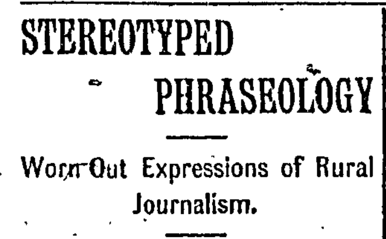
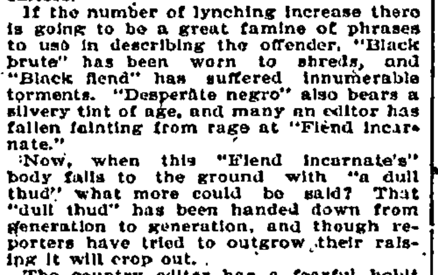
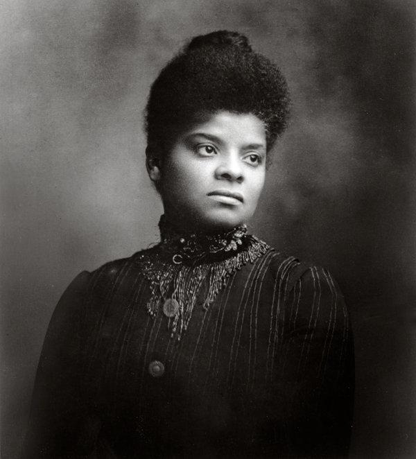

```{r setup, include=FALSE}
knitr::opts_chunk$set(echo = FALSE)
```


# Media and Violence

## Today

### **1) Narratives Recap**
### **2) Resistance: Ida Wells**

# Violence Narratives Recap

## Example: Lynching

### What frames are used to endorse lynching?

### What narrative features support this?

- Lynching press coverage
- "The Birth of a Nation"


## Lynching: Diagnostic Frames

### From advocates of lynching:

- **Inefficiency/corruption** of courts
- **Legal punishment** creates insufficient deterrent
- **Threat of black criminality/sexual aggression**

## Lynching: Prognostic Frames

### From advocates of lynching:

- **Popular sovereignty** in punishment is better than the courts
- **Heinous crimes** require **heinous punishment** to deter
- **"Natural" to lynch** in response to rape

## Lynching: Narratives

### Actors:

**Protagonists** (Lynch mob)

- sober, orderly (*rationalization*)
- "best" or "leading" citizens, entire community (*authorization*, *inclusion*)
- mob "redeems" the community "like the lifting of a fog when the morning sun bursts forth" (*euphemism*)

## Lynching: Narratives

### Actors:

**Antagonists** (Victim)

- animalistic (*repudiation*)
- described as repeat criminal, troubled person (*exclusion*)
- "monster", "fiend", "brute", etc (*dysphemism*)

## Lynching: Narratives

### Actions:

- ‘the hearts of the Citra people were bowed down in grief to know that a **duty was to be performed.**’ (*euphemism*)
- Victim of lynching "**undeniably guilty**" of crimes, particularly rape (*objectification*)
- Violence against victim described using passive voice (*passivization*)
- Violence happens **because** of a crime, 'meet the only justice possible.' (*naturalization*)


## Lynching: Narratives

### Repetition

- "Boilerplate"/"stock" lynching narratives used regardless of truth
- Complaint of overused/"hackneyed" language
- Distinguished between "warranted" and "unwarranted" lynchings

## Lynching: Narratives



## Lynching: Narratives



#

# Resisting Violent Narratives

## Challenging Violent Rhetoric

### Who has **knowledge** needed to do this?

### Who has the **motive** to do this?

### Who has the **status** and **connections** to be an effective messenger?

### What can be done to challenge justifications for violence?

# Ida Wells

#



## Ida Wells: Biography

- Born into slavery; family became middle class
- Gendered expectations of "ladies"
- Challenged segregation
- Became part-owner of Memphis newspaper

## Ida Wells: Radicalization

### 1892 Lynching in Memphis

### Editorial criticism of lynching

### Exile

## Ida Wells:

### Attributes as effective messenger:

**African American**: access to information, motive to combat lynching

**Woman**: credibly question "rape" narrative

**Middle-class "Lady"**: respectable status, language, deportment

**Journalist**: access to media, skilled in communication, national network

**"Credentials"**: approval from Frederick Douglass


## Ida Wells: Diagnostic Frames

In *Southern Horrors*:

### Lynching is systemic racial violence connected to the state

1) Courts **easily convict** African Americans, compared to whites

2) White men rape black women with little cost or condemnation

### Lynching is built on racial bias

3) Sexual relations between black men and white women are (often) consensual

4) White elites are complicit in racial injustice of lynching to ensure dominance

## Ida Wells: Diagnostic Frames

### Lynching a threat to rule of law

## Ida Wells:

### **How did she challenge lynching narratives**?


