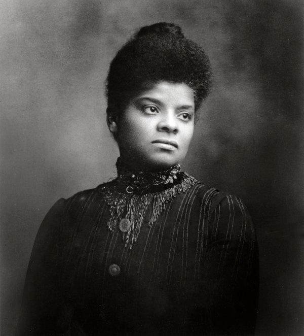

```{r setup, include=FALSE}
knitr::opts_chunk$set(echo = FALSE)
```


# Media and Violence

## Today

### **1) Resistance: Ida Wells**

# Ida Wells

#



## Ida Wells: Biography

- Born into slavery; family became middle class
- Gendered expectations of "ladies"
- Challenged segregation
- Became part-owner of Memphis newspaper

## Ida Wells: Radicalization

### 1892 Lynching in Memphis

### Editorial criticism of lynching

### Exile

## Ida Wells:

### Attributes as effective messenger:

**African American**: access to information, motive to combat lynching

**Woman**: credibly question "rape" narrative

**Middle-class "Lady"**: respectable status, language, deportment

**Journalist**: access to media, skilled in communication, national network

**"Credentials"**: approval from Frederick Douglass

## Ida Wells: Diagnostic Frames

### Lynching not about sexual threat from black men

- Sexual relations between black men and white women are (often) consensual
- White hypocrisy with assault of black women
- Minority of lynching events have rape accusation
- Victims of lynching not matching the narrative

## Ida Wells: Kinds of Evidence

### Lynching not about sexual threat from black men

- **consensual**: white women admitting this; white news accounts
- **hypocrisy**: stories from African American community
- **rape accusations**: statistics on lynchings 
- **victims**: statistics on lynchings

## Ida Wells: Diagnostic Frames

### Lynching about racial oppression

- Connection between lynching and segregation
- "Moral depravity" cannot be worse with emancipation
- Lynching for voting first (*Birth of a Nation*)
- Victims of lynching often not guilty of real crimes
- White legal system can easily convict
- White domination of government, but still lawless 
  - lynching is degradation of white morality

## Ida Wells: Diagnostic Frames

### Lynching threat to law and order/ civilization

## Ida Wells: Strategy

### Resonant Frames

- What kinds of messages would work with different audiences?
- What kinds of evidence would be most effective?

## Ida Wells: Strategy

### New Narratives

- Use of white press against itself
- Use of first-hand experience
- Hiring private investigators

## Ida Wells: Strategy

### Gaining Access

- Played up middle-class sensibilities
- "Forced" to address scandalous issues of lynching, rape
- Portrayed herself as a political novice
- Worked with male allies (e.g. Charles Aked, Frederick Douglass)
- Travel to the UK

## Ida Wells: Strategy

### Kinds of activism

- Publish in newspapers
- Hold lecture series
- Pamphlets
- Travel to the UK
- Network with publishers, politicians

## Ida Wells: Strategy

### Effective?

- UK audiences condemn American lynching
- US audiences concerned about reputation
- Southern papers irate


