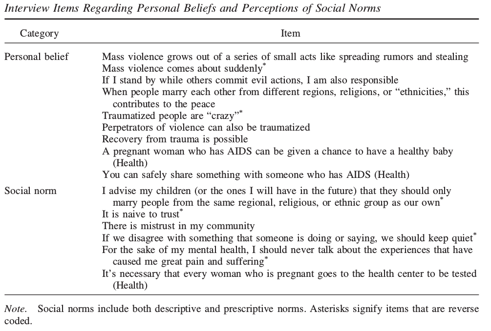

```{r setup, include=FALSE}
knitr::opts_chunk$set(echo = FALSE)
```

# Media and Ethnic Cooperation

## Today

### **1) Recap: Non-violence**

### **2) Media Interventions and Ethnic Trust**

### **3) Evidence on Media Interventions**

# Recap: Non-Violence 

### Non-violent tactics can compel **less violence**

### Depends on **media attention** and **coverage** of protesters

### May be limits to its efficacy

- un-shamable opponents
- ethnically/racially divided societies

#

# Media to rebuild<br>multi-ethnic communities


## Media and ethnic peace:

Like study of media and violence...

### Interested in **persuasion** or **coordination**

**persuasion**: people convinced of different ideas about other ethnic group, new beliefs/attitudes

**coordination**: changing understanding about norms and behaviors that are **appropriate** (about social costs and consequences of behavior)


## Media and ethnic peace:

### What kinds of media interventions most effective?

### Why are these media interventions potentially effective?

## Media and ethnic peace:

### Entertainment/narratives likely to be effective

## Why entertaining narratives?

### **Beliefs/Attitudes**: 

- beliefs about facts regarding other ethnic group/ethnic issues
- attitudes/prejudice toward ethnic groups

narratives better at persuasion b/c

- less selection into messages; 
- better for remembering

## Why entertaining narratives?

### **Beliefs/Attitudes**:

- beliefs about facts regarding other ethnic group/ethnic issues (changing *resonance*)
- attitudes/prejudice toward ethnic groups (*persuasion*)

**narratives** better at persuasion b/c

- less selection into messages; 
- better for remembering

## Why entertaining narratives?

### **motivation/emotion**:

- more attention and involvement when there is a narrative
- can lead to more persuasion due to personal investment in story

## Why entertaining narratives?

### **vicarious relationships with out-group** (*persuasion*)

- Contact Hypothesis (Allport)
- Empathy with beloved characters on-screen

## Why entertaining narratives?

### **social norm diffusion** (*coordination*)

- shows alter perceived socially desirable norms (e.g. how widely they are used)
- shows provide basis for real-life conversations (diffuse norms further)

# Does this really work?

# Sounds like<br>"after-school special"

## Evidence from Paluck (2009)

### Experiment in Rwanda

- Exposed communities to soap-opera addressing ethnic cooperation post-genocide
- Examines:
    - shifts in beliefs
    - shifts in norm perception
    - shifts in empathy
    - shifts in behaviors

## Evidence from Paluck (2009)

- Soap-opera following fictional but similar genocide
- Locals cross ethnic lines to defy leaders encouraging violence

### Soap Opera (New Dawn) messages

**beliefs**: violence based on psychological responses, lack of independent thought and dissent, insufficient group interactions

**norms**: positive portrayal of inter-ethnic cooperation, expression of dissent

## Evidence from Paluck (2009)

### Experiment:

- 14 communities; 7 pairs with strong similarities, randomly assigned within pairs
- "Treatment" gets reconciliation soap-opera; "Control" gets health-themed soap opera
- Listened to show over course of a month in groups

#



## Evidence from Paluck (2009)

### Beliefs:

- causes of violence (no change)
- bystanders responsible for violence (no change)
- intermarriage brings peace (no change)
- views on trauma (no change)
- views on reconciliation (no change)

## Evidence from Paluck (2009)

### Norms:

Treatment shifted norms:

- in favor of inter-ethnic marriage
- trusting ethnic out-group not naive
- more willing to discuss lack of trust
- more support for expressing dissent

## Evidence from Paluck (2009)

### Empathy:

- During shows, verbal expressions of empathy for characters
- surveys showed more empathy for various groups in Rwandan society

## Evidence from Paluck (2009)

### Behavior:

Secret observation of how groups handled reward:

- "Control" groups had no dissent/discussion
- "Treatment" groups: listening group keeps stereo, solve problems themselves, belief in inter-ethnic cooperation


## Evidence from Paluck (2010)

Similar experiment in Democratic Republic of the Congo:

- Treatment group gets soap opera + talk-show; control group gets soap opera

### Does discussion after a show increase its efficacy?

## Evidence from Paluck (2010)

"Treatment"/Discussion group showed:

- more contentious discussions
- more negative attitudes toward outgroup
- less willingness to help ethnic out-group

## Key lessons:

###Effective media intervnetions have

1. Engage attention (narratives more effective)
2. Subtle / not too obvious (narratives work well)
3. Tell audience what others think (narratives reveal social norms/preferences)
4. Create behavioral channels (narratives show what to do)
