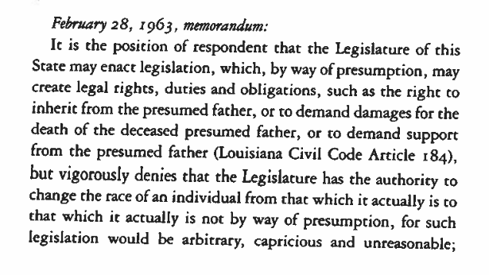
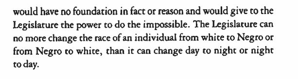
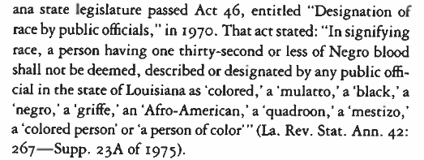
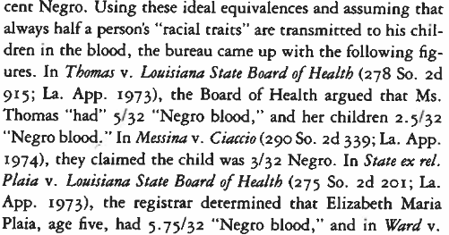

```{r setup, include=FALSE}
knitr::opts_chunk$set(echo = FALSE)
```


# An Introduction

### What is race/ethnicity?

## What is race/ethnicity: Goals

### Definitions

- What do ordinary people think they are?
- Can race/ethnicity be changed?
- Where do these groups come from?

### In Practice

- How does ethnicity/race work in reality?
- Prone to conflict? Why?

# Today

## Goals

### What is common sense notion of race/ethnicity?

### Essentialist/primordialist definitions

### Complicate those definitions

# STOP

## Think and Write

### 2-3 minutes:

### According to "common sense":

### What are definitions/key attributes of "race" or an "ethnic group"

#

## Essentialist definition

### **essentialist definition of race/ethnicity**:

an identity where membership is based on descent and is

- inherited at birth
- fixed (unchangable for individuals, and unchanging over time)
- universal (all group members share traits, capacities, competences, behaviors)

Thus:

- natural ("blood", "genes")
- shared culture (language, religion), tradition, history

##  {.centered}





## Essentialist definition

### Checkered Past

- Nazis and Final Solution

- White supremacy and slavery


## Essentialist definition

### Checkered Past

- Nazis and Final Solution

- White supremacy and slavery

### But also...

- Used by oppressed/colonized peoples
- Arab nationalism, Black Power / Nationalist movements, Indian independence

# Does this definition match reality?

## 

<iframe width=100% src="https://www.youtube.com/embed/kU2oVyFXnf0?start=220&end=390&autoplay=0" frameborder="0" allowfullscreen></iframe>


##
<iframe width=100% src="https://www.youtube.com/embed/kU2oVyFXnf0?start=1908&end=475&autoplay=0" frameborder="0" allowfullscreen></iframe>


##
<iframe width=100% src="https://www.youtube.com/embed/kU2oVyFXnf0?start=3123&end=80&autoplay=0" frameborder="0" allowfullscreen></iframe>

## Key questions:

### - Why does it matter she is more than 50%?
  
### - How does her father’s family history relate to the received history of African Americans?


# 

---

### **primordialist definition of race/ethnicity**:

an identity where membership is based on descent and is

- inherited at birth
- even though not in fact, **people think** of it as:

    - fixed (unchangable for individuals, and unchanging over time)
    - universal (group members share traits, capacities, competences, behaviors)
    - natural ("blood", "genes")

Thus, ethnicity/race:

- durable/hard to change once created
- shared (or imagination of shared) culture (language, religion), tradition, history
- even if not natural, act "as if" they are natural

##  {.centered}






