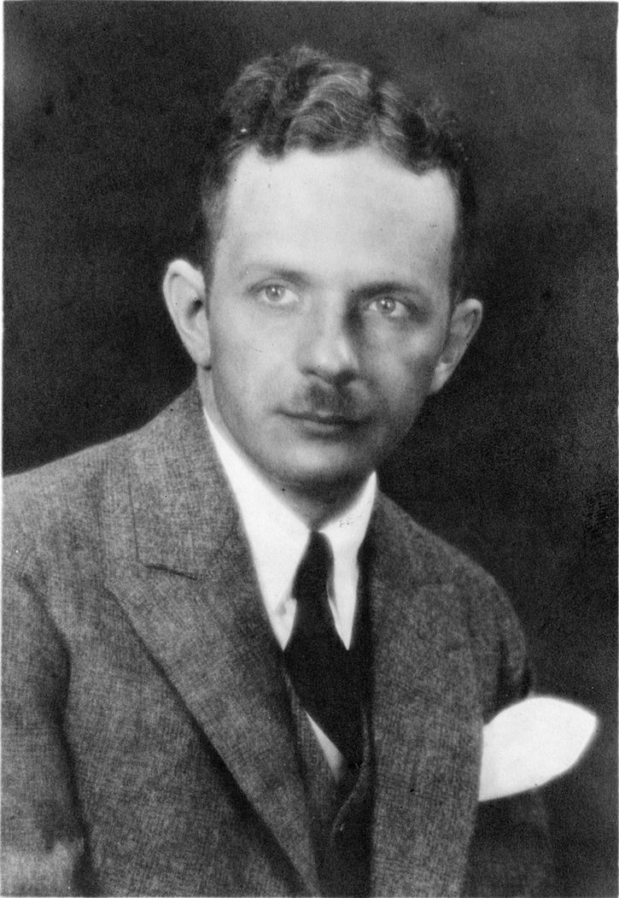

```{r setup, include=FALSE}
knitr::opts_chunk$set(echo = TRUE)
```

# Socially constructed?

### What is race/ethnicity?

## Plan for the day

### **Recap**

### **Instrumentalism**

### **How "fluid" can race/ethnicity be?**


# Recap

## Limits of primordialism:

### Contrary to expectations:

- Ethnic/racial groups **can change quickly** (years/decades, not centuries)
    - Creoles in Louisiana, Irish Catholics, Muhajirs

- Divides between ethnic/racial groups **do not depend on objective** cultural **difference**
    - Yoruba (Ancestral Cities vs. Religion)
    
- People simultaneously belong to **multiple ethnicities/races**, not equally **salient**
    - Yoruba
    - Communities at home vs in diaspora
    
## Sneetches

- Apparently rapid switching
    - switching groups: ethnicity/race is changable
    - switching criteria for "difference" (stars on, stars off): cultural/social differences between groups not important
    
# Instrumentalism


---

**instrumentalist theory of race/ethnicity**: 

a **constructivist** theory that suggests:

1. individuals are motivated by economic and political gains

2. ethnic groups are an easy way to organize and coordinate to win elections, mobilize to improve benefits/business

3. because ethnicity is changable and shared traditions invented

4. ethnic groups change quickly as people (rationally) make them large enough to win elections/business, but small enough to maximize the benefit to each member (minimum winning coalition)

Ethnic groups can change whenever political and economic incentives change

## Instrumentalism: Chewas and Tumbukas

Chewas and Tumbukas, tribal groups that differ along:

- language
- traditional dances
- traditional norms norms
- rituals
- farming practices 


## Instrumentalism: Chewas and Tumbukas

British South African Company: arbitrary boundary

### **In Malawi:**

Chewas and Tumbukas are political adversaries

### **In Zambia:**

Chewas and Tumbukas are seen as part of same ethnic group; political allies


## Instrumentalism: Chewas and Tumbukas

Political usefulness of these groups (**minimum winning coalition**)

### **In Malawi:**

Chewa and Tumbuka are 28 and 12 percent of population; 

Big enough to organize to claim government resources

### **In Zambia**

Chewa and Tumbuka are 7 and 4 percent of population

Too small to organize for government resources, organized around shared Nyanja language

## Instrumentalism: Chewas and Tumbukas

|           | Nyanja | Language (1) | Language (2) |
|-----------|--------|--------------|--------------|
| Chewa     |    X   |              |              |
| Tumbuka   |    X   |              |              |
| Tribe (a) |        |       X      |              |
| Tribe (b) |        |       X      |              |
| Tribe (c) |        |              |       X      |
| Tribe (d) |        |              |       X      |

## Nested Cleavage

**nested cleavage**: when multiple ethnic/racial identities are organized such that membership in a smaller group implies membership in a specific larger group

## Crosscutting

**crosscutting cleavage**: when multiple dimensions of ethnic/racial identities are organized such that membership in a group along one dimension  **does not** imply membership in a specific group along the other dimension

## Crosscutting: Yoruba

|          | Traditional | Christian | Muslim |
|----------|-------------|-----------|--------|
| City (a) |      X      |     X     |    X   |
| City (b) | X           |     X     | X      |
| City (c) |      X      |     X     |    X   |
| City (d) | X           | X         |    X   |


## Overlapping

**overlapping cleavage**: when multiple dimensions of ethnic/racial identities are organized such that membership in a group on one dimension **implies** membership in similarly-sized group along the other dimension

## Overlapping: in Germany?

|                | Christian | Muslim |
|----------------|-----------|--------|
| White          |     X     |        |
| African        |     X     | X      |
| Middle Eastern |           |    X   |

* For illustrative purposes only, not strictly true

# How far can you go with that?

### Socially constructed:

#

<iframe width=100% src="https://www.youtube.com/embed/bFTheldotb0?autoplay=0" frameborder="0" allowfullscreen></iframe>

# Can you actually *switch*, not just change emphasis?

#

<iframe width=100% src="https://www.youtube.com/embed/T76IPVdkDZ4?autoplay=0" frameborder="0" allowfullscreen></iframe>

# 

<iframe src="https://player.vimeo.com/video/206242985" frameborder="0" webkitallowfullscreen mozallowfullscreen allowfullscreen></iframe>
<p><a href="https://vimeo.com/206242985">O.J.: The Pioneer Before the Prisoner</a> from <a href="https://vimeo.com/atlanticvideo">The Atlantic</a> on <a href="https://vimeo.com">Vimeo</a>.</p>

#

### OJ: Made in America

# Why? Why not?

### Can you actually *switch*, not just change emphasis?

## Passing: {.columns-2}

**passing**: ability of a person to be regarded as a member of an ethnic/racial group different from their own; **or** ability of a person to be regarded as a member of two (or more) ethnic/racial groups that are ordinarily treated as mutually exclusive



*Walter White, NAACP Head*

# Conclusion

## A puzzle:

Seen that ethnicity and race are socially **constructed**...

...but we **can't** simply  **identify** as **anything** we want.

## A solution?

Socially constructed $\nRightarrow$ Race/Ethnicity is **subjective**

### ethnic/racial identification is **inter-subjective**
