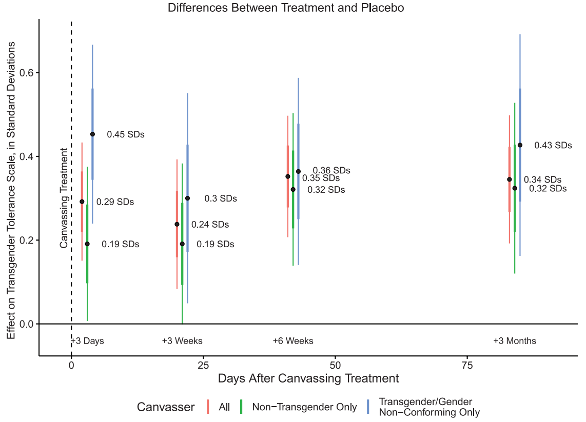
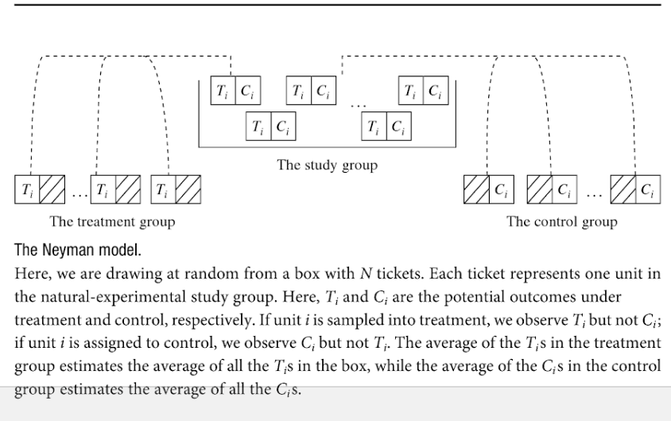

```{r setup, include=FALSE}
knitr::opts_chunk$set(echo = TRUE)
```

## Course Introduction

### Get to know each other

### Plan/Philosophy of the course

### Causality, Potential Outcomes, Review

# Introductions

# Who are you?<br>degree/year?<br>will use stats?<br>goals for the course?

#

# Course Policies

# Questions

# Causal Inference

## One Example: Can Contact Reduce Prejudice?


## One Example: Can Contact Reduce Prejudice?

#### Allport and a large literature suggests that prejudice against groups can be reduced through contact

- Contact could create empathy, contradict negative stereotypes. But people could also build empathy without contact.
- Contact is often chosen... hard to test whether it is contact that actually shifts prejudice, rather than levels of prejudice driving contact

#### Broockman and Kalla replicated a fraudulent experiment that tested prejudice reduction against gays using gay vs. straight canvassers for gay rights.

## Broockman and Kalla 2016

- Trans-rights organization canvassed to reduce transphobia in Miama, FL
- Researchers worked with them to randomize which people received different "treatments"

### Subjects

- 1825 registered voters 
- Drawn from responders to invitation to join online survey

## Broockman and Kalla 2016

### Treatments

Subjects either saw:

- Canvasser on law againts transgender discrimination who was **cis-gender** or **transgender**
- Canvasser **for** recycling program who was **cis-gender** or **transgender**
- Canvasser in treatment: asked people to consider time when they were judged negatively for being different

### Survey

- Answered survey questions about discrimination law, transgender tolerance
- From 3 days after canvass to 3 months

## Estimated Treatment Effects




## Key points:

### Simple analysis, nothing fancy: difference in means

### Design-based inference:

- causality through research design, not statistical tool
- analysis still depends on a statistical model (though simple, usually credible)

### Contrast with model-based inference:

> "The power of multiple regression analysis is that it allows us to do in non-experimental environments what natural scientists are able to do in a controlled laboratory setting: keep other factors fixed" (Wooldridge 2009: 77)

## Strong Research Design: pros and cons

### Strengths:

- Causal inference possible
- Statistical model simple, transparent, plausible

### Limitations:

- analysis may not follow from the research design
- lack of external validity

## Causality

### (1) Counterfactuals

### (2) Manipulation

## Counterfactuals

- A counterfactual statement with a false (untrue about the world) premise, and an assertion of what would have happened had the premise been true:

"If the legal marijuana policy has not been adopted, then Y..."

- For cause C, **causal effect** of C is the difference between the two states of the world where C is present versus absent.

### Not a sufficient criterion!

- mercury in barometer and storms

## Manipulation

- Causation as forced action

### Combination with counterfactuals gives us a strong criterion:

- counterfactuals without manipulation do not give us the direction of causality
- manipulation without counterfactuals may permit spurious results

## Potential Outcomes

### Statistical approach to causality combines both:

### Neyman (Rubin; Holland) model:

An experiment with two treatment conditions (treatment and control)

- **potential outcome** under treatment is $Y_i^1$: what unit $i$ would experience if assigned to treatment
- **potential outcome** under control is $Y_i^0$: what unit $i$ would experience if assigned to control.
- **unit causal effect** is the difference between these:

$$\tau_i = Y_i^1 - Y_i^0$$

## Potential Outcomes

### Neyman model is a **causal model**

- Explicitly states how units behave under different counterfactual conditions
- These sets of potential outcomes or **response schedules** are crucial for using statistics to achieve causal inference.

## Potential Outcomes

| i | $Y_i^0$ | $Y_i^1$ | $Y_i^1 - Y_i^0$ |
|---|---------|--------|-----------------|
| 1 | 3 | 6 | 3 |
| 2 | 2 | 5 | 3 |
| 3 | 5 | 8 | 3 |
| 4 | 4 | 7 | 3 |
| 5 | 3 | 6 | 3 |

## Potential Outcomes

### TROUBLE

- Can never directly observe the *unit causal effect*: only ever see $Y_i^1$ or $Y_i^0$, not both.


### Fundamental Problem of Causal Inference


## Potential Outcomes

**fundamental problem of causal inference**:

| i | $Y_i^0$ | $Y_i^1$ | $Y_i^1 - Y_i^0$ |
|---|---------|--------|-----------------|
| 1 | ? | 6 | ? |
| 2 | 2 | ? | ? |
| 3 | ?| 8 | ? |
| 4 | 4 | ? | ? |
| 5 | ? | 6 | ? |

## Average Causal Effects

Because **unit causal effects** are fundamentally unobservable, focus has been on **average causal effects** (or *average treatment effects*)

- For units in $i = 1 \ldots N$

$$ACE = \bar{\tau} = \frac{1}{N}\sum\limits_{i=1}^N [Y_i^1 - Y_i^0]$$

- This parameter takes the difference between two counterfactuals:
    - average outcome of all units if assigned to treatment
    - average outcome of all units if assigned to control

## Solving the problem

We have a **parameter** (average causal effect) that we would like to know. But half the data we need is always missing. 

Analogical problem to estimating, e.g., population mean (a parameter) without observing the entire population.

- Use **random sampling** and **statistics** to solve our problem

# A digression: Review

## Random Variables and Expectations

**random variable**: a *chance* procedure for generating a number

**observed value** (**realization**): value of a particular draw of a random variable.

## Random Variable: Example

### Six-sided fair die

- Equal probability of landing on $1,2,3,4,5,6$

- Imagine the **random variable** as a box containing all possible values of a die roll on tickets

- A roll of the die would be a **realization**

## Random Variables: Operations

#### (1) Arithmetic operations on random variables are new random variables

- E.g. $Y * X = Z$; where $Y$ is $-1,1$ based on a coin flip and $X$ is $1,2,3,4,5,6$ based on die roll.

## Random Variables: Expectations

#### (2) **Expected value** of a random variable is a number.
  
- If $X$ is a random draw from a box of numbered tickets, then $E(X)$ is the mean of the tickets in the box
- Any **realization** of the random variable may be above or below the **expected value**

## Independence and Dependence

$X$ and $Y$ are random variables. 

- If you know the value of $X$ **and** the chances of $Y$ taking on a specific value depends on that value of $X$, $X$ and $Y$ are **dependent**
- If you know the value of $X$ **and** the chances of $Y$ taking on a specific value do not depend on that value of $X$, $X$ and $Y$ are **independent**

## Independence and Dependence

| **X** | **Y** |
|-------|-------|
|1|1|
|1|2|
|1|3|
|3|1|
|3|2|
|3|3|


## Independence and Dependence

| **X** | **Y** |
|-------|-------|
|1|1|
|1|2|
|1|3|
|3|2|
|3|2|
|3|3|

## Random Variables Summary:

- We often have **data variables**: lists of numbers

- **random variables** are chance processes for generating numbers
    - permit us to use chance process to draw inferences
    
- to treat **data variables** as **random variables** need a **model** for data generating process

- our models may be good descriptions of chance procedure, or not.

## Statistics and Parameters

- Expected value of a random variable is a **parameter**
    - in our examples (e.g. fair die), we have known it
    - usually, we **want** to estimate it
    
- **statistics** (e.g., sample mean) let us draw inferences about **parameters** from the data.


## Statistics and Parameters

#### If we roll a die $n$ times and add up spots ($S_i$) on each roll $i$:

$$\sum\limits_{i=1}^{n}S_i$$

#### Each $S_i$ is a random variable, as is the sum

## Statistics and Parameters

It turns out that:

$$E\left(\sum\limits_{i=1}^{n}S_i\right) = \sum\limits_{i=1}^{n}E\left(S_i\right) = n \cdot 3.5$$

$$\frac{1}{n}\sum\limits_{i=1}^{n}E\left(S_i\right) = n \cdot 3.5 \cdot \frac{1}{n}$$

If we roll die $n$ times and take the mean of spots, it is a random variable. The mean of the draws is, in expectation, the mean of the random variable. AND as $n$ gets large, sample mean will approximate the box/population mean.

## Key Takeaway:

We can use repeated observations to estimate parameters of random variable (e.g. expected value).

We did this using independent, identically distributed random draws: good for rolling dice

#### but reality is complicated. 

# Return to Causal Effects

## Average Causal Effect unobserved

$$ACE = \bar{\tau} = \frac{1}{N}\sum\limits_{i=1}^N [Y_i^1 - Y_i^0]$$

How do we solve our "missing data" problem?

### Random sampling!

## 



## If we randomly sample

Our parameter:

$$\frac{1}{N}\sum\limits_{i=1}^N [Y_i^1 - Y_i^0]$$

Our estimator:

$$\frac{1}{m}\sum\limits_{i=1}^m [Y_i^1 | Z_i = 1] - \frac{1}{N-m}\sum\limits_{i=m + 1}^N [Y_i^0 | Z_i = 0]$$

Where $m$ units are assigned to treatment $Z = 1$ and $N - m$ assigned to control $Z = 0$.

## Causal Inference Using Statistics

#### **Because we randomly assign samples to treatment and control**

1. Expected values of sample mean are equal to population mean
2. Expected value of mean $Y_i^1$ for sample in treatment equals  population mean of $Y_i^1$
3. Expected value of mean $Y_i^0$ for sample in treatment equals population mean of $Y_i^0$
4. Because sample means are random variables, ACE in a sample may differ from the population ACE.
5. But across all possible assignments of subjects to treatment and control, the average sample ACE is the same as the population ACE
6. This estimate is **unbiased**

## Algebraically:

$$ACE =\frac{1}{N}\sum\limits_{i=1}^N [Y_i^1 - Y_i^0]$$

$$ACE =E[Y_i^1 - Y_i^0]$$

$$ACE =E[Y_i^1] - E[Y_i^0]$$

And because $Z_i$ is randomly assigned:

$E[Y_i^1|Z_i = 1] = E[Y_i^1|Z_i = 0] = E[Y_i^1]$
$E[Y_i^0|Z_i = 0] = E[Y_i^0|Z_i = 1] = E[Y_i^0]$

## Key Assumptions

For us to get an **unbiased** estimate of the average causal effect, we **assume**:

1. **Random assignment**: units are sample at random (or as if at random) from the study group and assigned to treatment or control
2. Non-interference/SUTVA: each unit's outcome depends only on its treatment assignment (not on assignment of others)
3. Exclusion restriction: treatment assignment only affects outcomes through receipt of treatment

### Can we test or evaluate the validity of these assumptions?