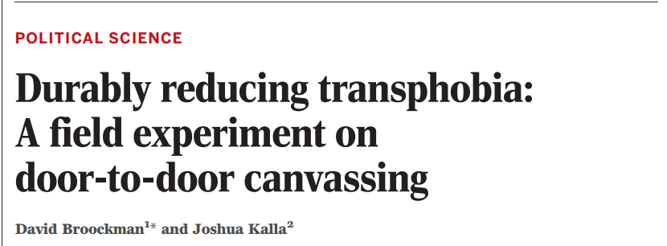

```{r setup, include=FALSE}
require(knitr)
require(magrittr)
knitr::opts_chunk$set(echo = TRUE)
```

<style type="text/css">
  .reveal h2,h3,h4,h5,h6 {
    text-align: left;
  }
  .reveal p {
    text-align: left;
  }
  .reveal ul {
    display: block;
  }
  .reveal ol {
    display: block;
  }
</style>

## Potential Outcomes and Causal Inference

# Introduction

## Does Contact Reduce Prejudice?

#### Allport (1954) and a large literature suggests that prejudice against groups can sometimes be reduced through interpersonal contact

- Contact could create empathy, contradict negative stereotypes. But people could also build empathy without contact.

## Does Contact Reduce Prejudice?



## Does Contact Reduce Prejudice?

#### In pairs: 

How do statistical tests help authors assess causality?

Do you find these statistical tests persuasive (about causality)?

## Compare and contrast

> Broockman and Kalla use simple $t$ tests to compare differences in means

> "The power of multiple regression analysis is that it allows us to do in non-experimental environments what natural scientists are able to do in a controlled laboratory setting: keep other factors fixed" (Wooldridge 2009: 77)

## Design vs. Model-based inferences

A matter of **degree**

Statistical evidence for causality combines **observed data** with a **mathematical model** of the world

>- mathematical model describes how observed data are generated
>- model always involves assumptions
>- can almost always apply the model, even if it is wrong

## Design vs. Model-based inferences

Causal evidence varies in terms of complexity of math/assumptions: a matter of **degree**

- **Model-based** inferences about causality depend on complex statistical models with many assumptions

- **Design-based** inferences about causality use carefully controlled comparisons with simple, transparent models and assumptions

## Design vs. Model-based inferences

Whatever our approach...

<br>

**do the assumptions needed to use this mathematical tool reasonably fit reality?**

## Objectives

- Counterfactual Causality
- Potential Outcomes
- Causal Effects (unit vs average)
- Neyman Causal Model for inference

# Causality

## What is causality?

**What does it mean to say that interpersonal contact with an out-group members *causes* a reduction in prejudice (toward that group)?**

## What is causality?

Causality is...

### (1) Counterfactual

- A statement of what the state of the world would have been had prior events been different

> "If legal cannabis policy had not been adopted, then Y..."

- For some putative cause $C$, **causal effect** of $C$ is the difference between the two, otherwise identical, states of the world where $C$ is present versus absent.

## What is causality?

Causality is...

### (2) Manipulation

Causality requires something acting on another (a mechanism)

- e.g. barometer and storms

## What is causality?

### Counterfactual and manipulation together:

- counterfactuals without manipulation do not give us the direction of causality
- manipulation without counterfactuals may permit spurious results

## Potential Outcomes

A powerful way to formalize the mathematical model of causality

## Potential Outcomes

Imagine you were a participant in an experiment similar to the Broockman and Kalla paper...

Imagine that, today, you were asked to contribute money to a trans-rights advocacy organization. Imagine: would you contribute (1) or not contribute (0)...

>- ... if, yesterday, you were in the **no contact** group

>- ... if, yesterday, you were in the **contact** group

## Potential Outcomes

In an experiment with two conditions: each subject, prior to intervention has two possible states that it could take. 

If $Y_i$ is the donation status of person $i$; $Z$ is the experimental condition: $1$ indicates contact, $0$ no contact, then we have two **potential outcomes**

1. donation status with **no contact** is $Y_i(0)$
2. donation status **with contact** is $Y_i(1)$

More generally: $Y_i(Z \in (0,1))$

## Potential Outcomes


## Potential Outcomes

The **unit causal effect** of contact for person $i$ is the **difference** between the potential outcomes:

$$\tau_i = Y_i(1) - Y_i(0)$$

## Potential Outcomes

Tables of potential outcomes for different units are **response schedules**

- a general tool for thinking of how units behave under different possible counterfactual conditions

## Potential Outcomes


## Potential Outcomes

What happen when we've fallen from Mount Olympus, and we actually have to examine the data?

## Potential Outcomes

### TROUBLE

- Can never observe the *unit causal effect*
- Only ever observe $Y_i(1)$ or $Y_i(0)$ for a unit $i$, not both.
- One potential outcome is **factual**; other is **counterfactual**

>- This is the Fundamental Problem of Causal Inference

## Potential Outcomes

**fundamental problem of causal inference**:

| i | $Y_i(0)$ | $Y_i(1)$ | $Y_i(1) - Y_i(0)$ |
|---|---------|--------|-----------------|
| 1 | ? | 0 | ? |
| 2 | 1 | ? | ? |
| 3 | ?| 1 | ? |
| 4 | 0 | ? | ? |
| 5 | ? | 1 | ? |

## Potential Outcomes

The potential outcomes model points toward a statistical solution:

- we have missing data about some potential outcomes for each case
- similar to having data from a sample but not the entire population
- different approaches we can take to solve this problem
    - one approach makes "no assumptions", but only gives us *bounds*
    - another approach makes assumptions, but gives us a *point estimate*


# Partial Identification

# A digression: Review

## Random Variables and Expectations

**random variable**: a *chance* procedure for generating a number

**observed value** (**realization**): value of a particular draw of a random variable.

## Random Variable: Example

### Six-sided fair die

- Equal probability of landing on $1,2,3,4,5,6$

- Imagine the **random variable** as a box containing all possible values of a die roll on tickets

- A roll of the die would be a **realization**

## Random Variables: Operations

#### (1) Arithmetic operations on random variables are new random variables

- E.g. $Y * X = Z$; where $Y$ is $-1,1$ based on a coin flip and $X$ is $1,2,3,4,5,6$ based on die roll.

## Random Variables: Expectations

#### (2) **Expected value** of a random variable is a number.
  
- If $X$ is a random draw from a box of numbered tickets, then $E(X)$ is the mean of the tickets in the box
    - $E(X)$ has **minimum distance** to all possible values of $X$
- Any **realization** of the random variable may be above or below the **expected value**

## Independence and Dependence

$X$ and $Y$ are random variables. 

- If you know the value of $X$ **and** the chances of $Y$ taking on a specific value depends on that value of $X$, $X$ and $Y$ are **dependent**
- If you know the value of $X$ **and** the chances of $Y$ taking on a specific value do not depend on that value of $X$, $X$ and $Y$ are **independent**

## Independence and Dependence

<big>

| **X** | **Y** |
|-------|-------|
|1|1|
|1|2|
|1|3|
|3|1|
|3|2|
|3|3|

</big>

## Independence and Dependence

| **X** | **Y** |
|-------|-------|
|1|1|
|1|2|
|1|3|
|3|2|
|3|2|
|3|3|

## Random Variables Summary:

- We often have **data variables**: lists of numbers

- **random variables** are chance processes for generating numbers
    - permit us to use observed **realizations** to draw inferences about the random variable
    
- to treat **data variables** as **random variables** need to *assume* a **model** for data generating process

## Statistics and Parameters

- Expected value and other attributes of a random variable are **parameters** 
    - in our examples (e.g. fair die), we have known it
    - usually, we **want** to estimate it
    - (often greek letters)
    
- **statistics** (e.g., sample mean) are data we observe; if model assumptions hold, let us draw inferences about **parameters**.
    - (often latin letters or $\widehat{greek}$)

## Statistics and Parameters

#### If we roll a die $n$ times and add up spots ($S_i$) on each roll $i$:

$$\sum\limits_{i=1}^{n}S_i$$

#### Each $S_i$ is a random variable, as is the sum

## Statistics and Parameters

It turns out that:

$$E\left(\sum\limits_{i=1}^{n}S_i\right) = \sum\limits_{i=1}^{n}E\left(S_i\right) = n \cdot 3.5$$

$$\frac{1}{n}\sum\limits_{i=1}^{n}E\left(S_i\right) = n \cdot 3.5 \cdot \frac{1}{n}$$

If we roll die $n$ times and take the mean of spots, it is a random variable. The mean of the $n$ draws is, in expectation, the mean of the random variable $S$. AND as $n$ gets large, sample mean will approximate the mean of $S$.

## Key Takeaway:

We can use repeated observations to estimate parameters of random variable (e.g. expected value).

We did this assuming independent and identically distributed random draws.

Good for rolling dice...

### but reality is complicated. 


# Return to Causal Effects

## Average Causal Effects

**unit causal effects** are fundamentally unobservable, so focus has been on **average causal effects** (or *average treatment effects*)

- For units in $i = 1 \ldots N$

$$ACE = \bar{\tau} = \frac{1}{N}\sum\limits_{i=1}^N [Y_i(1) - Y_i(0)]$$

- This parameter takes the difference between two counterfactuals:
    - average outcome of all units if assigned to treatment
    - average outcome of all units if assigned to control
    
## Solving the problem

We have a **parameter** (average causal effect) that we would like to know. But data we need is always missing. 

Analogical problem to estimating, e.g., population mean (a parameter) without observing the entire population.

>- We want an **estimator**: mathematical model applied to data we **can** observe that, with assumptions, estimates our **parameter** *without bias*. 
>- Use **random assignment** to solve our problem

## Solving the problem

Assuming **Random Assignment** does two things:

1. $Z_i$ is independent of $Y_i(1)$ and $Y_i(0)$;
  - treated $Y(1)$s comes from same "box" as control $Y(1)$s and vice versa.
2. $E(Y_i(1))$ and $E(Y_i(0))$ are random variables
  - we know that expected value of sample is equal to "box" expected value.
  

## 


## If we randomly sample

**parameter**: $ACE = \bar{\tau} = \frac{1}{N}\sum\limits_{i=1}^N [Y_i(1) - Y_i(0)]$

We use the **estimator** ($\widehat{ACE}$ or $\widehat{\bar{\tau}}$):

$$\normalsize\underbrace{\frac{1}{m}\sum\limits_{i=1}^m}_{\text{Avg. over T}} \overbrace{[Y_i(1) | Z_i = 1]}^{\text{Y(treated) for T}} - \underbrace{\frac{1}{N-m}\sum\limits_{i=m + 1}^N}_{\text{Avg. over C}} \overbrace{[Y_i(0) | Z_i = 0]}^{\text{Y(control) for C}}$$

<small>
Where units $1 \to m$ (group $T$) are assigned to treatment $Z = 1$ and units $(N - m) \to N$ (group $C$) assigned to control $Z = 0$.
</small>


## Causal Inference Using Statistics

This **estimator** ($\widehat{ACE}$) uses the

- mean value of $Y(1)$ for the **treatment** group (observable) to stand in for mean $Y(1)$ for **all** units (unobservable)
- mean value of $Y(0)$ for the **control** group (observable) to stand in for mean $Y(0)$ for **all** units (unobservable)

## Causal Inference Using Statistics

#### **Because we randomly assign**

1. Expected value of mean for **sample** in treatment $E(Y_i(1) | Z = 1)$ equals population mean $E(Y_i(1))$
2. Expected value of mean for **sample** in control $E(Y_i(0) | Z = 0)$ equals population mean $E(Y_i(0))$
3. Because **sample** means are random variables, $\widehat{ACE}$ in a sample may differ from the parameter $ACE$.
5. Across **all possible assignments**: $E(ACE) = E(\widehat{ACE})$, thus $\widehat{ACE}$ is unbiased.
 

## Algebraically:

$$ACE =\frac{1}{N}\sum\limits_{i=1}^N [Y_i(1) - Y_i(0)]$$

$$ACE =E[Y_i(1) - Y_i(0)]$$

$$ACE =E[Y_i(1)] - E[Y_i(0)]$$

And if $Z_i$ is randomly assigned:

$$ACE = E[Y_i(1)|Z_i = 1] - E[Y_i(0)|Z_i = 0]$$
$$ACE = E(\widehat{ACE})$$

## Key Assumptions

For us to get an **unbiased** estimator of the average causal effect, we use a statistical model that **assumes**:

1. **Random assignment**: units are sample at random (or as if at random) from the study group and assigned to treatment or control ($Z$ is independent of $Y(1)$ and $Y(0)$)
2. **Non-interference/SUTVA**: each unit's outcome depends only on its treatment assignment (not on assignment of others)
3. **Exclusion restriction**: treatment assignment only affects outcomes through receipt of treatment

## Key Assumptions

Limitations:

- Only reveals **average** effect
- Trade-offs in terms of relevance:
     - does experimental sample reflect population of interest?
     - might there be "general equilibrium effects"?