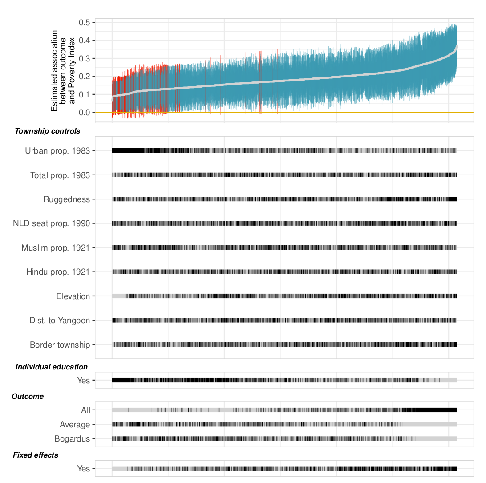

```{r setup, include = F}
require(knitr)
require(magrittr)
require(kableExtra)
require(ggplot2)
require(grid)
require(data.table)
require(UsingR)
require(modelsummary)
require(tidyverse)
require(haven)
require(fixest)
require(ggdag)
options("kableExtra.html.bsTable" = T)


analysis_df <- 
    readRDS("/home/mdweaver/Dropbox/myanmar-prejudice/02-replication/analysis_df.rds")


```


<style type="text/css">
  .reveal h2,h3,h4,h5,h6 {
    text-align: left;
  }
  .reveal p {
    text-align: left;
  }
  .reveal ul {
    display: block;
  }
  .reveal ol {
    display: block;
  }
  .table-hover > tbody > tr:hover { 
  background-color: #696969;
  color: #FFFFFF;
  }
</style>


# Introduction

---

### Outline


1. Review

- Regression and Conditioning
- Interpolation and Extrapolation
- What if conditional independence assumption is wrong?

2. Omitted Variables

3. Sensitivity (Partial Identification)

4. Sensitivity (Choice of Covariates)


# Conditioning

---

In order for conditioning to estimate the $ACE$ without bias, we must assume

$1$. **Ignorability**/**Conditional Independence**: within strata of $X$, potential outcomes of $Y$ must be **independent** of cause $D$ (i.e. within values of $X$, $D$ must be as-if random)

  - all 'backdoor' paths are blocked
  - no conditioning on colliders to 'unblock' backdoor path

---

In order for conditioning to estimate the $ACE$ without bias, we must assume
  
$2$. **Positivity**/**Common Support**: For **all** values of treatment $d$ in $D$ and all value of $x$ in $X$: $Pr(D = d | X = x) > 0$ and $Pr(D = d | X = x) < 1$

  - There must be variation in the levels of treatment **within every strata** of $X$

---

In order for conditioning to estimate the $ACE$ without bias, we must assume

    
3. **No Measurement Error**: If conditioning variables $X$ are mis-measured, bias will persist.


---

###  Conditional Independence in Regression

Even if we included **all** variables on backdoor path between $D$ and $Y$, regression may still produce  biased estimates.

- we assume the conditional expectation function is linear and additive. 
- but the world might be non-linear and interactive 
- **our decisions** about how to **specify the regression equation** can lead to bias: $\Rightarrow$ **model dependence**
- Our imputation of missing potential outcomes is biased due to choices we make about **how to impute** (linear/additive)

---

### (1) Interpolation Bias: 

Typically: we approximate the relationship between variables in $X$ and $D$ to be additive and linear. If this approximation is wrong, we can have bias.

- By forcing relationship between $X$ and $D$ to be linear and additive, conditioning on $X$ may not remove non-linear association between $X$ and $D$, $X$ and $Y$. $\to$ bias.
- This unmodeled relationship will become part of $\epsilon_i$ (because $X$ affects $Y$), and will not be independent of $D_i$ (because there is a non-linear dependence between $X$ and $D$).
- In other words, regression may "impute" wrong counterfactual values of $Y$.


---

```{r, echo = F, message=F}
set.seed(20250307)
n = 100
x = rnorm(n, sd = 2) %>% round
d = ((4 + 0.75*x - 0.5*x^2 + rnorm(n, sd= 2))/3) %>% pnorm %>% rbinom(n = n, size = 1, prob = .)
x[d == 0] = x[d==0] - 0.5
y = 2 + d + -0.5*x+ x^2 + rnorm(n)

m = lm(y ~ d + x)
r_d = lm(d ~ x)$residuals

y_alt = predict(m, newdata = data.frame(d = 1 - d, x = x))
plot_data = data.table(x = x,
           d = d %>% as.factor,
           y = y,
           y_alt = y_alt,
           d_alt = (1 - d) %>% as.factor,
           d_hat = lm(d ~ x)$fit,
           var_d = r_d^2
           )


dens_data = plot_data[, list(raw = .N/100, adj = (.N/100)*mean(var_d)) , by = x]
dens_data[, adj := adj / sum(adj)]
setkey(dens_data, x)
ggplot(plot_data, aes(x = x, y = y, color = d)) + geom_point(size = 2) + geom_point(aes(x = x, y = y_alt, color = d_alt), alpha = 0.4, size = 3, stroke = 0,  stat = 'unique', shape = 17) + theme_bw() + ggtitle("Interpolation Bias") 
```


---

### Positivity and Regression
 
Regression **seems** to help get around positivity assumption...

- on one hand: regression fills in missing potential outcomes using linear estimate of CEF
- on the **other hand**: regression extrapolates out to infinity, even where this is no data 
- if there is a lack of positivity, result driven by extrapolation **beyond the data** to impute missing counterfactuals
- extrapolations of potential outcomes where we have no data likely to be **terrible** (highly model dependent)
- a lack of positivity **exacerbates** limitations of regression

---

### (2) Extrapolation Bias

Typically: we approximate the relationship between variables in $X$ and $D$ to be additive and linear. 

If $D = 1$ **never** occurs for certain values of $X$ (e.g. $X > 0$), regression model will use linearity (or ANY functional form) to **extrapolate** a predicted value of what $D = 1$ would look like when $X > 0$.

- King and Zeng show that extrapolations are very **sensitive to model choice**: small changes in assumptions create large changes in estimates.


---

```{r, echo = F, message = F, warning = F}
data_9 = read.csv('https://www.dropbox.com/s/ultold1kgsvfs4s/example_9.csv?dl=1')
data_9 = data_9 %>% as.data.table
m_extrap = lm(public_goods ~ Democracy + l_GDP_per_capita, data_9)

y_alt = predict(m_extrap, newdata = data.frame(Democracy = 1 - data_9$Democracy, 
                                             l_GDP_per_capita = data_9$l_GDP_per_capita))
plot_data = data.table(l_GDP_per_capita = data_9$l_GDP_per_capita,
           Democracy = data_9$Democracy %>% as.factor,
           public_goods = data_9$public_goods,
           public_goods_cf = y_alt,
           d_alt = (1 - data_9$Democracy) %>% as.factor)

ggplot(plot_data, aes(x = l_GDP_per_capita, y = public_goods, color = Democracy)) + geom_point(size = 2) + geom_point(aes(x = l_GDP_per_capita, y = public_goods_cf, color = d_alt), alpha = 0.4, size = 3, stroke = 0,  stat = 'unique', shape = 17) + theme_bw() + ggtitle("Extrapolating beyond common support")
```


---

All of this has assumed that we have blocked all backdoor paths... that  **Conditional Independence Assumption** is correct.

### What if we do not believe conditional independence holds?

What if there are unblocked confounders?

---

### A problem

You present/submit a paper, and discussant/reviewer says: "I don't believe this causal estimate, because there is some confounding variable you've not accounted for."

What do we do?

---

### A problem

$1.$ They identify a **specific** confounding variable.

- If you can measure it, include in your model to see if estimates change.
- If you cannot measure it:
    - Create a DAG with this variable added. Is it already blocked?
    - What is implied direction of the bias? Does it lead you to over-estimate or under-estimate the effect of $D$?
    - If it over-estimates the effect... can you **benchmark** by how much?

---

### A problem

$2.$ They propose an **unknown** confounding variable.

- Annoying. Cannot be measured; no proposed story of bias.
- Can you **benchmark** how big it would have to be to explain away the estimated effect you've found?

---

### Solutions

- Getting implied direction of bias requires we understand **omitted variable bias**.
- Benchmarking possible bias size involves **sensitivity analyses**.

# Omitted Variable Bias

---

### Conditioning with Regression


1. **Conditional Independence Assumption**: 

Someone argues that you've forgotten a specific variable. What is the bias that results?


---

### What if we forgot a variable?

If the true process generating the data is:

$$Y_i = \beta_0 + \beta_1 D_i + \beta_2 X_i + \nu_i$$

with $(D_i,X_i) \perp \!\!\! \perp \nu_i$, $E(\nu_i) = 0$ 

$\nu_i$ is unit $i$ deviation from $Y_i(D=d, X=x) - E[Y_i(D = d | X = x)]$

What happens when we estimate this model with a constant and $D_i$ but exclude $X_i$?

$$Y_i = \beta_0 + \beta_1 D_i + \epsilon_i$$

---

```{r, echo = F}
dagify(
       y ~ d,
       y ~ x,
       d ~ x,
       y ~ nu,
       labels = c('y' = "Y", 
                  'd' = 'D',
                  'x' = "X",
                  'nu' = 'nu')) %>%
  tidy_dagitty() %>%
  ggplot(aes(x = x, y = y, xend = xend, yend = yend)) +
geom_dag_edges() +
geom_dag_text(aes(label = label), color ='black') +
theme_dag()
```


---

$$\small\begin{eqnarray} 
\widehat{\beta_1} &=& \frac{Cov(D_i, Y_i)}{Var(D_i)}    \\
&=& \frac{Cov(D_i, \beta_0 + \beta_1 D_i + \beta_2 X_i + \nu_i)}{Var(D_i)} \\
&=& \frac{Cov(D_i, \beta_1 D_i)}{Var(D_i)} + \frac{Cov(D_i,\beta_2 X_i)}{Var(D_i)} + \frac{Cov(D_i,\nu_i)}{Var(D_i)}   \\
&=& \beta_1\frac{Var(D_i)}{Var(D_i)} + \beta_2\frac{Cov(D_i, X_i)}{Var(D_i)} \\
&=& \beta_1 + \beta_2\frac{Cov(D_i, X_i)}{Var(D_i)}
\end{eqnarray}$$

So, $E(\widehat{\beta_1}) \neq \beta_1$, it is (potentially) **biased**

---

### Omitted Variable Bias

When we exclude $X_i$ from the regression, we get: 

$$\widehat{\beta_1} = \beta_1 + \beta_2\frac{Cov(D_i, X_i)}{Var(D_i)}$$

This is **omitted variable bias**

- recall: $\beta_1$ is the effect of $D$ on $Y$
- recall: $\beta_2$ is the effect of $X$ on $Y$
- what does $\frac{Cov(D_i, X_i)}{Var(D_i)}$ look like?

---

Excluding $X$ from the model: $\widehat{\beta_1} = \beta_1 + \beta_2\frac{Cov(D_i, X_i)}{Var(D_i)}$

What is the direction of the bias when:

1. $\beta_2 > 0$; $\frac{Cov(D_i, X_i)}{Var(D_i)} < 0$

2. $\beta_2 < 0$; $\frac{Cov(D_i, X_i)}{Var(D_i)} < 0$

2. $\beta_2 > 0$; $\frac{Cov(D_i, X_i)}{Var(D_i)} > 0$

2. $\beta_2 = 0$; $\frac{Cov(D_i, X_i)}{Var(D_i)} > 0$

2. $\beta_2 > 0$; $\frac{Cov(D_i, X_i)}{Var(D_i)} = 0$

---

### Omitted Variable Bias

This only yields bias if two conditions are true:

1. $\beta_2 \neq 0$: omitted variable $X$ has an effect on $Y$ 

2. $\frac{Cov(D_i, X_i)}{Var(D_i)} \neq 0$: omitted variable $X$ is correlated with $D$. (on the same backdoor path)  

This is why we don't need to include EVERYTHING that might affect $Y$ in our regression equation; **only those variables that affect <u>treatment</u> and <u>the outcome</u>.**

---

### Omitted Variable Bias

Link to DAGs:

- OVB solved when we "block" backdoor paths from $D$ to $Y$.

Link to Conditional Independence:

- OVB is a result of conditional independence assumption being wrong

Link to linearity:

- OVB formula only describes bias induced in the **linear** approximation of $ACRF$ of $Y(D)$ by exclusion of a linear confounder. (Interpolation bias $\to$ regression does not return true $ACRF$)

---

### Omitted Variable Bias

If someone proposes a specific omitted variable, check that in their story:

- Does this missing $X$ causally affect $D$? (must be yes to have bias)
- Does this missing $X$ causally affect $Y$? (must be yes to have bias)
- Is the  implied bias **the same sign** as the estimated causal effect of $D$ on $Y$? (If yes, then your estimate does not meet weak severity)

---

### Omitted Variable Bias

If the missing variable...

- could explain the effect you find (the bias from omitting it is the same sign as your estimate)
- is not specified...

Then you need to benchmark how your estimate would change, depending on the possible magnitude of the bias.

# Sensitivity (partial identification)

---

### Example

[Courtin et al](https://www.researchgate.net/publication/369404284_Poverty_and_Prejudice_Before_Genocide) examine the effect of income on anti-Muslim prejudice in Myanmar.

We have income categories (1 to 4, 4 is highest); average scores on anti-Muslim prejudice questions.

The raw relationship looks like this:

---


```{r, echo = F, warning =F, message =F}
analysis_df = analysis_df %>% as.data.table %>% .[svy_sh_religion_rc %in% "Buddhist"]
ggplot(analysis_df[!is.nan(svy_sh_anti_muslim_prejudice_average)], 
       aes(x = svy_sh_income_rc, y = svy_sh_anti_muslim_prejudice_average)) + 
  geom_jitter() + 
  geom_smooth(method = 'lm') +
  theme_bw() + 
  xlab("Income (1 to 4)") +
  ylab("Mean Anti-Muslim Prejudice") + 
  ggtitle("Income and Prejudice")
```


---

Income is not randomly assigned, and so there may be confounding. To find the effect of income on prejudice, we can condition on the following:

- Gender (0/1 for Female)
- Age (10 year age bins)
- Education (primary, middle, secondary, graduate, post-graduate)
- Ethnicity (categorical variable)
- Profession (categories)
- Source of Income (categories)

--- 
  
Estimate Effect of income on Anti-Muslim Prejudice in Myanmar

```{r}
m_linear = lm(svy_sh_anti_muslim_prejudice_all ~ svy_sh_income_rc + 
                svy_sh_female_rc + svy_sh_age_rc + 
                svy_sh_education_rc + svy_sh_ethnicity_rc +  
                 svy_sh_profession_type_rc + 
                svy_sh_income_source_rc, data = analysis_df)
```

---

<small>  
```{r echo = F, warning = F, message = F}
modelsummary(list(linear = m_linear), 
             estimate  = "{estimate}{stars} ({std.error})",
             statistic = NULL,
             gof_omit = 'Log.Lik.|F|AIC|BIC|Adj', stars = T
)
```
</small>


---

Income is not assigned at random; so condition on these variables to "block" confounding paths:

- Gender (0/1 for Female)
- Age (10 year age bins)
- Education (primary, middle, secondary, graduate, post-graduate)
- Ethnicity (categorical variable)
- Profession (categories)
- Source of Income (categories)

---

```{r, echo = F}
dagify(
       prejudice ~ income,
       prejudice ~ gender,
       prejudice ~ age,
       prejudice ~ educ,
       prejudice ~ ethnic,
       prejudice ~ prof,
       prejudice ~ source,
       income ~ gender,
       income ~ age,
       income ~ educ,
       income ~ ethnic,
       income ~ prof,
       income ~ source,
       labels = c('prejudice' = "Prejudice\n(Y)", 
                  'income' = 'Income\n(D)',
                  'gender' = "Gender",
                  'age' = "Age",
                  'educ' = "Education",
                  'ethnic' = "Ethnicity",
                  'prof' = "Profession",
                  'source' = "Income\nSource")) %>%
  tidy_dagitty() %>%
  ggplot(aes(x = x, y = y, xend = xend, yend = yend)) +
geom_dag_edges(curvature = 0.5) +
geom_dag_text(aes(label = label), color ='black') +
theme_dag()
```
Anything that might be MISSING from this DAG?

---

### Sensitivity

If we can **know** and can **measure** specific possible confounders, we just add to the model. 

[Cinelli and Hazlett (2020)](https://carloscinelli.com/files/Cinelli%20and%20Hazlett%20(2020)%20-%20Making%20Sense%20of%20Sensitivity.pdf) provide a more general take on omitted variable bias...

But the intuition is similar. If there is an unknown confounder $U$, the bias induced is a function of the relationship between $Y \sim U$ and $D \sim  U$, just like in omitted variable bias.

---

### Sensitivity

If we estimate this model, where $\widehat{\beta_D}$ is estimate of the causal effect of $D$

$Y_i = \beta_0 + \beta_D D_i + \pmb{\beta_X}\mathbf{X_i} + \epsilon_i$


$$|bias| = \widehat{se}(\widehat{\beta_D})\sqrt{\frac{R^2_{Y \sim U | D,X} \cdot R^2_{D\sim U | X}}{1- R^2_{D\sim U | X}}}$$

---

### Sensitivity

$$|bias| = \widehat{se}(\widehat{\beta_D})\sqrt{\frac{R^2_{Y \sim U | D,X} \cdot R^2_{D\sim U | X}}{1- R^2_{D\sim U | X}}}$$

What matters here are:

$R^2_{Y \sim U | D,X}$: how much **residual variance** in outcome $Y$ (after projecting onto $D,X$) is explained by $U$

$R^2_{D\sim U | X}$: how much **residual variance** in treatment $D$ (after projecting onto $X$) is explained by $U$

---
  
### Sensitivity

These $R^2_{Y \sim U | D,X}$ and $R^2_{D\sim U | X}$ (or "partial" $R^2$) can correspond to linear or non-linear relationships.

- Less restrictive than simple OVB formula; accounts for wider sources of bias.


---

We can reason about partial $R^2$ to think about extent of bias under different scenarios:

1. How must of the residual variation in $D$ and $Y$ must a confounder explain in order to bring the effect of $D$ ($\widehat{\beta}_D$) to zero?
2. How must of the residual variation in $D$ and $Y$ must a confounder explain in order to bring the effect of $D$ ($\widehat{\beta}_D$) no longer significantly different from zero (given a choice of $\alpha$)?
3. Assume that confounder explains all residual variation in outcome $Y$: how much variation in treatment $D$ must it explain to bring $\widehat{\beta}_D$ to zero?

---

### Sensitivity

One major limitation with this approach is... what counts as "a lot" of residual variance explained? What counts as "a little"?

To make these easier to interpret, we want to get an interpretable benchmark. 

What is a "known" important confounder in our model that we can compare against?

>- In this context, we might expect education to explain both income and prejudice.

---

Because education is categorical, need to account for all education dummies.
  
```{r warning = F, message = F}
require(sensemakr)
require(stringr)
covars = model.matrix(m_linear) %>% colnames
covars_edu = covars %>% str_detect("education") %>% covars[.]

myanmar.sensitivity <- sensemakr(model = m_linear, 
                                 treatment = "svy_sh_income_rc",
                                 benchmark_covariates = list('education' = covars_edu),
                                 kd = 1:3,
                                 ky = 1:3, 
                                 q = 1,
                                 alpha = 0.05, 
                                 reduce = TRUE)
```


---

```{r,  results= 'asis'}
ovb_minimal_reporting(myanmar.sensitivity, format = "html")

```

$RV_{q=1}$: how much residual variation in $D$ and $Y$ to make effect $\to$ 0.

$RV_{q=1 \alpha=0.05}$: how much residual variation in $D$ and $Y$ to make effect $p \to > 0.05$ 

$R^2_{Y\sim D | X}$: If $U$ explains all of residual $Y$, how much should it explain $D$ to make effect $\to$ 0?

---

```{r,  results= 'asis'}
ovb_minimal_reporting(myanmar.sensitivity, format = "html")
```

We can then benchmark these against what we know to be $R^2_{Y \sim U | D,X}$ (residual $Y$ explained) by education; and $R^2_{D\sim U | X}$ (residual D explained) by education.

Is it plausible that there is a confounder as "big" as education?

---

Plots can be more informative:

```{r, echo = T, eval = F}
#Partial R2 of U with D, Y, compared against 0 causal effect
plot(myanmar.sensitivity)

#Partial R2 of U with D, Y, compared against
#failing to reject null of no causal effect
plot(myanmar.sensitivity, sensitivity.of = "t-value")

#Partial R2 of U with D, assuming U explains all Y
plot(myanmar.sensitivity, type = 'extreme')
```

---
  
```{r echo = F}
plot(myanmar.sensitivity)
```

Adjusted effect for confounder 1-3 times larger than education.


---

```{r, echo = F}
plot(myanmar.sensitivity, sensitivity.of = "t-value")
```

Adjusted $t$ value of effect for confounder 1-3 times larger than education.

---
  
```{r echo = F}
plot(myanmar.sensitivity, type = 'extreme')
```

Adjusted effect if confounder explained **all** or **most** of the outcome: here effect sign could easily be reversed.
  
  
---

### Conditional Independence
  
Main identifying assumption (for unbiased estimates of causal effects) is **Conditional Independence Assumption**

- This is untestable.
- Must argue that relevant confounders included in conditioning
- Remaining possible confounders are unlikely to alter conclusions

These sensitivity tests give us information to make arguments using theoretical/case knowledge and model estimates to see whether confounders of "reasonable" magnitude would change the effect.

---
  
### Sensitivity
  
Link to partial identification:
  
- Can be used to set bounds on causal effect in worst-case scenario, where **all remaining variation** in treatment and outcome explained by a confounder
- Can be used to set bounds on causal effect under a range of "plausible" scenarios that you have made explicit and argued for.
- Comparison to "known confounder" creates standard candle

---

### Exercise:

Download the `suffrage` data

```{r} 
suffrage = read.csv("https://www.dropbox.com/scl/fi/y5wvmmhhknzbpdufaql9p/referenda_vote.csv?rlkey=1z2hromullprdzumkrawu5n21&dl=1")
```

1. Create `enlist_rate` as `veterans`/`mil_age`
2. Regress `suff65_yes` on `enlist_rate`, `suff57_yes`, and `state`.
3.  Using `sensemakr`, calculate the sensitivity of `enlist_rate`, using `suff57_yes` as the 'benchmark'; save to object `enlist_sensitivity`

---

<ol start=4>
<li> Interpret the results of `summary(enlist_sensitivity)`
<li> Interpret results of the three plots you can make with `plot(enlist_summary)` (see previous slides)
</ol>

# Sensitivity (II)

---

### Conditioning

1. **Condition on** variables that

- **have causal paths toward $D$ and toward $Y$ **
- have causal paths toward $Y$ and backward path toward $D$ 

2. **Do NOT condition on** variables that

- **are on causal path** from $D$ to $Y$ (**mediators**)
- **are "colliders"**

But we don't know the true DAG...

---

### Conditioning

If we want to avoid $p$ hacking and avoid evidence that fails to meet "weak severity", we cannot just try combinations of covariates until we get a "significant" effect.

Instead:

- **Condition on variables that have causal paths toward $D$ and $Y$**: "pre-treatment"
- **Show Results are Robust to Different Choices of conditioning variables**: not sensitive to a specific "DAG" that may or may not be true.

---

### Robustness/Global Sensitivity

Best practice here is to identify the many reasonable choices you could make:

- measurements of $Y$; measurements of $D$; measurements of $X$
- relevant subsets of the data (I prefer dropping subgroups one at a time)
- possible conditioning variables (that are pre-treatment)
- choices about functional form

Then you can conduct analyses using **all** combinations.

---

### Reporting Robustness

How do you report "a million f-ing regressions"?

- histogram of coefficients (not fully informative)
- histogram of $p$ values (can be misleading)
- histogram of $t$ statistics (better)
- specification curve (increasingly my favorite)

---

### Specification Curve:

Two parts:

1. Plot of coefficients w/ confidence intervals (color coded for rejection of null), sorted by coefficient size.

2. "Rug plots" for each attribute of a model, with lines

---





---

### How to do this?

- `specr` package makes specification curves easy (but you may not like their default plots)
- write your own function to estimate model; pull out coefficients/standard errors; then loop across possible specification choices
- write your own function to customize your plot.

---

### Specification Curve

```{r, eval = F}
library(specr)
# Setup Specifications ----
specs <- setup(data = example_data, #data
               y = c("y1", "y2"), #outcome measures
               x = c("x1", "x2"), #treatment measures
               model = c("lm"), #model to estimate
               controls = c("c1", "c2"), #controls to include
               subsets = list(group1 = unique(example_data$group1), #values to subset the data
                              group2 = unique(example_data$group2)))

# Run Specification Curve Analysis ----
results <- specr(specs)

# Plot Specification Curve ----
plot(results)
```

---

### Specification Curve

Let's download the data on Islamist legislators in Indonesia from [Problem Set 3](https://www.dropbox.com/scl/fi/nr4kelc8cd00v6rl9gyvg/ps_3.html?rlkey=0fz60qyqkvl1olk8xydrueq00&dl=1) :

```{r}
dprd_data = read.csv("https://www.dropbox.com/scl/fi/7w8zfmmpg64aqye7dxqan/dprd_ps3.csv?rlkey=m8tss3ope9hhl5clizdmnufse&dl=1")
```

1. Generate treatment variable:  1 if any seats were won by Islamist parties and 0 otherwise.
2. Construct Islamist Vote Share: fraction of votes won by Islamist parties over the number of total votes cast

---

Now...

3. Use your answer to 1.e of PS 3 to identify of plausible pre-treatment covariates
4. Use all combinations of the variables in 3 to make a specification curve looking at effect of Islamist vote share on `NVM_Violence_1_deaths`
5. Create the plot


---

Another way to get combinations of variables

```{r}
vars = c('election_cycle', 'province', 'econ_hh_ag_pct', 'econ_hh_in_slums_pct', 'econ_hh_elec_pct', 'econ_kab_support_per_cap', 'demo_dcapital_dist', 'demo_scndschl_per_10k', 'att_bars_pct', 'relg_majority_muslim_pct', 'relg_mosques_per_10k', 'relg_madrasah_per_10k', 'all_IT_vs', 'dapil_seats', 'enp')

models = do.call(c, lapply(seq_along(vars), combn, x = vars, simplify = FALSE)) %>%
         lapply(paste, collapse = " + ") %>%
         unlist()

models %>% unique %>% length
```

---

Another way to get combinations of variables


```{r}
dprd_data = dprd_data %>% mutate(treated = 1*(all_IT_seats>0))
formulae = paste0("NVM_Violence_1_deaths ~ treated + ", models) 
#results = lapply(formulae, function(f) lm(as.formula(f), data = dprd_data) %>% broom::tidy() %>% mutate(f = f)) %>% rbindlist

```

